A cyclist rides in a straight line for 20 minutes. He waits for half an hour, then returns in a straight line to his starting point in 15 minutes. This is a displacement (d)-time (t) graph for his journey.

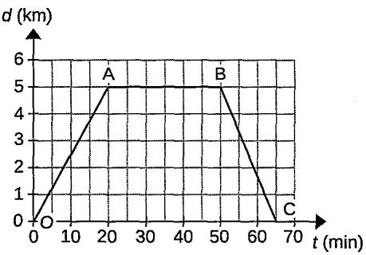

(a)Work out the average velocity for each stage of the journey in km/h.

(b) Write down the average velocity for the whole journey.

(c) Work out the average speed for the whole journey.

A woman travels at a speed of 20 m/s for half an hour before she stops for grocery shopping. After spending 45 minutes in the shop, she continues her journey for another 25 km in 20 minutes. The woman is then caught in a traffic jam for 10 minutes before making the last part of the journey of 15 km in 10 minutes.

(a) Calculate the speed of the driver for the last part of the journey. Express your answer in m/s.

(b)Calculate the average speed of the car, in m/s, for the whole journey.

The motion of a car travelling in a straight line is tracked for 60 seconds. The information is then displayed in the velocity-time graph.

(a) Calculate the acceleration of the car at 20 s.

(b) Calculate the distance travelled in the first 28 seconds.

(c) Calculate the displacement of the car from its starting point after 60 seconds.

A boy goes for a ride on his bike. The graph shows how his displacement from the start of his ride changes with time.

The graph has been divided into five regions, A, B, C, D and E.

(a)Which region or regions show each type of motion? Put ticks (√) in the correct box or boxes for each row. You may tick more than one box in a row.

<table><tr><td rowspan=2 colspan=1>Type of motion</td><td rowspan=1 colspan=5>Region</td></tr><tr><td rowspan=1 colspan=1>A</td><td rowspan=1 colspan=1>B</td><td rowspan=1 colspan=1>C</td><td rowspan=1 colspan=1>D</td><td rowspan=1 colspan=1>E</td></tr><tr><td rowspan=1 colspan=1>Stationary</td><td rowspan=1 colspan=1></td><td rowspan=1 colspan=1></td><td rowspan=1 colspan=1></td><td rowspan=1 colspan=1></td><td rowspan=1 colspan=1></td></tr><tr><td rowspan=1 colspan=1>Moving with constant speed</td><td rowspan=1 colspan=1></td><td rowspan=1 colspan=1></td><td rowspan=1 colspan=1></td><td rowspan=1 colspan=1></td><td rowspan=1 colspan=1></td></tr><tr><td rowspan=1 colspan=1>Accelerating</td><td rowspan=1 colspan=1></td><td rowspan=1 colspan=1></td><td rowspan=1 colspan=1></td><td rowspan=1 colspan=1></td><td rowspan=1 colspan=1></td></tr></table>

(b) Which of the following sketch graphs, 1, 2, 3 or 4, shows the boy's velocity in regions C, D and E?

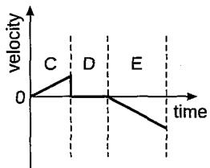

1

2

3

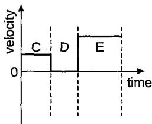

4

(c) On the sketch graph below, show how the boy's velocity changes with time in region A.

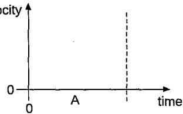

The diagram show the velocity-time graph of an object moving in a straight line.

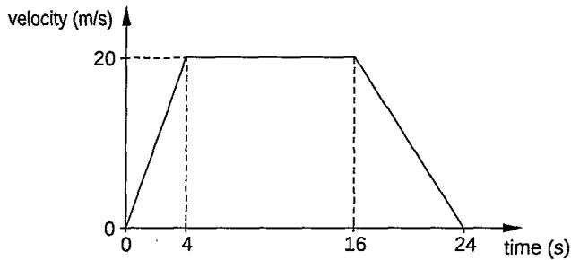

Calculate

(a) the distance travelled by the object when it is moving at a constant speed,

(b) the deceleration of the object,

(c) the average velocity of the object.

The velocity-time graph shows the motion of a particle starting from rest in a straight line.

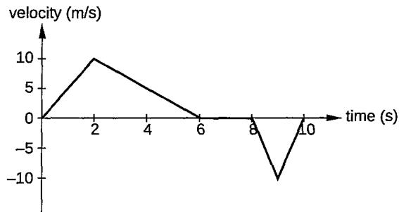

(a) How long is the particle at rest before moving in the opposite direction?

(b) Calculate

(i) the average speed of the particle,

(ii) the average velocity of the particle.

A car travelling at a velocity of 5 m/s accelerates at 0.5 m/s². In a time of 6.0 s, what is the distance travelled by the car?

The diagram shows the distances between towns A, B and C.

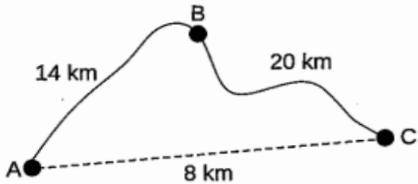

A man travels from A to B and then to C in his journey.

(a) What is the distance travelled by the man from A to C?

(b) What is the displacement of the man when he travels from A to C?

Which of the following defines acceleration? change in distance change in velocity   
A B time taken time taken change in displacement change in speed   
C D time taken time taken

Which car, moving from rest, has an average acceleration of 4.0 m/s²? A a car reaching a speed of 20 m/s in 4 s B a car reaching a speed of 60 m/s in 20 s C a car reaching a speed of 40 m/s in 5 s D a car reaching a speed of 40 m/s in 10 s

When a car driver applies the brake, the speed of car changes from 90 km/h to 50 km/h in 5 s. Calculate the acceleration, in m/s², of the car.

## Section A: Multiple-choice Questions

1 Which of the following must change if a body experiences acceleration? A force acting on the body B density of the body C mass of the body D velocity

2Which graph best represents the motion of a car travelling with a constant velocity?

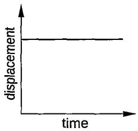

B

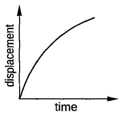

C

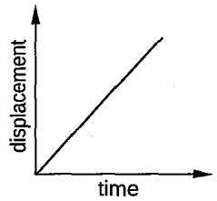

D  
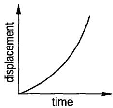

The velocity (v)-time (t) graph shows the motion of two cars, X and ${ \mathsf { Y } } ,$ travelling in a straight line towards the same direction.

Which of the following statements about cars X and Y is correct?

AThe acceleration of both cars X and Y is the same.

B The distance travelled by both cars X and Y is the same.

C The acceleration of car Y is greater than car X.

D The average velocity of car Y is greater than car X.

4 Which of the following pairs of graphs can be used to represent the same motion of an object?

A  

B  
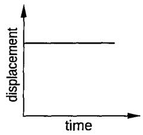

C  

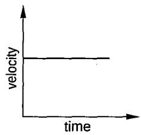

D  
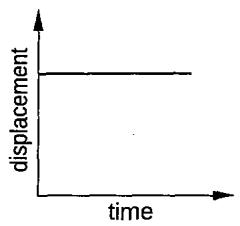

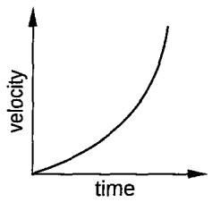

Which graph best represents the motion of an object, initially at rest, that accelerates uniformly in a straight line?

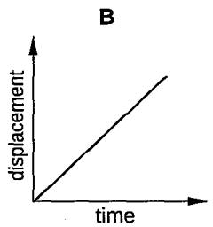

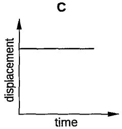

D  

6 The graph shows the motion of a car along a straight road over a period of 25 s.

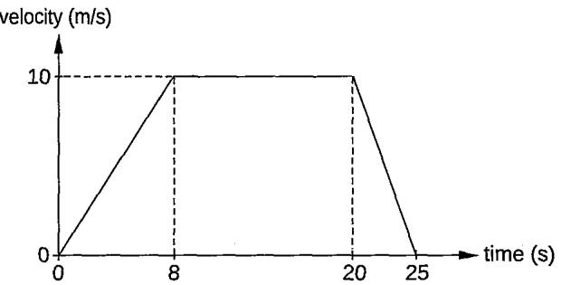

What was the distance travelled by the car during the time when it was travelling at a uniform velocity? A 40 m B 120 m C 185 m D 200 m

7The graph shows the motion of a car.

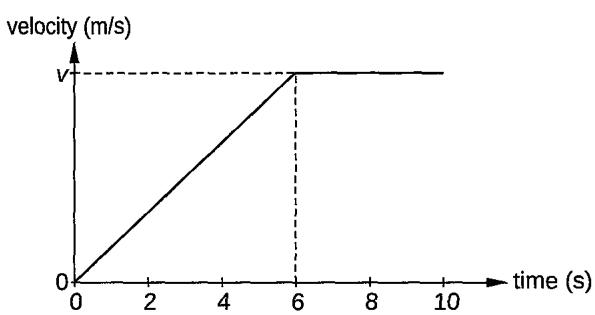

If the total displacement of the car is 35 m in 10 s, what is the value of v? A 1 m/s B 5 m/s C 15 m/s D 20 m/s

8 The graph shows a straight-line motion of an object. velocity (m/s)

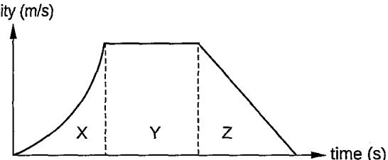

Which feature of the graph represents the distance travelled by the object whilst travelling at a steady acceleration? A area Y B area Z C area X + area Y D area Y + area Z

The diagram shows a velocity-time graph.

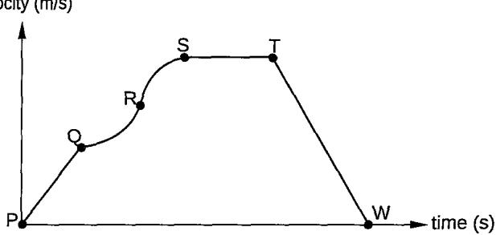

In which region does the car experience increasing acceleration? A P to Q B Q to R C R to S D T to W

10 A motorcyclist rides at an initial velocity of 10 m/s. He then accelerates to a velocity of 25 m/s in 5 s. What is the acceleration of the motorcyclist? A 3 $\mathsf { m } / \mathsf { s } ^ { 2 }$ B 5 $\mathsf { m } / \mathsf { s } ^ { 2 }$ C 10 $\mathsf { m } / \mathsf { s } ^ { 2 }$ D 25 $\mathsf { m } / \mathsf { s } ^ { 2 }$

## Section B: Structured Questions

1 The velocity (v)-time (t) graph shows the motion of a car.

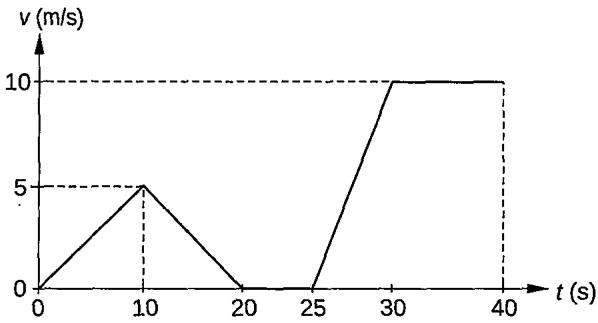

(a) Describe the motion of the car shown in the graph.

(b) Calculate

(i) the acceleration in the first 10 s of the car journey.

(ii) the average speed of the car for the whole journey.

2 The speed (v)-time (t) graph shows the motion of a bal. It falls vertically and hits the ground. It then rebounds vertically upwards.

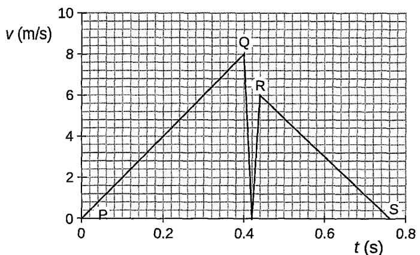

The ball is released at P, hits the ground at Q and is in contact with the floor between Q and R. S is the highest point reached as the ball rises.

(a) From the graph, describe the motion of the ball between P and Q.

(b) State how the graph shows that the distance travelled between P and Q is larger than the distance travelled between R and S.

(c) (i) Explain the difference between speed and velocity.

(ii) Determine the change in speed of the ball between Q and R, the change in velocity of the ball between Q and R.

3 The velocity (v)-time (t) graph shows the motion of a cyclist travelling along a straight road. Upon approaching a bridge, the cyclist slows down. The cyclist rides at a constant speed from the start of the bridge, at X, to the end of the bridge, at Y. The cyclist speeds up after passing through the bridge.

(a) Calculate the distance travelled by the bicycle on the bridge.

(b)The cyclist accelerates after passing through the bridge. Calculate the acceleration.

(c) A second cyclist is stationary on the road at the point where the bridge starts. He accelerates uniformly for 50 s and reaches a speed of 2 m/s. Determine whether the second cyclist reaches the end of the bridge in 50 s.

## Section C: Free-response Questions

1 (a) A car travelling with a velocity of 5 m/s accelerates uniformly at a constant acceleration of 2 m/s² for 30 s. Calculate the distance travelled by the car while it is accelerating

(b) A cyclist is travelling due east with a velocity of 16 m/s. The cyclist changes velocity to be travelling due south with a velocity of 12 m/s. Draw a vector diagram to calculate the change in the velocity of the cyclist.

## 2 The velocity (v)-time (t) graph shows the motion of two cars X and Y.

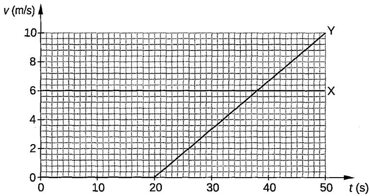  
Both cars travel along a straight road in the same direction.

(a) Car X travels at a uniform velocity. Car Y is at rest until t = 20 s, when it then starts moving with a uniform acceleration. (i) State what is meant by uniform velocity. (ii) State what is meant by uniform acceleration.   
(b) At t = 0, car X passes car Y. Determine the distance between cars X and Y at time $t = 3 8 s .$

(c) Describe how the distance between the two cars changes between t = 0 and $t = 3 8 s .$

(d) Calculate the average velocity of cars X and Y respectively for the whole journey shown in the graph.