# Unit 2

## Kinematics

## Kinematics

What is kinematics?

It is the study of the motion of objects without reference to forces acting on them.

What is motion?

Motion is a change in an object's position over time.

What are the physical quantities used to describe motion of objects?

• Distance and displacement

• Speed and velocity

• Acceleration

## Distance and displacement

Define distance.

It is the total length travelled by an object.

State the SI unit of distance.

metre (m)

What type of quantity is distance classified as?

Scalar quantity

Eg.

The distance between the school and the science centre is 2.5 km.

In this example, we only know the total length between the school and the science centre is 2.5 km. However, we do not know the location or direction of the school with respect to the science centre.

Remark:

Recall that scalar quantities are quantities with magnitude only.

Worked example

What is the distance travelled by John when he drives from A to B and then to C?

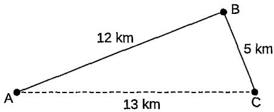

Answer:

Distance = 12 km + 5 km = 17 km

What is displacement?

It is the distance measured in a straight line in a specific direction.

State the SI unit of displacement.

metre (m)

What type of quantity is displacement classified as?

Vector quantity

Remark:

It indicates both magnitude and direction. See Worked example 1.

Can displacement be a positive, negative or zero magnitude?

Yes

Remarks:

What are the meaning of'+' and '—'sign in displacement?

• See Worked example 3.

• On the other hand, distance can be positive or zero but cannot be negative.

They represent motion in opposite directions.

Eg.

In horizontal direction

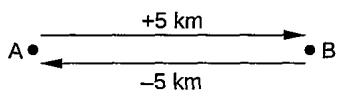

In vertical direction

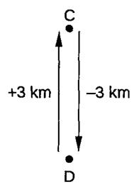

Give another example when the displacement of an object is zero after its motion.

When an object moves from A to B and then back to A, its displacement is zero. Explain why it is so.

Remarks:

In the horizontal or vertical direction, if you take positive to be in right or upward directions, then the motion to the left or downwards will be negative, and vice versa.

Displacement measures the shortest distance travelled between the starting and ending points.

When an object moves from A to B and then back to A, it returns to its original position.

This makes the shortest distance between these two points zero and hence, the displacement is zero.

Remark:

See Worked examples 2 and 3.

An object moves in a circular path of 20 m in circumference and returns to its origin after completing one revolution.

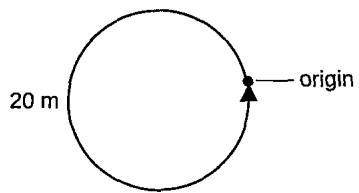

Distance travelled = 20 m

Displacement = 0 m

Remark:

Displacement is calculated as the straight-line distance from the initial position to the final position, considering direction. Since the initial and final positions are the same, the displacement is zero.

QuestionWhat is the displacement of B from A?

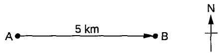

Answer Displacement of B is 5 km east of A.

Question What is the displacement when John drives from A to B and then to C?

Answer Displacement = 13 km

Remarks:

Displacement takes into consideration of the shortest distance between the starting point and the end point.

The shortest distance is always the straight line between the starting point and the end point.

Question The diagram shows the distance between positions A and B.

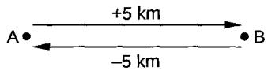

By taking the direction to the right as positive, state the displacement when a person travels

(a) from A to B,

(b) from B to A,

(c) from A to B and then back to A.

## Answer

(a) Displacement = +5 km

(b) Displacement = -5 km

(c) Displacement = (+5 km) + (-5 km) = 5 km − 5 km = 0 km

## Question 1

The diagram shows the distances between towns A, B and C.

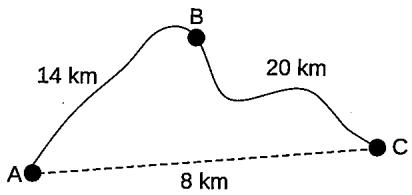

A man travels from A to B and then to C in his journey.

(a)What is the distance travelled by the man from A to C?

(b) What is the displacement of the man when he travels from A to C?

## Speed and velocity

What are speed and velocity?

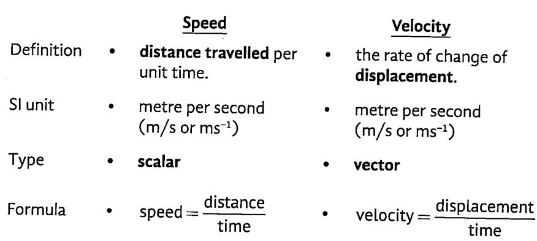

Remarks:

The other commonly used unit for speed and velocity is km/h.

The positive or negative sign of velocity indicates direction.

Eg.

The velocity of a moving object from A to B is +10 m/s. However, when $m / s .$ it moves in the opposite direction from B to A, its velocity is -15 m/s. $\mathsf { A } ,$

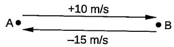

Question A car travels at a speed of 20 m/s for 10 minutes. Calculate the distance travelled.

Answer

$$
{ \begin{array} { r l } & { { \mathsf { d i s t a n c e } } = { \mathsf { s p e e d } } \times { \mathsf { t i m e } } } \\ & { \qquad = 2 0 \ m / s \times \left( 1 0 \times 6 0 \right) s } \\ & { \qquad = 1 2 \ 0 0 0 \ m \ { \mathsf { o r } } \ 1 2 \ { \mathsf { k m } } } \end{array} }
$$

What is uniform speed?

Question

The diagram shows an object travelling from A to B and then from B to C.

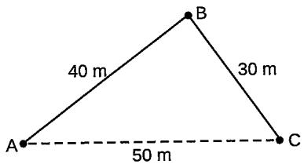

If the object takes 4 s to travel from A to B and then 6 s from B to C, calculate the

(a) speed of the object from A to C.

(b) velocity of the object from A to C.

Answer

(a) Distance travelled $= 4 0 ~ { \mathsf { m } } + 3 0 ~ { \mathsf { m } } = 7 0 ~ { \mathsf { m } }$ Total time taken = 4 s + 6 s = 10 s

$$
\mathsf { s p e e d } = \frac { 7 0 \mathsf { m } } { 1 0 \mathsf { s } } = 7 \mathsf { m } / \mathsf { s }
$$

(b) Displacement = 50 m

Total time taken $= 4 5 + 6 5 = 1 0 5$

$$
v e l o c i t y = \frac { 5 0 \mathsf { m } } { 1 0 \mathsf { s } } = 5 \mathsf { m } / \mathsf { s }
$$

It is the speed of a moving object that remains the same throughout its journey.

Remark:

Another word for 'uniform' is 'constant'.

At constant speed, the speed of a moving object does not increase or decrease. Therefore, the object will cover the same distance in every regular interval of time.

Average speed

Average velocity

Definition

the total distance traveled divided by the total time taken

the total   
displacement divided   
by the total time   
taken

Type

• scalar

• vector

Formula

average speed total distance travelled total time taken

average velocity total displacement 1 total time taken

## Worked example 3

Question A man drives at a constant speed of 20 m/s for half an hour. He then stops for a break for 15 minutes before continuing his journey of 20 km for another 20 minutes. Calculate the average speed, in km/h, of the man for his journey.

AnswerDistance travelled in half an hour = 20 m/s × (30 × 60) s = 36 000 m or 36 km Total distance travelled = 36 km + 20 km = 56 km Total time taken = 30 min + 15 min + 20 min = 65 min = 1.083 h 56 km average speed= = 51.7 km/h 1.083 h

Question Peter took a total of three hours to complete a journey of 180 km. This 3-hour journey included a coffee break for half an hour and a quarter of an hour being stationary due to a traffic jam. Calculate the average speed he would have driven his car if he managed to complete the journey in three hours.

Answer Time not moving = 0.5 h + 0.25 h = 0.75 h

Time spent driving = 3 h – 0.75 h = 2.25 h

Average speed to complete the 3-h journey

$$
= \frac { 1 8 0 k m } { 2 . 2 5 h } = 8 0 k m / h
$$

Remark:

Always check whether the question asks for average speed during motion or overall average speed, as they are different if breaks are involved.

## Question

A cyclist travels 30 km east in 1.5 h and then 40 km west in 2 h. What is the cyclist's average velocity for the entire trip?

## Answer

Take the direction to the east as positive.

Total displacement = 30 km + (− 40 km) = -10 km

Total time = 1.5 h + 2 h = 3.5 h

Average velocity $= \frac { - 1 0 k m } { 3 . 5 h } = - 2 . 8 6 k m / h$

The cyclist's average velocity for the entire trip is 2.86 km/h westwards.

Remark:

Since we denote eastwards as positive, the negative sign of velocity denotes the direction of westwards.

A woman travels at a speed of 20 m/s for half an hour before she stops for grocery shopping. After spending 45 minutes in the shop, she continues her journey for another 25 km in 20 minutes. The woman is then caught in a traffic jam for 10 minutes before making the last part of the journey of 15 km in 10 minutes.

(a) Calculate the speed of the driver for the last part of the journey. Express your answer in m/s.

(b) Calculate the average speed of the car, in m/s, for the whole journey.

## Acceleration

Define acceleration.

It is the rate of change of velocity.

## Remarks:

• It measures how fast the velocity change.

• Any objects that experience changes in velocity are said to have acceleration.

<table><tr><td>Situation</td><td></td><td>What is it?</td><td></td><td>Examples</td></tr><tr><td>1</td><td></td><td>Change in speed</td><td></td><td>Car accelerating on a highway</td></tr><tr><td rowspan="5">2</td><td rowspan="5"></td><td>An object increases or</td><td></td><td>Bicycle decelerating</td></tr><tr><td>decreases its speed.</td><td></td><td>to stop</td></tr><tr><td>Change in direction</td><td></td><td>Car turning a corner</td></tr><tr><td>An object changes its</td><td></td><td>Athlete running around a track</td></tr><tr><td>direction while maintaining constant speed.</td><td></td><td></td></tr><tr><td rowspan="5">3</td><td></td><td>Change in both speed</td><td></td><td>Roller coaster in a</td></tr><tr><td></td><td>and direction</td><td></td><td>loop</td></tr><tr><td></td><td>An object</td><td></td><td>Airplane taking off</td></tr><tr><td></td><td>changes both its speed and its</td><td></td><td>from runway</td></tr><tr><td></td><td>direction.</td><td></td><td></td></tr></table>

## Remark:

When an object moves in a circular path, it also experiences acceleration even if it travels at a constant velocity. This is due to a constant change of directions when the object moves in a circular path.

State the formula to calculate acceleration.

metre per second per second or metre per second squared $( \mathsf { m } / \mathsf { s } ^ { 2 }$ or $m s ^ { - 2 } )$

## Vector

$a = \frac { v - u } { t }$ where a = acceleration $( m / s ^ { 2 } )$ ν = final velocity $( m / s )$ u = initial velocity $( m / s )$ t = time (s)

This equation assumes that objects move with constant acceleration.

## Remark:

The formula for acceleration can also be expressed as:

$a = \frac { \Delta \nu } { t }$ where'∆' means 'change'.

<table><tr><td>Acceleration</td><td>What it means</td><td>Example</td></tr><tr><td>Positive</td><td>Velocity increases or speeding up (without changing the direction of motion)</td><td> $t _ { \mathrm { 1 } } = 5 \ : \mathsf { m } / \mathsf { s }$   $t _ { _ 2 } = 2 0 \mathrm { m } / s$   $t _ { \scriptscriptstyle 3 } = 5 0 \mathrm { m } / \mathsf { s } , \ldots$ </td></tr><tr><td>Negative (or</td><td>Velocity decreases</td><td> $t _ { \mathrm { _ 1 } } = 6 0 \mathrm { m } / \mathrm { s }$ </td></tr><tr><td>deceleration/ retardation)</td><td>or slowing down</td><td> $t _ { 2 } = 4 5 \mathrm { m } / \mathrm { s }$ </td></tr><tr><td></td><td>(without changing the direction of motion)</td><td> $t _ { \scriptscriptstyle 3 } = 2 0 \ : \mathrm { m } / s , \ldots$ </td></tr><tr><td rowspan="2">Zero</td><td>constant velocity (velocity remains the</td><td> $t _ { \mathrm { _ 1 } } = 2 0 \mathrm { m } / \mathrm { s }$ </td></tr><tr><td>same throughout)</td><td> $t _ { 2 } = 2 0 \mathrm { m } / \mathsf { s }$ </td></tr><tr><td rowspan="4">Constant / Uniform</td><td>A constant rate of</td><td> $t _ { \scriptscriptstyle 3 } = 2 0 \mathsf { m } / \mathsf { s } , \ldots$ </td></tr><tr><td>change of velocity</td><td> $t _ { \mathrm { _ 1 } } = 2 \ : \mathsf { m } / \mathsf { s }$ </td></tr><tr><td>(It means velocity</td><td> $t _ { 2 } = 4 \mathsf { m } / \mathsf { s }$ </td></tr><tr><td>increases or decreases at the same rate.) Remark:</td><td> $t _ { \scriptscriptstyle 3 } = 6 ~ \mathsf { m } / \mathsf { s } , \ldots$ </td></tr></table>

Question An object, moving at a constant velocity of 1000 $m / s ,$ speeds up to a velocity of 3000 $\mathsf { m } / \mathsf { s }$ in 20 s. What is the acceleration of the object?

$$
a = { \frac { \left( 3 0 0 0 - 1 0 0 0 \right) { \mathrm { ~ m } } / { \mathsf { s } } } { 2 0 { \mathsf { s } } } } = 1 0 0 { \mathrm { ~ m } } / { \mathsf { s } } ^ { 2 }
$$

Question A student cycles at a constant speed of 15 m/s. When he steps on the brake, the bicycle comes to a stop after 6 s. Calculate the acceleration of the student.

Answer

$$
a = \frac { 0 - 1 5 \ m / s } { 6 s } = - 2 . 5 \ m / s ^ { 2 }
$$

## Question 3

Which of the following defines acceleration?

<table><tr><td rowspan="2">A</td><td>change in distance</td><td rowspan="2">B</td><td>change in velocity</td></tr><tr><td>time taken</td><td>time taken</td></tr><tr><td rowspan="2">C</td><td>change in displacement</td><td>D</td><td>change in speed</td></tr><tr><td>time taken</td><td></td><td>time taken</td></tr></table>

## Question4

Which car, moving from rest, has an average acceleration of 4.0 m/s²?

A a car reaching a speed of 20 m/s in 4 s B a car reaching a speed of 60 m/s in 20 s C a car reaching a speed of 40 m/s in 5 s D a car reaching a speed of 40 m/s in 10 s

## Question 5

When a car driver applies the brake, the speed of car changes from 90 km/h to 50 km/h in 5 s. Calculate the acceleration, in m/s², of the car

## Displacement-time graph

What is a displacement-time graph?

It shows the displacement of an object from a fixed origin as it moves in a straight line.

It shows displacement (on the vertical axis) against time (on the horizontal axis).

Displacement-time graphs can go below the horizontal axis, whereas distance-time graphs cannot.

This is because distance is a scalar and displacement is a vector. Hence, distance cannot be negative, whereas displacement can be (the positive and negative signs indicate opposite directions from the origin).

How do we find the velocity of an object from a displacement-time graph?

The gradient of the graph is the velocity of the object.

displacement

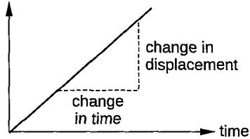

velocity = gradient of graph change in displacement change in time

What are the key features of a displacement-time graph?

## Remark:

<table><tr><td></td><td></td></tr><tr><td></td><td>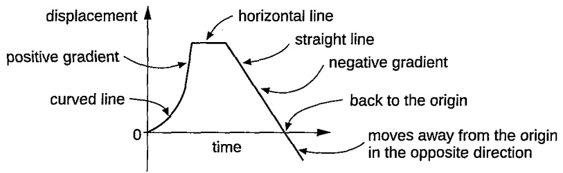</td></tr><tr><td></td><td></td></tr><tr><td>Features</td><td>What it means</td></tr><tr><td>Gradient of the graph</td><td>Positive gradient</td></tr><tr><td></td><td>Object moving forwards (away from the origin)</td></tr><tr><td></td><td>Negative gradient</td></tr><tr><td></td><td>Object moving backwards (towards the origin)</td></tr><tr><td></td><td>Steepness of the graph</td></tr><tr><td>Position on the graph</td><td>The greater the gradient, the greater the velocity</td></tr><tr><td></td><td>Above the x-axis</td></tr><tr><td></td><td>object is located on one side of the origin</td></tr><tr><td></td><td>(positive displacement) On the x-axis (y = 0)</td></tr><tr><td></td><td>object is exactly at the origin (zero</td></tr><tr><td></td><td>displacement)</td></tr><tr><td></td><td>Below the x-axis object is on the opposite side of the origin</td></tr><tr><td></td><td>(negative displacement)</td></tr><tr><td>Straight line</td><td>object moving at a constant velocity</td></tr><tr><td>Curved line</td><td>Curve gets steeper → Object is accelerating (velocity increasing)</td></tr><tr><td></td><td>Curve flattens → Object is decelerating</td></tr><tr><td>Horizontal line object at rest/stationary</td><td>(velocity decreasing)</td></tr></table>

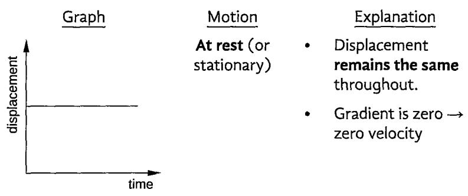

<table><tr><td></td><td>Motion Uniform</td><td>Explanation</td><td></td></tr><tr><td rowspan="5">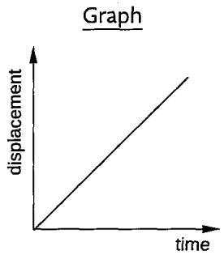</td><td rowspan="5">velocity (forward direction)</td><td>gradient</td><td>Positive and constant</td></tr><tr><td></td><td>Displacement increases at a constant rate (steady</td></tr><tr><td></td><td>increase in displacement while moving forwards)</td></tr><tr><td>Uniform</td><td></td></tr><tr><td></td><td></td></tr><tr><td rowspan="5">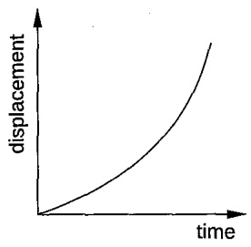</td><td rowspan="5">velocity (backward direction)</td><td>gradient</td><td>Negative and constant</td></tr><tr><td></td><td>Displacement decreases at a constant rate (steady</td></tr><tr><td></td><td>decrease in displacement</td></tr><tr><td></td><td>while moving backwards)</td></tr><tr><td></td><td></td></tr><tr><td rowspan="5"></td><td>Increasing velocity (non-</td><td></td><td>Positive and increasing gradient (steeper upwards)</td></tr><tr><td>uniform forward)</td><td></td><td>Displacement increases at a increasing rate (speeding up</td></tr><tr><td></td><td></td><td>while moving forwards)</td></tr><tr><td>Decreasing</td><td></td><td>Positive and decreasing</td></tr><tr><td></td><td></td><td></td></tr><tr><td rowspan="5">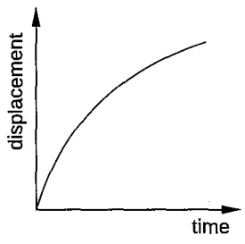</td><td>velocity (non- uniform forward)</td><td></td><td>gradient (flattens upwards)</td></tr><tr><td></td><td></td><td>Displacement increases at a decreasing rate (slowing</td></tr><tr><td></td><td></td><td>down while moving</td></tr><tr><td>Increasing</td><td></td><td></td></tr><tr><td></td><td></td><td></td></tr><tr><td rowspan="5">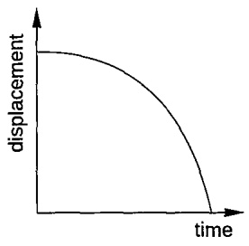</td><td></td><td>forwards)</td><td></td></tr><tr><td></td><td></td><td></td></tr><tr><td>(non- uniform backward)</td><td></td><td>gradient (steeper drop) Displacement decreases at</td></tr><tr><td></td><td></td><td></td></tr><tr><td></td><td></td><td></td></tr><tr><td rowspan="5">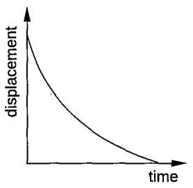</td><td>velocity</td><td></td><td>Negative and increasing</td></tr><tr><td></td><td></td><td></td></tr><tr><td></td><td></td><td>an increasing rate (speeding up while moving backwards]</td></tr><tr><td>Decreasing velocity</td><td></td><td></td></tr><tr><td>(non- uniform backward)</td><td>down while moving</td><td>Negative and decreasing gradient (flatter drop) Displacement decreases at a decreasing rate (slowing</td></tr></table>

## Remark:

For point G, it means that the object is on the opposite side of the origin (has a negative displacement) and is moving further away from the origin in the negative direction

Describe the motion of an object, from A to G, shown in the displacement-time graph.

displacement

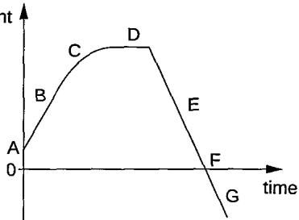

## Answer

A It is at the initial displacement from the origin. (means that the object has travelled some distance from the origin)

B It moves at a constant velocity.

C It experiences decreasing velocity (slowing down or deceleration).

D It is at rest/stationary.

E It moves backwards towards the origin at a constant velocity.

F It is at the origin. (hence, zero displacement)

G It moves forwards on the opposite side of the origin (increasing negative displacement)

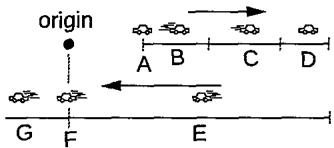

Remarks:

•  Displacement is a vector.

» On the graph, from A to C, the displacement is positive. From E to F, the displacement is negative. Hence, the sum of displacements from A to F becomes zero.

» From G, the object starts to move away from the origin in the opposite direction. Hence, the displacement has a net negative value.

To determine whether velocity is increasing or decreasing from the displacement-time graph, we can calculate the instantaneous velocity by finding the slope of the tangent line at a specific point on the graph.

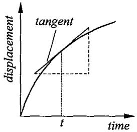  
instantaneous velocity at t  
change in distance change in time

where t = at any given instant in time

A cyclist rides in a straight line for 20 minutes. He waits for half an hour, then returns in a straight line to his starting point in 15 minutes. This is a displacement (d)-time (t) graph for his journey.

(a) Work out the average velocity for each stage of the journey in km/h.

(b) Write down the average velocity for the whole journey.

(c)Work out the average speed for the whole journey.

## Velocity-time graph

What is a velocity-time graph?

• It shows the velocity of an object as it moves in a straight line.

It shows velocity (on the vertical axis) against time (on the horizontal axis).

• Velocity-time graphs can go below the horizontal axis whereas speed-time graphs cannot.

This is because speed is a scalar and velocity is a vector. Hence, speed cannot be negative, whereas velocity can be.

What are the key features of a velocity-time graph?

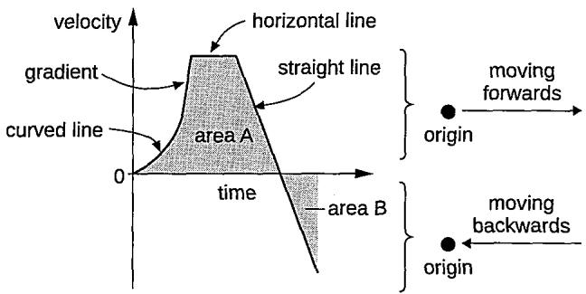

Features What it means

Gradient • represents the acceleration of the object

Straight line• object accelerating at a constant rate

Curved line• object experiencing non-uniform acceleration

Horizontal line• object moving at a constant (or uniform) velocity

Area under graph

• represents the displacement

area above x-axis (area A) → Positive displacement (object moving forwards)

area below x-axis (area B) → Negative displacement (object moving backwards)

Sum of all areas

net displacement (total change in position from the starting point)

Graph touches x-axis

• object is at rest (velocity = 0) at that moment

Graph above x-axis

• object has positive velocity → moving forwards (away from origin)

Graph below x-axis

• object has negative velocity → moving backwards (towards origin)

Describe the motion shown in velocity-time graphs when an object is moving forwards in a straight line (without changing its direction of motion).

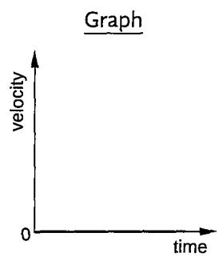

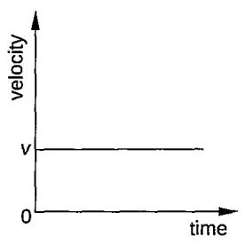

• Gradient = zero

Zero acceleration (moving at the same speed v continuously)

<table><tr><td rowspan="5">velcity</td><td rowspan="5">Graph</td><td>Motion</td><td>Explanation Positive and</td></tr><tr><td>Uniform acceleration</td><td>constant gradient</td></tr><tr><td>(or constant acceleration)</td><td>Velocity increases at a constant rate</td></tr><tr><td></td><td>(steady increase in speed)</td></tr><tr><td>time Uniform deceleration (or constant deceleration)</td><td></td><td>Negative and constant gradient Velocity decreases at a constant rate</td></tr><tr><td>Remark:</td><td>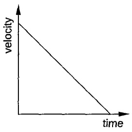</td><td></td><td>(steady decrease in speed)</td></tr><tr><td>&#x27;Positive gradient&#x27; or &#x27;Negative gradient&#x27; refers to the slope of the graph, which represents acceleration:</td><td>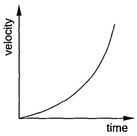</td><td>Increasing acceleration (non-uniform acceleration)</td><td>Positive and increasing gradient (steeper upwards)</td></tr><tr><td>Positive gradient → Positive acceleration (velocity increasing) Negative gradient → Negative acceleration</td><td></td><td>Decreasing</td><td>Velocity increases at an increasing rate (speeding up faster)</td></tr><tr><td>(velocity decreasing) Note: This is independent of the direction of motion — that is, whether the velocity is positive (forward) or negative (backward).</td><td>vlcity</td><td>acceleration (non-uniform acceleration)</td><td>Positive and decreasing gradient (flattens upwards)</td></tr><tr><td></td><td></td><td></td><td>Velocity increases</td></tr><tr><td></td><td></td><td></td><td></td></tr><tr><td></td><td></td><td></td><td></td></tr><tr><td></td><td></td><td></td><td>at a decreasing rate</td></tr><tr><td></td><td></td><td></td><td>(speeding up more</td></tr><tr><td></td><td>time</td><td></td><td></td></tr><tr><td>Steepness tells us how</td><td></td><td></td><td>slowly)</td></tr><tr><td>rapidly velocity changes, ie.</td><td></td><td></td><td></td></tr><tr><td>rate of acceleration.</td><td></td><td>Increasing</td><td></td></tr><tr><td></td><td></td><td></td><td>Negative and</td></tr><tr><td>Curves getting steeper =</td><td></td><td>deceleration</td><td>increasing gradient</td></tr><tr><td></td><td></td><td>(non-uniform</td><td></td></tr><tr><td>faster rate of change</td><td></td><td></td><td>(steeper drop)</td></tr><tr><td></td><td></td><td>negative</td><td></td></tr><tr><td>Curves getting flatter =</td><td>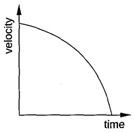</td><td></td><td>Velocity decreases</td></tr><tr><td>slower rate of change</td><td></td><td>acceleration)</td><td>at an increasing</td></tr><tr><td></td><td></td><td></td><td></td></tr><tr><td></td><td></td><td></td><td>rate (slowing down</td></tr><tr><td></td><td></td><td></td><td>faster)</td></tr><tr><td></td><td></td><td></td><td></td></tr><tr><td></td><td></td><td>Decreasing</td><td></td></tr><tr><td></td><td></td><td></td><td>Negative and</td></tr><tr><td></td><td></td><td>deceleration</td><td>decreasing gradient</td></tr><tr><td></td><td></td><td></td><td></td></tr><tr><td></td><td></td><td>(non-uniform</td><td>(flatter drop)</td></tr><tr><td></td><td></td><td></td><td></td></tr><tr><td></td><td></td><td>negative</td><td></td></tr><tr><td></td><td></td><td></td><td>Velocity decreases</td></tr><tr><td></td><td></td><td></td><td></td></tr><tr><td></td><td>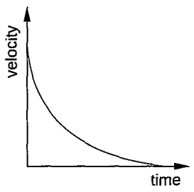</td><td>acceleration)</td><td></td></tr><tr><td></td><td></td><td></td><td></td></tr><tr><td></td><td></td><td></td><td>at a decreasing</td></tr><tr><td></td><td></td><td></td><td></td></tr><tr><td></td><td></td><td></td><td>rate (slowing down</td></tr></table>

Describe the motion of the car in these regions of the journey, AB, BC, CD, DE and EF, based on the velocity-time graph below.

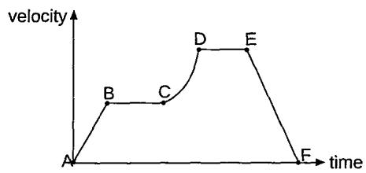

## Answer

AB The car travels at a constant acceleration.

BC It travels at a constant velocity.

CD It travels at an increasing acceleration.

DE It travels at a constant velocity again.

EF It travels at a constant deceleration.

The diagram shows the velocity-time graph of a car moving in a straight line.

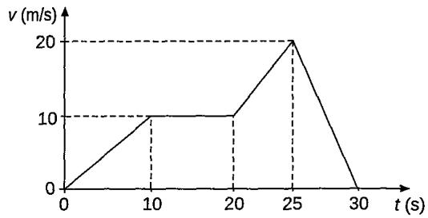

Calculate

(a) the acceleration of the car after 5 s,

(b) the total displacement of the car,

(c) the average velocity of the car.

## Answer

(a) $a = { \frac { 1 0 { \mathrm { ~ m } } / { \mathsf { s } } - 0 } { 1 0 { \mathsf { s } } } } = 1 { \mathrm { ~ m } } / { \mathsf { s } } ^ { 2 }$

(The car moves with the same constant acceleration from 0 to 10 s.)

(b) Total displacement

$$
\begin{array} { l } { = \displaystyle \frac { 1 } { 2 } \big ( 1 0 \times 1 0 \big ) + \big ( 1 0 \times 1 0 \big ) + \bigg \lbrack \frac { 1 } { 2 } \big [ \big ( 1 0 + 2 0 \big ) \big ( 5 \big ) + \big ( 2 0 \times 5 \big ) \big ] \bigg \rbrack } \\ { = 5 0 + 1 0 0 + 1 2 5 } \\ { = 2 7 5 \mathsf { m } } \end{array}
$$

(c) Average velocity $= \frac { 2 7 5 \mathrm { ~ m } } { 3 0 \mathrm { ~ s ~ } } { = } 9 . 1 7 \mathrm { ~ m } / s$

Describe the difference between the speed-time graph and the velocity-time graph.

Velocity is a vector quantity; it can have both positive and negative values on a velocity-time graph, representing forward and backward motion respectively.

•Speed is a scalar quantity; it only has positive values on a speedtime graph.

Eg.

The velocity-time and the speed-time graphs of a ball being thrown upwards in the air and falling back to the ground.

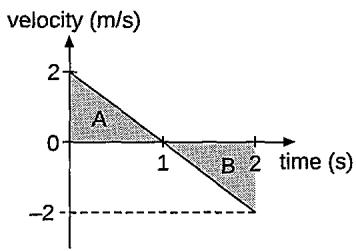

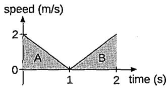

In this example, we take the motion in upward direction as positive for vector quantities.

<table><tr><td colspan="2">velocity-time graph Upward The magnitude</td><td>speed-time graph</td></tr><tr><td>motion from 0 to 1 s</td><td>of the velocity decreases from 2 m/s to 0. However, since it moves upward, its direction is assigned positive for this part of journey.</td><td>The speed decreases from 2 m/s to 0 as it is moving upwards. (Since speed is a scalar, it does not have a direction and thus does not require a positive or negative sign.)</td></tr><tr><td>At peak at 1 s•</td><td>Velocity is 0 at its peak.</td><td>Speed is 0 at its peak.</td></tr><tr><td>Downward motion from 1 s to 2 s</td><td>The magnitude of the velocity increases from 0 to 2 m/s. However, since it moves downward, its direction is assigned negative for this part of journey.</td><td>Its speed increases from 0 to 2 m/s as it hits the ground.</td></tr><tr><td>Total displacement and distance travelled</td><td>Total displacement = Area A + (—Area B) = Area A − Area B</td><td>Total distance travelled = Area A + Area B</td></tr></table>

## Question

1Describe the motion of an object, from A to l, shown in the velocity-time graph.

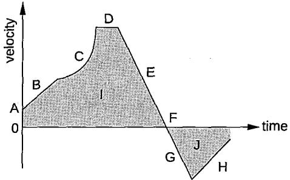

## Answer

A The initial velocity of the object.

B It moves at a constant acceleration.

C It has an increasing acceleration (or The velocity is increasing at an increasing rate).

D It has a constant velocity.

E It has a uniform deceleration (slowing down while moving forwards).

F It has a zero velocity/at rest.

G It has a constant acceleration while moving backwards.

H It has a constant deceleration while moving backwards.

IDistance travelled forwards

JDistance travelled backwards

Remarks:

》 The total distance travelled = I + J

When given initial velocity, final velocity and displacement, in order to ind time, we must sketch a velocity-time graph to help us obtain the correct value for time.

## Worked example 2

» The total displacement = I + (-J) = I − J

## Question

A car is travelling with uniform acceleration along a straight road. The road is lined with a tree every 60 m. When the car passes one tree, it has a velocity of 5 m/s and, when it passes the next one, its velocity is 10 ${ \mathfrak { m } } / { \mathfrak { s } }$ What is the car's acceleration?

## Remark:

## Answer Given:

Distance between two trees = 60 m Initial velocity = 5 m/s Final velocity = 10 m/s

Let the time the car travelled 60 m as t.

$$
6 0 = { \frac { 1 } { 2 } } ( 5 + 1 0 ) ( t )
$$

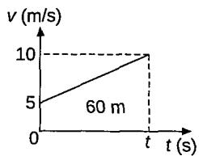

$$
t = 8 5
$$

$$
a = \frac { 1 0 - 5 } { 8 } = 0 . 6 2 5 m / s ^ { 2 }
$$

## Question 7

The motion of a car travelling in a straight line is tracked for 60 seconds. The information is then displayed in the velocity-time graph.

(a) Calculate the acceleration of the car at 20 s.

(b) Calculate the distance travelled in the first 28 seconds.

(c) Calculate the displacement of the car from its starting point after 60 seconds.

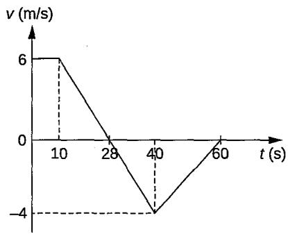

## Question8

A boy goes for a ride on his bike. The graph shows how his displacement from the start of his ride changes with time.

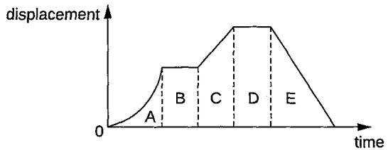

The graph has been divided into five regions, A, B, C, D and E.

(a) Which region or regions show each type of motion? Put ticks (√) in the correct box or boxes for each row. You may tick more than one box in a row.

<table><tr><td rowspan=2 colspan=1>Type of motion</td><td rowspan=1 colspan=5>Region</td></tr><tr><td rowspan=1 colspan=1>A</td><td rowspan=1 colspan=1>B</td><td rowspan=1 colspan=1>C</td><td rowspan=1 colspan=1>D</td><td rowspan=1 colspan=1>E</td></tr><tr><td rowspan=1 colspan=1>Stationary</td><td rowspan=1 colspan=1></td><td rowspan=1 colspan=1></td><td rowspan=1 colspan=1></td><td rowspan=1 colspan=1></td><td rowspan=1 colspan=1></td></tr><tr><td rowspan=1 colspan=1>Moving with constant speed</td><td rowspan=1 colspan=1></td><td rowspan=1 colspan=1></td><td rowspan=1 colspan=1></td><td rowspan=1 colspan=1></td><td rowspan=1 colspan=1></td></tr><tr><td rowspan=1 colspan=1>Accelerating</td><td rowspan=1 colspan=1></td><td rowspan=1 colspan=1></td><td rowspan=1 colspan=1></td><td rowspan=1 colspan=1></td><td rowspan=1 colspan=1></td></tr></table>

(b) Which of the following sketch graphs, 1, 2, 3 or 4, shows the boy's velocity in regions C, D and E?

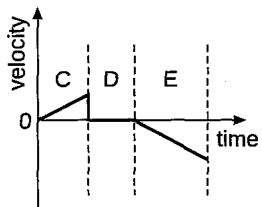

1

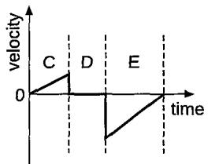

2

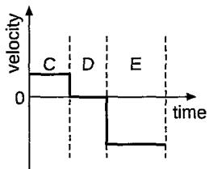

3

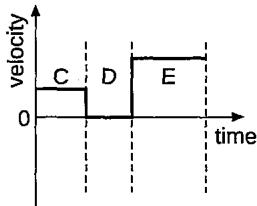

4

(c) On the sketch graph below, show how the boy's velocity changes with time in region A.

## Question 9

The diagram show the velocity-time graph of an object moving in a straight line.

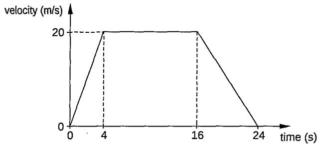

Calculate

(a) the distance travelled by the object when it is moving at a constant speed,

(b) the deceleration of the object,

(c) the average velocity of the object.

## Question 10

The velocity-time graph shows the motion of a particle starting from rest in a straight line.

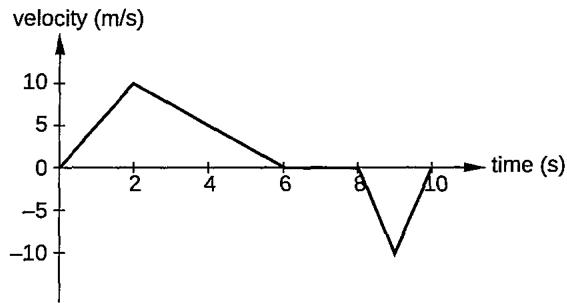

(a) How long is the particle at rest before moving in the opposite direction?

(b) Calculate

(i) the average speed of the particle,

(ii) the average velocity of the particle.

## Question 11

A car travelling at a velocity of 5 m/s accelerates at 0.5 m/s². In a time of 6.0 s, what is the distance travelled by the car?

## Free fall

What is meant by free fall?

What is the acceleration of a free falling object near the surface of Earth?

What are the two important characteristics of a free falling object?

Explain why the speed of a free falling object increases when it falls towards the Earth's surface.

It is a state of motion in which any object is only acted upon by the force of gravity.

• Approximately 9.8 $m / s ^ { 2 }$ near the surface of Earth

Sketch the velocity-time graph of a free falling object.

• Often rounded to $\mathsf { 1 0 m } / s ^ { 2 }$ for simplicity in calculations

• It does not experience air resistance.

•  It accelerates downwards at a rate of $9 . 8 ~ \mathsf { m } / \mathsf { s } ^ { 2 }$

When a free falling object is in motion towards the Earth's surface, it accelerates due to the force of gravity.

This acceleration means that every second, the magnitude of the velocity increases by approximately 9.8 m/s downwards.

This consistent increase in velocity is why the speed of the object increases as it falls towards the Earth's surface.

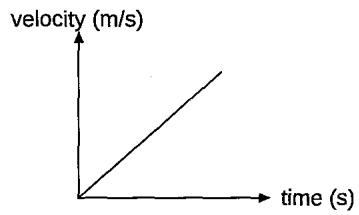

## Remarks:

The gradient of the graph is constant. This indicates that the acceleration of a free falling is constant.

We can use $a = ( \nu - u ) / t$ to calculate the constant acceleration of free-falling objects or objects falling with negligible air resistance if v, u and t are known.

## TOPICAL TEST 2

## Section A: Multiple-choice Questions

1 Which of the following must change if a body experiences acceleration?

A force acting on the body

B density of the body

C mass of the body

D velocity

2Which graph best represents the motion of a car travelling with a constant velocity?

A  
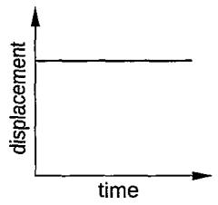

B  
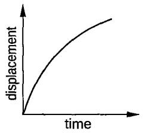

C  
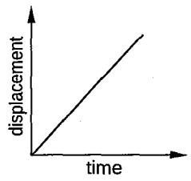

D  
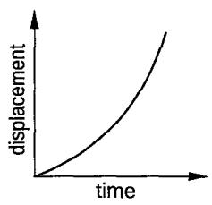

The velocity (v)-time (t) graph shows the motion of two cars, X and Y, travelling in a straight line towards the same direction.

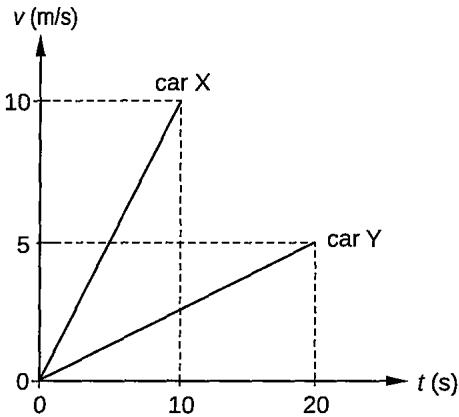

Which of the following statements about cars X and Y is correct?

AThe acceleration of both cars X and Y is the same.

B The distance travelled by both cars X and Y is the same.

C The acceleration of car Y is greater than car X.

D The average velocity of car Y is greater than car X.

4 Which of the following pairs of graphs can be used to represent the same motion of an object?

A  
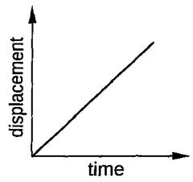

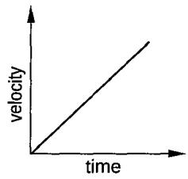

B  

C  

D  

Which graph best represents the motion of an object, initially at rest, that accelerates uniformly in a straight line?

D  

6 The graph shows the motion of a car along a straight road over a period of 25 s.

What was the distance travelled by the car during the time when it was travelling at a uniform velocity? A 40 m B 120 m C 185 m D 200 m

7The graph shows the motion of a car.

If the total displacement of the car is 35 m in 10 s, what is the value of v? A 1 m/s B 5 m/s C 15 m/s D 20 m/s

8 The graph shows a straight-line motion of an object.

Which feature of the graph represents the distance traveled by the object whilst travelling at a steady acceleration? A area Y B area Z C $\mathtt { a r e a } \mathsf { X } + \mathtt { a r e a } \mathsf { Y }$ D area Y + area Z

The diagram shows a velocity-time graph.

velocity (m/s)

In which region does the car experience increasing acceleration? A P to Q B Q to R C R to S D T to W

10 A motorcyclist rides at an initial velocity of 10 m/s. He then accelerates to a velocity of 25 m/s in 5 s. What is the acceleration of the motorcyclist? A 3 $\mathsf { m } / \mathsf { s } ^ { 2 }$ B 5 $\mathsf { m } / \mathsf { s } ^ { 2 }$ C 10 $\mathsf { m } / \mathsf { s } ^ { 2 }$ D 25 $\mathsf { m } / \mathsf { s } ^ { 2 }$

## Section B: Structured Questions

1 The velocity (v)-time (t) graph shows the motion of a car.

(a) Describe the motion of the car shown in the graph.

(b) Calculate

(i) the acceleration in the first 10 s of the car journey.

(ii) the average speed of the car for the whole journey.

2 The speed (v)-time (t) graph shows the motion of a ball. It falls vertically and hits the ground. It then rebounds vertically upwards.

The ball is released at P, hits the ground at Q and is in contact with the floor between Q and R. S is the highest point reached as the ball rises.

(a) From the graph, describe the motion of the ball between P and Q.

(b) State how the graph shows that the distance travelled between P and Q is larger than the distance travelled between R and S.

(c) (i) Explain the difference between speed and velocity.

(ii) Determine the change in speed of the ball between Q and R, the change in velocity of the ball between Q and R.

3 The velocity (v)-time (t) graph shows the motion of a cyclist travelling along a straight road. Upon approaching a bridge, the cyclist slows down. The cyclist rides at a constant speed from the start of the bridge, at X, to the end of the bridge, at Y. The cyclist speeds up after passing through the bridge.

(a) Calculate the distance travelled by the bicycle on the bridge.

(b)The cyclist accelerates after passing through the bridge. Calculate the acceleration.

(c) A second cyclist is stationary on the road at the point where the bridge starts. He accelerates uniformly for 50 s and reaches a speed of 2 m/s. Determine whether the second cyclist reaches the end of the bridge in 50 s.

## Section C: Free-response Questions

1 (a) A car travelling with a velocity of 5 m/s accelerates uniformly at a constant acceleration of 2 m/s² for 30 s. Calculate the distance travelled by the car while it is accelerating.

(b) A cyclist is travelling due east with a velocity of 16 m/s. The cyclist changes velocity to be travelling due south with a velocity of 12 m/s. Draw a vector diagram to calculate the change in the velocity of the cyclist.

## 2 The velocity (v)-time (t) graph shows the motion of two cars X and Y.

  
Both cars travel along a straight road in the same direction.

(a) Car X travels at a uniform velocity. Car Y is at rest until t = 20 s, when it then starts moving with a uniform acceleration. (i) State what is meant by uniform velocity. (ii) State what is meant by uniform acceleration.   
(b) At t = 0, car X passes car Y. Determine the distance between cars X and Y at time $t = 3 8 s .$

(c) Describe how the distance between the two cars changes between t = 0 and t = 38 s.

(d) Calculate the average velocity of cars X and Y respectively for the whole journey shown in the graph.