## Section A: Multiple-choice Questions

1 What is meant by the weight of an object?

A the gravitational field acting on the object

B the gravitational force acting on the object

C the mass of the object multiplied by gravity

Dthe object's mass multiplied by its acceleration

2 Object X has a mass of 10 kg and object Y has a mass of 60 kg. The gravitational field strength on the Moon is 1.6 N/kg. Which statement about objects X and Y is correct?

A The inertia of X on the Earth is greater than its inertia on the Moon.

B The weights of X and Y do not change when they are taken from the Earth to the Moon.

C X experiences the same gravitational field strength as Y on the Moon.

D X has about the same weight on the Moon as Y has on the Earth.

An object has a mass of 50 kg. The gravitational field strength on Earth is 10.0 N / kg. The gravitational field strength on a distant planet is 4.0 N / kg. What is the weight of the object on Earth, and what is its weight on the distant planet?

<table><tr><td rowspan=1 colspan=1></td><td rowspan=1 colspan=1>on Earth</td><td rowspan=1 colspan=1>on the distantplanet</td></tr><tr><td rowspan=1 colspan=1>A</td><td rowspan=1 colspan=1>5.0 kg</td><td rowspan=1 colspan=1>12.5 kg</td></tr><tr><td rowspan=1 colspan=1>B</td><td rowspan=1 colspan=1>5.0 N</td><td rowspan=1 colspan=1>12.5 N</td></tr><tr><td rowspan=1 colspan=1>C</td><td rowspan=1 colspan=1>500 kg</td><td rowspan=1 colspan=1>200 kg</td></tr><tr><td rowspan=1 colspan=1>D</td><td rowspan=1 colspan=1>500 N</td><td rowspan=1 colspan=1>200 N</td></tr></table>

4 Diagram 1 shows a piece of foam rubber that contains many pockets of air. Diagram 2 shows the same piece of foam rubber after it has been compressed so that its volume decreases.

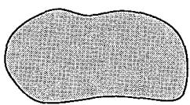

Diagram 1 (before compression)

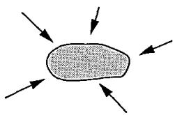  
Diagram 2 (after compression)

What happens to the mass and to the weight of the foam rubber when it is compressed?

<table><tr><td rowspan=1 colspan=1></td><td rowspan=1 colspan=1>mass</td><td rowspan=1 colspan=1>weight</td></tr><tr><td rowspan=1 colspan=1>A</td><td rowspan=1 colspan=1>decreases</td><td rowspan=1 colspan=1>decreases</td></tr><tr><td rowspan=1 colspan=1>B</td><td rowspan=1 colspan=1>decreases</td><td rowspan=1 colspan=1>no change</td></tr><tr><td rowspan=1 colspan=1>C</td><td rowspan=1 colspan=1>no change</td><td rowspan=1 colspan=1>decreases</td></tr><tr><td rowspan=1 colspan=1>D</td><td rowspan=1 colspan=1>no change</td><td rowspan=1 colspan=1>no change</td></tr></table>

An astronaut in an orbiting spacecraft experiences a force due to gravity. This force is less than when she is on the Earth's surface. Compared with being on the Earth's surface, how do her mass and her weight change when she goes into orbit?

<table><tr><td rowspan=1 colspan=1></td><td rowspan=1 colspan=1>mass in orbit</td><td rowspan=1 colspan=1>weight in orbit</td></tr><tr><td rowspan=1 colspan=1>A</td><td rowspan=1 colspan=1>decreases</td><td rowspan=1 colspan=1>decreases</td></tr><tr><td rowspan=1 colspan=1>B</td><td rowspan=1 colspan=1>decreases</td><td rowspan=1 colspan=1>unchanged</td></tr><tr><td rowspan=1 colspan=1>C</td><td rowspan=1 colspan=1>unchanged</td><td rowspan=1 colspan=1>decreases</td></tr><tr><td rowspan=1 colspan=1>D</td><td rowspan=1 colspan=1>unchanged</td><td rowspan=1 colspan=1>unchanged</td></tr></table>

6 The mass of an object is measured on Earth. The mass is 5.0 kg. The object is taken to the Moon. The mass of the object is measured on the Moon. What is the mass of the object on the Moon? A 0 kg B more than 0 kg, but less than 5.0 kg C 5.0 kg D more than 5.0 kg

7 Which statement about mass or weight is correct? A Mass is a force. B Mass is measured in newtons. C Weight is a force. D Weight is measured in kilograms.

8 What is the weight of an object? A the force of gravity on the object B the energy in the gravitational potential store of the object C the energy in the internal store of the object D the mass of the object

9 Which instrument is used to compare the masses of objects? A a balance B a barometer C a manometer D a measuring cylinder

10 A 1 kg sample of aluminium is stored in a laboratory. In a different laboratory, in the same town, there is a 1 kg sample of iron. Which quantity must these two samples always have in common? A the same density B the same temperature C the same volume D the same weight

11 A student stands with both feet on some scales in order to measure his weight. The reading on the scales is 500 N. He lifts one foot off the scales and keeps it lifted. What is the new reading on the scales? A 0 B 250 N C 500 N D 1000 N

12 Which statement about mass and weight is correct? A Mass and weight are both forces. B Neither mass nor weight is a force. C Only mass is a force. D Only weight is a force.

Two blocks of metal X and Y hang from spring balances, as shown in the diagrams.

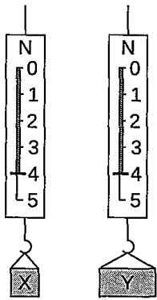

What does the diagram show about X and Y?

A They have the same mass and the same volume but different weights.

BThey have the same mass and the same weight but different volumes.

C They have the same mass, the same volume and the same weight.

D They have the same weight and the same volume but different masses.

14 A child sits on a rubber ball and bounces up and down on the ground.

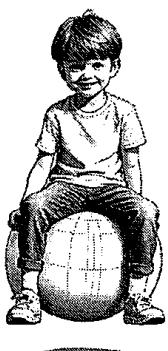

What stays the same when the ball hits the ground?

A the acceleration of the ball B the mass of the ball

C the shape of the bal the velocity of the ball

A student places object X on the left-hand pan of a balance. The two pans are level as shown when object Y with a weight of 23 N are placed on the right-hand pan. Take the weight of 1.0 kg to be 10 N.

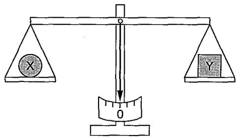

What is the mass of object X?

A 0.023 kg B 2.3 kg C 23 kg D 230 kg

## Section B: Structured Questions

(a)Distinguish between the mass of a body and its weight.

(b) State one situation where a body of a constant mass may experience a change in its apparent weight (how heavy we feel). [2]

2 During a space programme, an astronaut of mass 80 kg travelled to the moon. The gravitational field strength did not remain the same throughout the journey.

(a)What is meant by gravitational field strength?

(b) Complete the last two columns of the table below to show the astronaut's mass and his weight in different situations. [2]

<table><tr><td rowspan=1 colspan=1>Situation</td><td rowspan=1 colspan=1>Gravitational fieldstrength</td><td rowspan=1 colspan=1>Mass</td><td rowspan=1 colspan=1>Weight</td></tr><tr><td rowspan=1 colspan=1>On the Earth</td><td rowspan=1 colspan=1>10 N/kg</td><td rowspan=1 colspan=1></td><td rowspan=1 colspan=1></td></tr><tr><td rowspan=1 colspan=1>At a point in the journey</td><td rowspan=1 colspan=1>negligible</td><td rowspan=1 colspan=1></td><td rowspan=1 colspan=1></td></tr><tr><td rowspan=1 colspan=1>On the moon</td><td rowspan=1 colspan=1>1.6 N/kg</td><td rowspan=1 colspan=1></td><td rowspan=1 colspan=1></td></tr></table>

A satellite orbits Earth at a height of 760 km. It has a mass of 2 × 10⁴ kg. The graph shows how the gravitational field strength varies with height above the surface of the Earth.

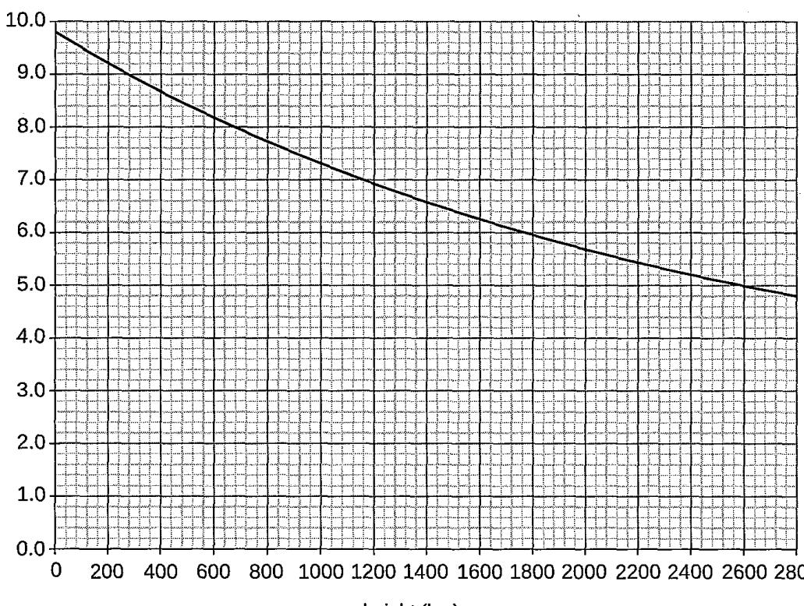

(a)What is the value of the gravitational field strength at the orbital height of the satellite? [1]

(b)Calculate the weight of the satellite at this height. [1]

(c) As the satellite is taken from Earth to its orbital height, what happens to its weight and mass? [2]

Study the two statements below. Each statement is incorrect. In the space alongside each statement, say what is wrong with the statement. [2]

<table><tr><td rowspan=1 colspan=1></td><td rowspan=1 colspan=1>statement</td><td rowspan=1 colspan=1>what is wrong with this statement</td></tr><tr><td rowspan=1 colspan=1>(a)</td><td rowspan=1 colspan=1>“The weight of this bag of peas is 5 kg.&quot;</td><td rowspan=1 colspan=1></td></tr><tr><td rowspan=1 colspan=1>(b)</td><td rowspan=1 colspan=1>&quot;The mass of this object is another name forits weight.&quot;</td><td rowspan=1 colspan=1></td></tr></table>

5 Different planets have different gravitational field strengths at their surface.

<table><tr><td rowspan=1 colspan=1>Planet</td><td rowspan=1 colspan=1>Gravitational field strength (N/kg)</td></tr><tr><td rowspan=1 colspan=1>Earth</td><td rowspan=1 colspan=1>10</td></tr><tr><td rowspan=1 colspan=1>Mars</td><td rowspan=1 colspan=1>3.7</td></tr><tr><td rowspan=1 colspan=1>Venus</td><td rowspan=1 colspan=1>8.8</td></tr></table>

(a)On which planet's surface would an astronaut have the greatest weight? Explain your answer.

(b) State one property of a planet affects its gravitational field strength. [1]

## Section C: Free-response Questions

1(a)A physical science test book has a mass of 2.2 kg.

(i) What is the weight on the Earth? Take g of Earth as 10 N/kg. [1]

(ii) What is the weight on Mars? Take g of Mars as 3.7 N/kg. [1]

(iii) If the textbook weighs 19.6 N on Venus, What is the gravitational field strength of Venus? [2]

(b) Some students observe drops of water falling from a tap that leaks, as shown in the diagram.

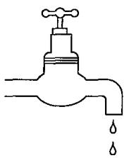

(i) The students measure the time for 50 drops to fall from the tap. The time for 50 drops to fall is 20 s. Calculate the average time between two drops falling. [2]

The students collect some drops of water.

(ii) The students measure the volume of the water they collect. State the equipment that is suitable for measuring the volume accurately. [1]

(iii) In a similar experiment, another student collects 0.21 kg of water. Calculate the weight of this water. Take g as 10 N/kg. [3]

An astronaut landed on the Moon and carried out an experiment by dropping a hammer from a certain height. The graph shows how the velocity of the hammer changed with time.

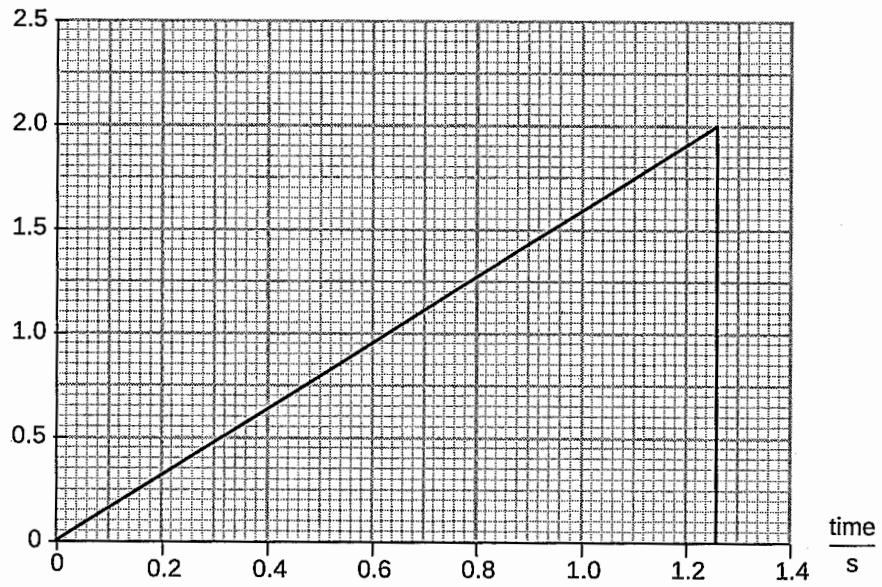

(i) Use the graph to calculate the acceleration due to gravity on the Moon. Give the unit. [3]

(ii) Use the graph to calculate the height the hammer was dropped from. [2]

(iii) The gravitational field strength is smaller on the Moon than on the Earth. Suggest why. [1]

Of all the planets in our solar system, Jupiter has the greatest gravitational strength.

(i) If a 0.5 kg pair of running shoes would weigh 11.55 N on Jupiter, what is the gravitational field strength of this planet? [1]

(ii) If the same pair of shoes weighs 0.3 N on Pluto, what is the gravitational field strength of Pluto? [1]

(iii) State two differences between mass and weight of the pair of running shoes when they are placed in different planets. [2]

Weightlessness is experienced when someone falls with the acceleration of a free fall. In an experimental setting, a physicist reaches a speed of 20 m/s in 3.0 seconds after starting from rest.

(i) Calculate the acceleration of the physicist. [2]

(ii)Does the physicist experience weightlessness? Explain your answer. [3]

(iii) What happens to the value of the physicist's mass during the fall? [1]

(iv) Calculate the distance fallen by the physicist during these 3.0 seconds. [3]

Another physicist slides down a slope without changing his speed. The slope is shown below.

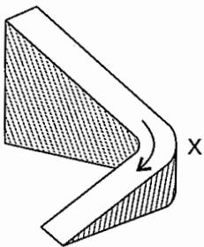

Explain why he has an acceleration at the corner of the slope at X.

## Section A: Multiple-choice Questions

1 Which property of a body cannot be changed if a force is applied to it? A its shape B its mass C its velocity D its size

2 A car is travelling at constant speed along a road and drives over a large patch of oil. The driver applies the brakes to stop the car. Compared to braking on a dry road, what may happen?

A The car takes longer to slow down because the thinking distance of the driver is greater.

B The car slows down more quickly because of the greater friction between the tyres and the road.

C The car speeds up at first because of the reduced friction between the tyres and the road.

D The car takes longer to slow down because of the reduced friction between the tyres and the road.

A force F is applied to a freely moving object. At one instant of time, the object has velocity v and acceleration a. Which quantities must be in the same direction? A a and v only B a and F only v and F only D v, F and a

4 The engine of an 800 kg car exerts a constant forward force of 500 N on the car. When the parachute is opened, the car decelerates at 2.5 m/s² while the engine continues to provide the forward force of 500 N.

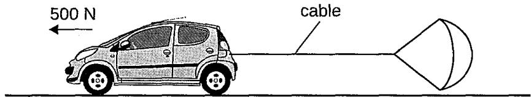

If there is no other resistive force, what is the tension in the cable at this instance? A 500 N B 1500 N C 2000 N D 2500 N

A skydiver falls at terminal velocity. He then opens his parachute. Which row gives the direction of the resultant force on the skydiver and the direction of the acceleration of the skydiver, immediately after the parachute opens?

<table><tr><td rowspan=1 colspan=1></td><td rowspan=1 colspan=1>resultant force</td><td rowspan=1 colspan=1>acceleration</td></tr><tr><td rowspan=1 colspan=1>A</td><td rowspan=1 colspan=1>downwards</td><td rowspan=1 colspan=1>downwards</td></tr><tr><td rowspan=1 colspan=1>B</td><td rowspan=1 colspan=1>downwards</td><td rowspan=1 colspan=1>upwards</td></tr><tr><td rowspan=1 colspan=1>C</td><td rowspan=1 colspan=1>upwards</td><td rowspan=1 colspan=1>downwards</td></tr><tr><td rowspan=1 colspan=1>D</td><td rowspan=1 colspan=1>upwards</td><td rowspan=1 colspan=1>upwards</td></tr></table>

6 What must change when a body is accelerating? A the mass of the body B the speed of the body C the velocity of the body D the resultant force of the body

The diagram shows the velocity-time graph of a car. The total resistive force acting on the car is 1000 N.   
The mass of the car is 1000 kg.

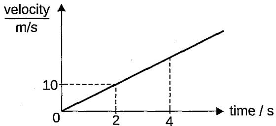

What is the resultant force acting on the car at $\pm = 4 . 0 \ { \mathsf { s ? } }$ A ON B 4000 N C 5000 N D 6000 N

8 The diagram shows a person using a rope to pull a load on a rough surface to the right. The load moves at a constant speed.

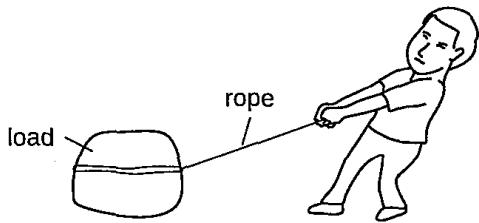

Which pair of forces is a pair of action and reaction forces?

A The weight of the load and the normal reaction force acting on the load by the ground.

B Frictional force acting on the load by the ground and the pulling force acting on the load.

C The frictional force acting on the person by the ground and the frictional force acting on the load by the ground.

D The pulling force on the load and the tension force experienced by the rope.

9 An engine pulls a truck at a constant speed on a level track.

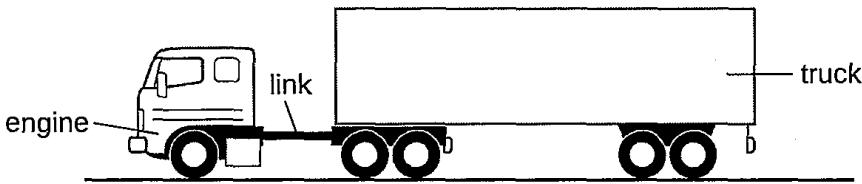

The link between the engine and the truck breaks. The driving force on the engine remains constant. What effect does this have on the engine and the truck?

<table><tr><td rowspan=1 colspan=1></td><td rowspan=1 colspan=1>engine</td><td rowspan=1 colspan=1>truck</td></tr><tr><td rowspan=1 colspan=1>A</td><td rowspan=1 colspan=1>speed stays constant</td><td rowspan=1 colspan=1>slows down</td></tr><tr><td rowspan=1 colspan=1>B</td><td rowspan=1 colspan=1>speed stays constant</td><td rowspan=1 colspan=1>stops immediately</td></tr><tr><td rowspan=1 colspan=1>C</td><td rowspan=1 colspan=1>speeds up</td><td rowspan=1 colspan=1>slows down</td></tr><tr><td rowspan=1 colspan=1>D</td><td rowspan=1 colspan=1>speeds up</td><td rowspan=1 colspan=1>stops immediately</td></tr></table>

Two balls are dropped one after another from the same height. Assuming that the air resistance is negligible, which of the following statements is true?   
A The two balls get closer as they descend.   
B The two balls drop with a constant speed.   
C The two balls get further away as they descend.   
D The two balls drop with a constant distance between them.

Two metal blocks are stacked one on top of the other as shown. They are dropped in vacuum, falling together freely under Earth's gravitational field. Take g as 10 m/s².

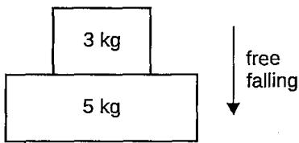

What is the net force acting on the 5 kg metal block during the fall? AON B 30 N C 50 N D 80 N

12 A 1500 kg car travelling at a constant velocity of 25 m/s encounters a total resistive force of 50 kN. Assuming there are no other horizontal forces acting on the car, which of these relationships describes the driving force F provided by the engine? A F=ON B F < 50 kN C F= 50 kN D F> 50 kN

A skydiver of mass 70 kg is falling through air when he opens his parachute. After the parachute is opened, the initial deceleration of the skydiver is 20 m/s². What is the initial air resistance acting on the skydiver after the parachute is opened? Take the gravitational field strength as 10 N/kg. A 700 N B 1400 N C 2100 N D 2400 N

A box is placing on a weighing scale inside a lift. The weighing scale reads 200 N when the lift is stationary.

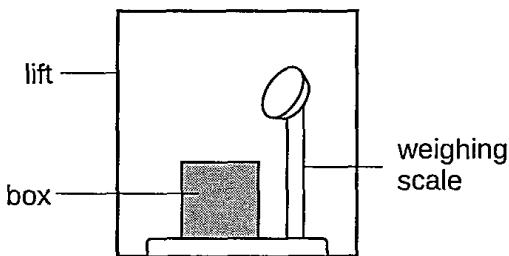

Which option describes correctly the reading on the weighing scale when the lift accelerates upwards and when the lift accelerates downwards?

<table><tr><td rowspan=1 colspan=1></td><td rowspan=1 colspan=1>lift accelerating upwards</td><td rowspan=1 colspan=1>lift accelerating downwards</td></tr><tr><td rowspan=1 colspan=1>A</td><td rowspan=1 colspan=1>more than 200 N</td><td rowspan=1 colspan=1>less than 200 N</td></tr><tr><td rowspan=1 colspan=1>B</td><td rowspan=1 colspan=1>less than 200 N</td><td rowspan=1 colspan=1>more than 200 N</td></tr><tr><td rowspan=1 colspan=1>C</td><td rowspan=1 colspan=1>200 N</td><td rowspan=1 colspan=1>less than 200 N</td></tr><tr><td rowspan=1 colspan=1>D</td><td rowspan=1 colspan=1>more than 200 N</td><td rowspan=1 colspan=1>200 N</td></tr></table>

A wooden box of mass 2.0 kg is pushed horizontally across a table.

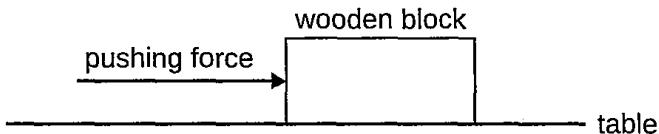

It the acceleration of the block is 0.40 m/s² and the frictional force acting against the block's motion is 20 N, what is the magnitude of the pushing force? A 0.80 N B 19.2 N C 20 N D 20.8 N

Two blocks with masses 4M and 2M are pushed along a horizontal frictionless surface by a horizontal applied force F as shown.

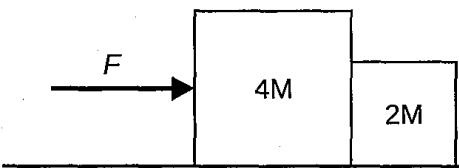

During the motion, both blocks exert equal and opposite forces against each other. What is the magnitude of this egual but opposite force? A $\frac { F } { 2 }$ B $\frac { F } { 3 }$ C $\frac { 2 F } { 3 }$ D F

17 A boy applied a force, F, to pull a box across the floor at a constant velocity. If the boy now uses twice the amount of the force to pull the box across the same floor, the box will move A at the same constant velocity. B at a higher constant velocity. C with a uniform acceleration. D with an increasing acceleration.

18 A large pail, lifted by a rope attached to a motor, is used to lift heavy loads. The pail, of totaí mass m when fully loaded, rises at a uniform velocity v before decelerating uniformly to rest in time t. The gravitational field strength is g. What is the difference between the tensions in the rope supporting the pail when the pail is travelling at uniform velocity and when the pail is decelerating? A $\frac { - m v } { t }$ B $\frac { - m g } { t }$ C $m \left( g + { \frac { v } { t } } \right)$ D $m \left( g - { \frac { v } { t } } \right)$

19A mass accelerates uniformly when the resultant force acting on it A is zero. B is constant but not zero. C increases uniformly with respect to time. D is proportional to the displacement from a fixed point.

Diagram 1 shows a wooden block initially at rest on a smooth horizontal surface. A pulling force F acting on the wooden block varies as shown in Diagram 2.

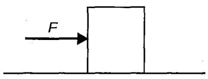  
Diagram 1

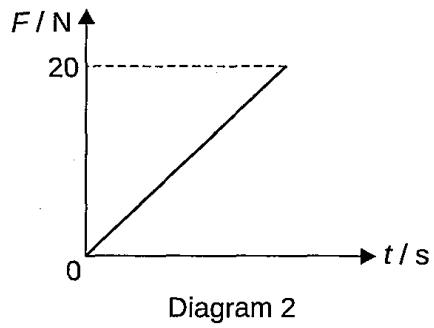

Which graph best describes the motion of the wooden block?

A  
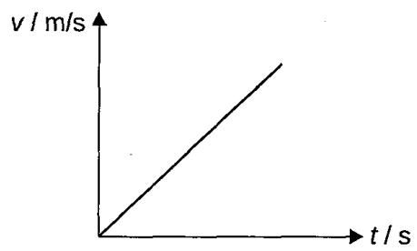

B  
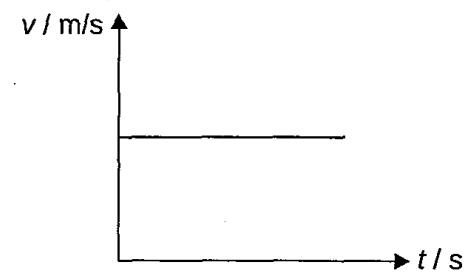

C  
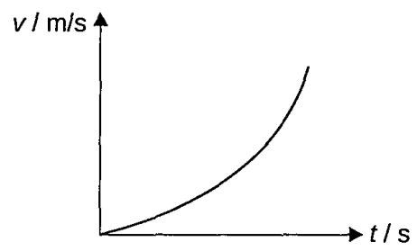

D  
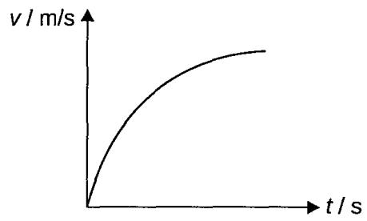

Section B: Structured Questions

(a) Two blocks of mass 4 kg and 6 kg are tied together on a horizontai table. They system is pulled by a horizontal force of 30 N as shown below.

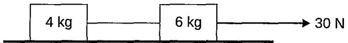

Find the acceleration of the system and the tension in the string connecting the blocks if

(i) the table is smooth,

[2]

(ii) the friction between the table and each block is 4 N.

[2]

The diagram below shows the grasshopper of mass $3 . 0 \times 1 0 ^ { - 5 }$ kg at the instant when it is at its maximum height above the ground.

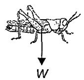

ground

(i) The arrow labelled W represents the force of gravity on the grasshopper due to the Earth. Identify the Newton Third Law of Motion 'equal and opposite' force to W. [1]

(ii) Calculate the magnitude of the force you identified in (b)(i).

[1]

[2]

A car accelerates from rest in a straight line. During the first 14 s, the acceleration is uniform and the car reaches a velocity of 25 m/s.

(a) (i) Calculate the acceleration of the car.

(ii) After the first 14 s, the velocity of the car continues to increase but the acceleration decreases gradually. From 70 s to 80 s after the start, the car moves at a constant velocity of 55 m/s. On the diagram, sketch a possible velocity-time graph for the car. [2]

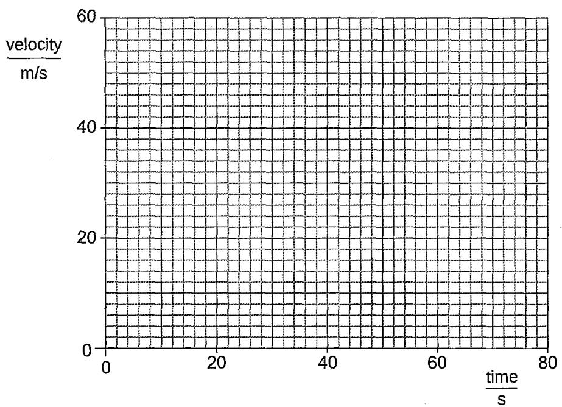

(b) At a later time, the driver applies the brakes to stop. As he is wearing a seat belt, his body slows down in his seat. However, a bag on the seat next to him slides forwards, across the seat towards the front of the car. Using ideas about the forces acting, explain why

(i) the driver slows down,

(ii) the bag slides forwards.

3 Diagram 1 shows a skydiver, of weight 700 N, falling towards the Earth at constant velocity, a long time after jumping from an aeroplane. At time t = 0, he receives a radio signal. He opens his parachute 12 s later. Diagram 2 shows the velocity-time graph for the skydiver.

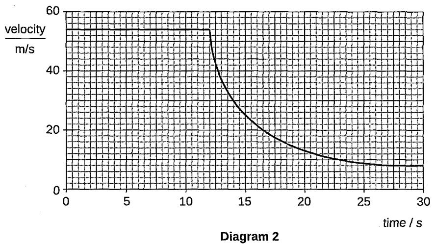  
(a) (i) As the skydiver jumps from the aeroplane initially, he is experiencing free-fall. State what is meant by experiencing free-fall. [1]

(ii) State the initial acceleration of the skydiver, as he initially jumps from the aeroplane. [1]

(b) State the size of the air resistance acting on the skydiver between t = 0 and t = 12 s. [1] (i) Using Newton's Laws of Motion, state and explain the effect on the motion of the skydiver of opening the parachute. [3]

(ii) As the skydiver is experiencing the motion as stated in (c)(i), according to Newton's Laws of Motion, the weight of the skydiver is one of the two forces that form an action-reaction pair of forces. Illustrate these two forces by drawing a pair of free-body diagram. [2]

Diagram 1 shows how the velocity of a cyclist travelling along a straight road changes with time. The mass of the cyclist and the bicycle is 80 kg

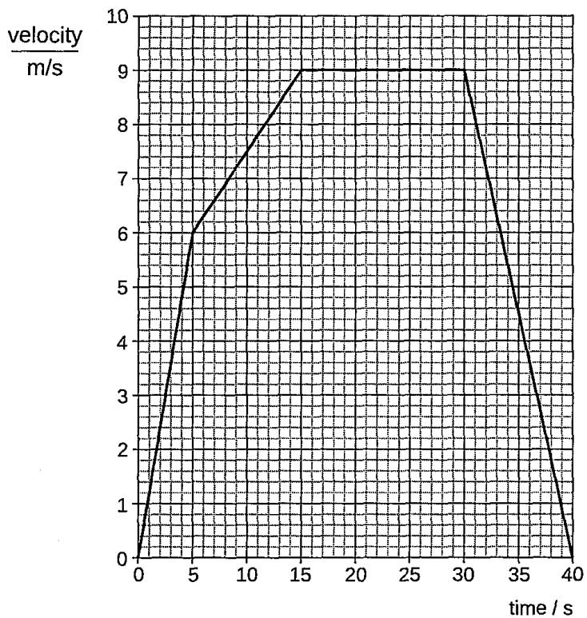  
Diagram 1

(i) Calculate the acceleration and hence the resultant force needed to produce this acceleration for the first 5.0 s of his journey. [3]

(ii)Calculate the distance travelled by the cyclist when decelerating.

Diagram 2 shows the horizontal forces acting on the cyclist at three different speeds. The length of an arrow represents the size of the forces.

B  
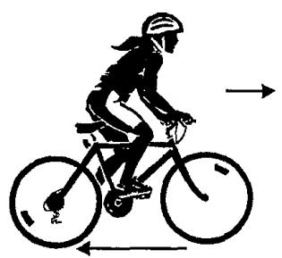  
Diagram 2

C  

(i) Which one of the diagrams, A, B or C, represents the forces acting when the cyclist is travelling at a constant speed of 9.0 m/s? [1]

(ii) Explain the reason for your choice. [2]

At a construction site, a crane is used to lift a long and heavy metal bar. Diagram 1 shows part of the lifting mechanism comprising a main cable PQ, two other cables QR and QS, and the metal bar. QR and QS make an angle of 100°.

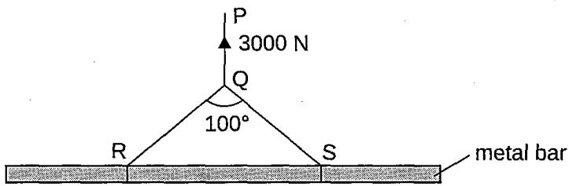  
Diagram 1

When the metal bar is being lifted verticaly at a constant speed, the tension in the main cable PQ is 3000 N. Take gravitational field strength g to be 10 N/kg.

(i) Given that the tension of cables QR and QS are equal, use a scaled drawing to determine the tension in each of these two cables. [2]

(ii) Calculate the total mass of the three cables and metal bar.

Diagram 2 represents three vectors A, B and C. Draw a sketch diagram to represent a vector D as the sum of the three vectors A, B and C. [1]

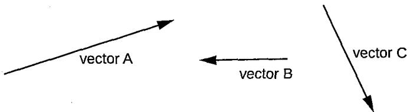  
Diagram 2

The diagram shows load X connected by a string to load Y over a frictionless pulley. Load X has a mass of 4.4 kg. The system accelerates at 1.8 m/s² in the direction shown. Take g as 10 N/kg.

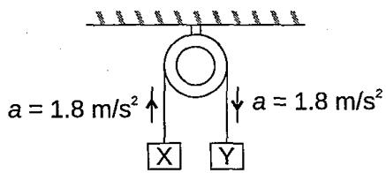

(a) Draw and label a free-body diagram for load X.

(b) Calculate the tension in the string. [2]

(c) Find the mass of load Y. [2]

(a) A buoy is held submerged in sea water by a rope anchored to the sea bed. Currents in the sea cause the buoy to be displaced so that the rope makes an angle of 35º with the vertical as shown in the diagram. The buoy may be considered to be acted upon by three forces: the tension T in the rope which is 600 N, a horizontal force of sea current H and a vertical force known as upthrust V.

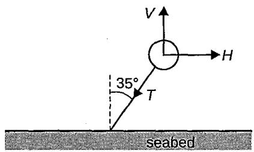

By means of a scale drawing, determine the value of the upthrust, V and horizontal force, H. [4] (b) A hot balloon is moving horizontally at a steady velocity when the stone is released. State whether the stone will land on the ground behind, directly beneath or in front of the moving basket. Explain your answer. [3]

Diagram 1 shows a boy standing on a weighing scale inside an elevator which is at rest. The weighing scale reads 500 N. Take g as 10 N/kg.

Diagram 2  
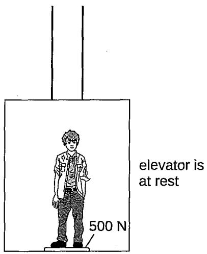  
Diagram 1

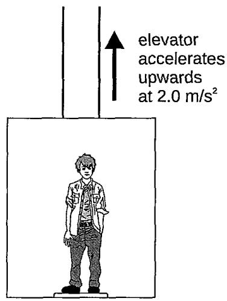

(a) On Diagram 1, draw and label the two forces acting on the boy. [1]

(b) Calculate the mass of the student. [1]

(c)Diagram 2 shows the elevator accelerating upwards momentarily at 2.0 m/s². Then it moves with a steady velocity of 6 m/s.

(i) Calculate the resultant force acting on the student when the elevator is accelerating at 2.0 m/s². [2]

(ii) Hence, state the reading of the scale. [1]

(iii) State and explain the reading of the scale when the elevator is moving with a steady velocity of 6 m/s. [2]

The diagram shows the velocity-time graph for a rocket from the moment that the fuel starts to burn at time t = 0.

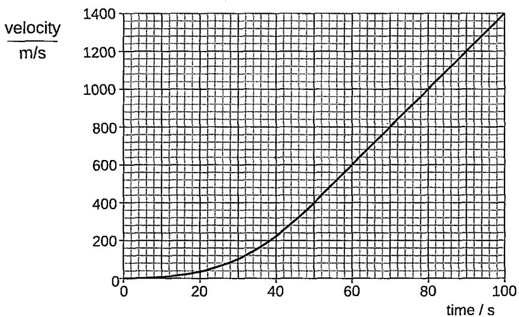  
(a) (i) State what happens to the acceleration of the rocket between $\mathbf { \boldsymbol { t } } = 5 \mathrm { ~ s ~ a n d ~ } \mathbf { \boldsymbol { t } } = 8 0 \mathrm { ~ s ~ } .$ [1]

(ii) Calculate the acceleration of the rocket at $t = 8 0 \thinspace s ,$ [2] (iii). The total mass of the rocket at $t = 8 0 \ s \ i s \ 1 . 5 \times 1 0 ^ { 6 }$ kg. Calculate the upward force on the rocket at this time, causing by the burning fuel. [2]

(b) As the rocket burns fuel, it ejects hot gas downwards. State how Newton's Third Law of Motion applies to the upward force on the rocket and to the force on the hot gas. [1]

The diagram shows the velocity-time graph of a 200 kg unmanned rocket Starlight launched from the surface of a planet T. Planet T has no atmospheric layer. The rocket rises vertically upward and after some time, a malfunction causes the rocket's engine to cut off suddenly.

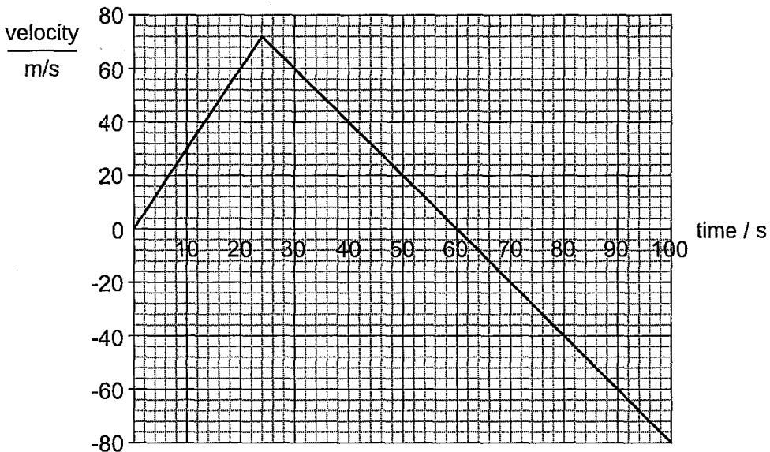  
(a) Describe the motion of the unmanned rocket from t = 60 s to t = 70 s.

(b) Determine the maximum height above the surface of planet T in which the unmanned rocket rose to. [2]

(c) Explain, using Newton's Laws of Motion, the motion of the rocket for the first 10 s. [2]

(d)Determine the weight of the rocket after it malfunctions. Assume the mass of the rocket remained constant. [2]

11 The diagram shows three cubes, P, Q and R, of mass 8 kg, 2 kg and 14 kg respectively, resting on a smooth horizontal surface initially. The cubes are in contact with each other. A horizontal force of 300 N is then exerted on cube P.

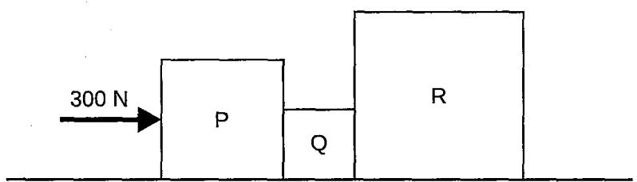

(a)Calculate the acceleration of cube Q and hence the resultant force acting on it.

(b) Calculate the force exerted on cube P by cube Q. [2]

State all the pairs of action-reaction forces involved cube R. [2]

Diagram 1 shows a trolley X on a horizontal table. Diagram 2 shows an identical trolley Y, which is loaded with steel bars, on the same table. A horizontal force of 20 N is applied to each of the trolley for a time of 0.2 s. Both trolleys are initially at rest

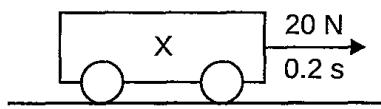

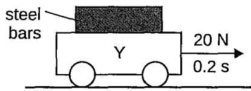  
Diagram 1  
Diagram 2

(a) After 0.2 s, trolley X moves to the right with a velocity of 10 m/s but trolley Y moves to the right with a velocity of 2 m/s. Explain why these velocities are different. [2]

(b) Trolley X is now turned over so that it is resting on its top surface as shown in Diagram 3. A force of 20 N is applied for 0.2 s and then removed.

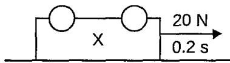  
Diagram 3

Explain why this force now results in a very small velocity and why that velocity rapidly reduces to zero after 0.2 s. [2]

(c) The mass of trolley X is 0.50 kg. Calculate the gravitational force acting on trolley X when the trolley is near the surface of the Earth. Take the acceleration of free fall to be 10 m/s² at the surface of the Earth. [1]

(a) State the condition necessary for the equilibrium of three coplanar forces acting at a point. [1] (Coplanar forces are forces that act within the same two-dimensional plane.)

(b) The diagram shows a crane hook in equilibrium under the action of a vertical force of 16.5 kN in the crane cable and tension forces $T _ { \scriptscriptstyle { \frac { 1 } { 3 } } }$ and $\boldsymbol { T } _ { 2 }$ in the sling.

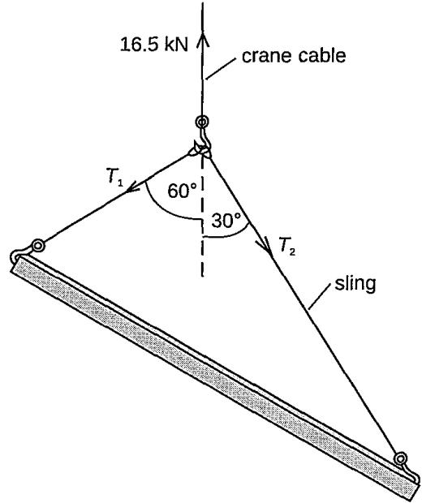

Find the tension forces $T _ { \scriptscriptstyle { 1 } }$ and $\boldsymbol { \tau } _ { 2 }$ acting in the sling by scale drawing.

[4]

1 Table 1 and Table 2 show some information from the manufacturer of a car. The kerb mass refers to the mass of the car without passengers and cargo. The gross mass refers to the mass of the car with passengers and/or cargo.

<table><tr><td rowspan=1 colspan=1>kerb mass</td><td rowspan=1 colspan=1>800 kg</td></tr><tr><td rowspan=1 colspan=1>gross mass (with an 80 kg driver)</td><td rowspan=1 colspan=1>880 kg</td></tr><tr><td rowspan=1 colspan=1>gross mass (with an 80 kg driver and an 80 kg passenger)</td><td rowspan=1 colspan=1>960 kg</td></tr></table>

Table 1
<table><tr><td rowspan=1 colspan=1></td><td rowspan=1 colspan=1>with one driver only</td><td rowspan=1 colspan=1>with one driver and passenger</td></tr><tr><td rowspan=1 colspan=1>maximum acceleration</td><td rowspan=1 colspan=1>3.40 m/s²</td><td rowspan=1 colspan=1>3.10 m/s²</td></tr><tr><td rowspan=1 colspan=1>maximum speed</td><td rowspan=1 colspan=1>40.0 m/s</td><td rowspan=1 colspan=1>40.0 m/s</td></tr></table>

Table 2

(a) When the mass of the people in the car doubles from 80 kg to 160 kg, there is only a slight decrease in the maximum acceleration. Explain why the acceleration did not decrease by half when the mass of people doubled and the engine's forward thrust remained the same. [1]

(b) Calculate the shortest time for the car, with a driver and a passenger inside, to achieve the maximum speed from rest. [2]

(c)Ignoring air resistance, calculate the maximum forward thrust of the car engine. [2]

(d) The driver takes the car for a test drive without any passenger. While travelling at the maximum speed, the driver sees a stationary police car ahead and applies the brakes after 2.0 s. The car decelerates uniformly and comes to rest a short distance away from the police car.

<table><tr><td rowspan=1 colspan=1>time / s</td><td rowspan=1 colspan=1>0</td><td rowspan=1 colspan=1>2</td><td rowspan=1 colspan=1>4</td><td rowspan=1 colspan=1>6</td><td rowspan=1 colspan=1>8</td><td rowspan=1 colspan=1>10</td><td rowspan=1 colspan=1>12</td></tr><tr><td rowspan=1 colspan=1>speed / m/s</td><td rowspan=1 colspan=1>40.0</td><td rowspan=1 colspan=1>40.0</td><td rowspan=1 colspan=1>40.0</td><td rowspan=1 colspan=1>30.0</td><td rowspan=1 colspan=1>20.0</td><td rowspan=1 colspan=1>10.0</td><td rowspan=1 colspan=1>0.0</td></tr></table>

Table 3

(i) State what it means by decelerates uniformly. [1]

(ii)Calculate the distance travelled by the car during the deceleration. [2]

(iii) Describe how the distance between the car and the stationary police car changes before and after the driver applies the brake. [2]

2 A block of mass 4 kg is placed on a rough horizontal table and is accelerated by a load of 3 kg mass as shown below. Take g as 10 N/kg.

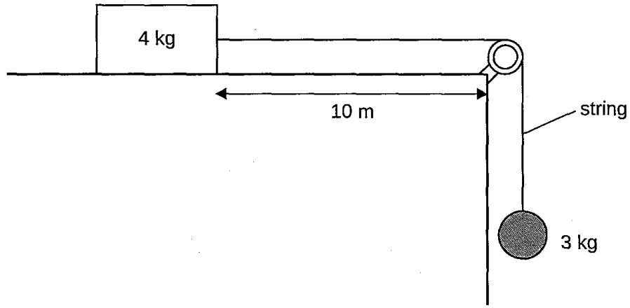

(a) Draw the free-body diagrams of the 4 kg block and the 3 kg load. [2]

(b) When the system is release, the block moves through a distance of 4 m in 2 seconds.

(i) Find the acceleration of the system. [2]

(ii)Find the frictional force between the block and the table. [1]

(c) After the system has been released for 2 seconds, the string is cut.

(i)What would be the acceleration of the load? Ignore air resistance. [1]

(ii) What would be the acceleration of the block? [2]

(iii) Can the block reach the edge of the table? Explain. [2]

The diagram shows a group of trolleys carrying coal being pulled horizontally to the right by a cable.

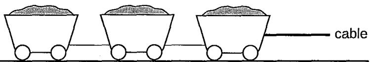

The table shows information on the group of trolleys.

<table><tr><td rowspan=1 colspan=1>speed / m/s</td><td rowspan=1 colspan=1>7.2</td><td rowspan=1 colspan=1>7.2</td><td rowspan=1 colspan=1>7.2</td><td rowspan=1 colspan=1>14.4</td><td rowspan=1 colspan=1>21.6</td><td rowspan=1 colspan=1>28.8</td><td rowspan=1 colspan=1>36.0</td></tr><tr><td rowspan=1 colspan=1>time / s</td><td rowspan=1 colspan=1>0.0</td><td rowspan=1 colspan=1>0.5</td><td rowspan=1 colspan=1>1.0</td><td rowspan=1 colspan=1>1.5</td><td rowspan=1 colspan=1>2.0</td><td rowspan=1 colspan=1>2.5</td><td rowspan=1 colspan=1>3.0</td></tr></table>

mass of empty trolleys = 1000 kg mass of fully loaded trolleys = 1250 kg total length = 8.5 m number of wheels =16

(a) Describe the motion of the trolleys from $t = 0 . 0 \ s \ t _ { 0 } t = 3 . 0 \ s .$ [2]

(b) (i) Determine the average tension in the cable pulling a fully loaded trolleys during t = 1.0 s to t = 3.0 s. [3]

(ii) Is the actual average tension higher, lower or the same compared to your answer in (b)(i)? Explain your answer. [2]

(c)Calculate the distance the trolleys travelled from $t = 1 . 0 \ s \ t _ { 0 } t = 3 . 0 \ s .$

(d) One of the workers claims that if the tension in the cable remains constant and the amount of coal is halved, the acceleration of the trolleys will be doubled. Explain whether the claim is true. [1]

4 Diagram 1 shows a hovercraft that moves on a cushion of air trapped underneath it.

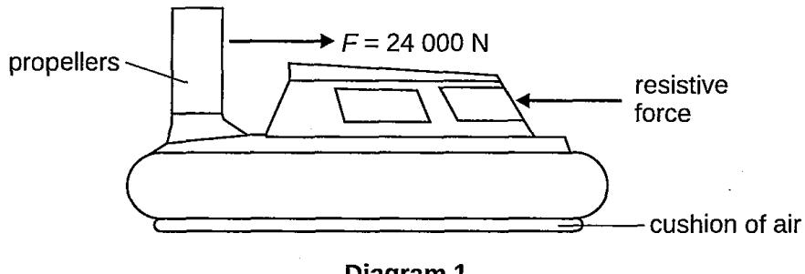  
Diagram 1

(a) At an instant, the propellers produce a forward force F of 24 000 N and experience a resistive force of 5000 N. The mass of the hovercraft is 30 000 kg. Calculate the acceleration of the hovercraft at this instant. [2] (b) After some time, the hovercraft reaches a steady speed, even though the force F is unchanged. Explain, in terms of the forces acting on the hovercraft, why the hovercraft will reach steady speed. [2]

(c)Explain how the propellers are able to produce a forward force, F.

(d) Diagram 2 shows how the velocity, v of the hovercraft varies with time, t for part of its journey.

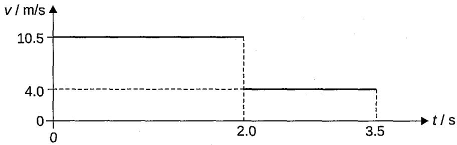  
Diagram 2

(i) State the acceleration of the hovercraft between t = 0 s and $t = 2 . 0 ~ \ s$ [1]

(ii)Calculate the total distance travelled by the hovercraft in 3.5 s. [2]

(iii) On Diagram 3, sketch how the distance travelled by the hovercraft, d, varies with time, t. You are not required to make any calculations. [2]

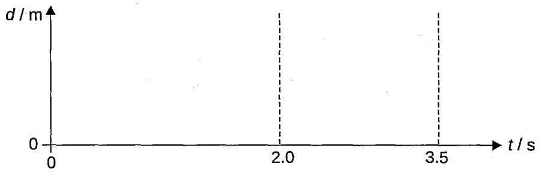  
Diagram 3

An object of mass 1.0 kg is attached to a trolley of mass 2.5 kg as shown. Initially the 1·0 kg mass is held at 1.6 m above the floor. Ignore the efforts of friction and air resistance.

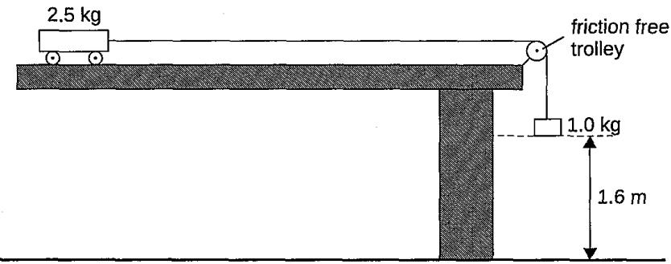

(a) Calculate the acceleration of both the trolley and mass when the 1.0 kg mass is released.[2]

(b) The trolley continues to accelerate while the 1.0 kg mass is falling.

(i) Determine the time taken for the mass to hit the floor. [2]

(ii)Calculate the trolley's velocity at this time. [2]

(c) Describe and explain the motion of the trolley after the 1.0 kg mass hits the floor. [2]

(d) Suppose the 1.0 kg mass had initially been at only 1.0 m above the floor. Without further calculation, state the effect this would have had on the trolley's

(i) acceleration; [1]

(ii) maximum velocity. [1]

Competitors are taking part in a bobsleigh competition.

(a) Diagram 1 shows the bobsleigh at point X near the end of its run.

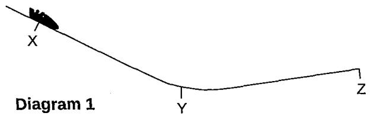

When bobsleigh reaches point Y, the brakes are applied until it comes to rest at point Z. The speed-time graph of the motion of the bobsleigh from point X to point Z is shown in Diagram 2.

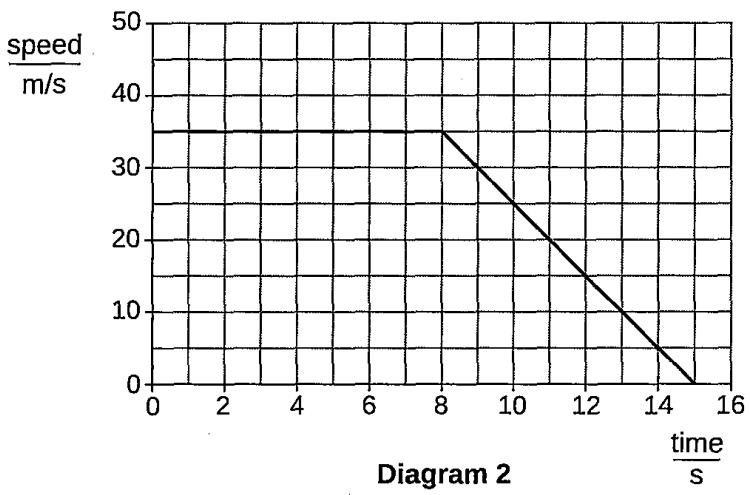

(i) What time did the bobsleigh take to travel from X to Y?

(ii)What was the distance travelled by the bobsleigh from point X until it comes to rest? [2]

(ii) Calculate the deceleration of the bobsleigh between Y and Z. [2]

(iv)The competitors and the bobsleigh have a total mass of 380 kg. Calculate the force causing the deceleration of the competitors and bobsleigh. [2]

(b) At the start of a run, at point A in Diagram 3, both competitors push the empty bobsleigh. At point B, one of the competitors jumps in while the other keeps pushing. At point C, the second competitor jumps in.

The speed-time graph of the motion of the bobsleigh from A to C is shown in Diagram 4.

  
(i) Give two reasons, in terms of Newton's laws, for the change in the acceleration of the bobsleigh between AB and BC. [2]

(ii) Complete the graph in Diagram 4 to show how the speed varies with time between C and D when both competitors are in the bobsleigh. [1]

7 A boy of mass 40 kg riding on a skateboard is shown in Diagram 1.

  
Diagram 1

He pushes off with his rear foot momentarily to accelerate. He then cruises for a while and allows resistive forces to slow him down. He then pushes off with his rear foot again. The cycle is repeated. Diagram 2 shows how the velocity of the boy changes over the first 6.0 s of his journey.

  
Diagram 2

(a)Describe the boy's motion over the first 2.0 s of his journey [2]

(b) Determine

(i) the total displacement at t =1.0 s, [1]

(ii) the value of the average velocity at t =1.0 s. [2]

## (c) Calculate

(i) the acceleration of the boy at t = 0.50 s, [1]

(ii) the resultant force of the boy at t = 0.50 s. [2]

(iii) the forward driving force acting on the boy at $t = 0 . 5 0 ~ \mathsf { s }$ if the total resistive force acting on him is 5.0 N. [1]

(d) Describe the other force that is part of an action-reaction pair with the forward driving force calculated in (c)(iii). [1]

A car of mass 1500 kg is in tow by a tow truck of mass 2500 kg using a rope of negligible mass as shown.   
The frictional forces acting on the tow truck and the car are 625 N and 375 N respectively.

(a)Draw the free-body diagrams of the tow truck and the car (omit the vertical forces). [2]

(b)The two vehicles are moving with a uniform velocity. What is the tension in the rope? [1]

(c) When the two vehicles are moving with a uniform acceleration of 2 m/s², what is the tension in the rope? [2]

(d) The maximum tension in the rope can tolerate is 4500 N.

(i) Will the rope break if the two vehicles are moving with a uniform acceleration of 2 m/s²? Explain your answer. [2]

(ii) What is the maximum acceleration of the two vehicles for the rope to remain intact? [1]

(e) If the rope breaks suddenly, what is the retardation of the car? [2]

The diagram shows a test rocket on its launch pad.

The rocket is powered by 3 engines each of which produces a thrust of 2000 N. The mass of the rocket and its fuel is 500 kg, so that its weight is 5000 N. Take g as 10 N/kg.

(a)When the engines are fired:

(i) Calculate the total thrust on the rocket. [1]

(ii)Explain why the rocket moves upwards. [2]

(iii) Calculate the resultant force on the rocket. [1]

(iv) Calculate the take-off acceleration of the rocket. [1]

(b) After 2 s, the rocket engines have used up 20 kg of fuel. Assuming that the thrust of the engines is constant, calculate

(i) the mass of the rocket and fuel after 2 s, [1]

(ii) the resultant force in newtons on the rocket after 2 s, [1]

(iii) the acceleration of the rocket after 2 s. [1]

(c)Assuming that the thrust of the engines is constant, explain why the acceleration of the rocket will continue to increase for as long as the engines are fired. [2]

(a)Distinguish between speed and velocity.

(b) A moon vehicle is being used to determine an accurate value for the acceleration due to gravity on the moon. The vehicle is remotely controlled and positioned so that it is stationary and on level ground. A projectile is fired vertically upwards from the deck of the vehicle and it reaches a height of 3.6 m before landing back on the vehicle. The time of flight is 4.26 s. There is no atmosphere on the moon.

(i) Show that the initial vertical velocity of the projectile is 3.4 m/s. [1]

(ii) Hece or otherwise determine the acceleration due to gravity on the moon. [1]

(iii)The time taken for the projectile to reach a height of 2·4 m is 0.90 s. Write down one other time when the projectile is at this height. [1]

(iv) In the spaces provided draw three free-body diagrams showing the force(s) acting on the projectile, at both times when it is at a height of 2.4 m above the vehicle, and also when it has reached its maximum height of 3.6 m. Label the forces. [1]

at 2.4 m moving upwards at 3.6 m at 2.4 m moving downwards

(v) Explain whether or not this would be a valid method of determining the acceleration due to gravity on the Earth. [1]

The moon vehicle is now made to travel in a straight line along the horizontal surface at constant velocity of 2.0 m/s, when the projectile is again fired with a vertical velocity of 3.4 m/s.

(i)Using a vector diagram, determine the resultant initial velocity of the projectile. [3]

(ii) State whether the projectile will land behind, in front of or on the moving moon vehicle. Explain your answer in terms of the forces acting on the projectile. [1]

## Three blocks, P, Q and R, on a frictionless horizontal surface are in contact with each other, as shown in Diagram 1. A force of 150 N is applied to block P.

<table><tr><td>Diagram 1</td><td>150 N</td><td>P 4 kg</td><td>Q 8 kg</td><td>R 3 kg</td><td></td></tr></table>

(i) Draw a free-body diagram for each block. [3]

(ii)Determine the acceleration of the system. [1]

(iii) Determine the net force on each block. [1]

(iv) Find the contact force (action-reaction forces) that each block exerts on its neighbor. [3]

Diagram 2 shows three blocks in contact and placed on a smooth horizontal fixed table. Find the ratio of force exerted by block A to B and the force by block B to C. [2]

<table><tr><td rowspan="2">Diagram 2</td><td rowspan="2">30 N</td><td rowspan="2">A 5 kg</td><td rowspan="2">B 2 kg</td><td rowspan="2">C 3 kg</td><td>10 N</td></tr><tr><td></td></tr></table>