## Mass

<table><tr><td>Describe the mass of an object.</td><td>Sl unit</td><td>Kilogram (kg)</td><td></td></tr><tr><td></td><td>Type of quantity</td><td></td><td>Scalar</td></tr><tr><td></td><td>Measuring mass</td><td></td><td>Beam balance, electronic balance</td></tr><tr><td></td><td>Properties</td><td></td><td>Constant regardless of its location</td></tr><tr><td></td><td></td><td></td><td>Not affected by the gravitational field strength.</td></tr><tr><td></td><td>Relationship to weight</td><td></td><td>Weight depends on mass and gravitational field strength (W = mg ). (see later)</td></tr><tr><td></td><td>Importance in Physics</td><td></td><td>Fundamental property for understanding motion and forces.</td></tr><tr><td></td><td></td><td></td><td>Mass is a measure of an object&#x27;s inertia (resistance to change in motion). (see</td></tr><tr><td></td><td></td><td></td><td>later) Essential for calculations involving</td></tr><tr><td></td><td></td><td></td><td>Newton&#x27;s Second Law of Motion (F = ma ). (see later)</td></tr></table>

## Concept

## Inertia

## Conservation of mass

## Explanation

The tendency of an object to resist changes in its state of motion.

– Directly related to mass.

• In a closed system, mass is conserved.

This means that mass cannot be created or destroyed.

## Remarks:

A closed system refers to a physical system that does not exchange any matter with its surroundings. However, energy can be transferred into or out of the system.

An example of a closed system is a sealed container with gas inside. The gas cannot escape, and no additional gas can enter (no exchange of matter), but energy transfer can still take place between the container and its environment (from a region of high temperature to a region of low temperature).

<table><tr><td>Characteristics</td><td>Details</td></tr><tr><td>Gravitational field lines•</td><td>Represent the direction of the gravitational force.</td></tr><tr><td></td><td>Lines point towards the mass creating the field.</td></tr><tr><td>Properties of gravitational field</td><td>Always attractive</td></tr></table>

## Gravitational field

It is a region in which a mass experiences a force due to gravitational attraction.

A gravitational field exists because of the presence of mass.

• Any object with mass generates a gravitational field around it.

The field is a region in space where the gravitational force of the object can be felt by other masses.

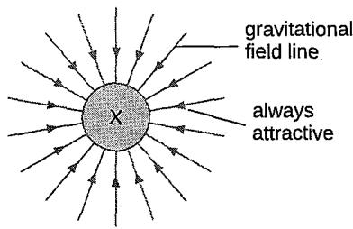

The gravitational field lines of object X pointing radially inward.

It is the gravitational force per unit mass placed at that point within a gravitational field.

## Remark:

The gravitational field strength at a point basically tells us how much force is exerted on each kilogram of mass at a point.

Unit

Newton per kilogram (N/kg)

Formula

$$
\cdot \quad g = \frac { W } { m }
$$

g = the gravitational field strength (N/kg)

W = weight or gravitational force (N)

m = mass (kg)

What is the gravitational field strength on Earth's surface?

State the factors that affect the gravitational field strength.

How do we show that gravitational field strength and acceleration due to gravity are equivalent?

Approximately 10 $\mathsf { N } / \mathsf { k g }$

This value indicates that every 1 kg mass on Earth's surface experiences a gravitational force of approximately 10 N due to Earth's gravity.

Factor

How it affects

Mass of the Greater mass results in a stronger gravitational object field.

Distance from• Greater distance results in a weaker the object gravitational field.

Step

Process

1• State Newton's Second Law of motion $F = m a$

2• Express the formula in terms of units. $\mathsf { N } = \mathsf { k g } \times \mathsf { m } / s ^ { 2 }$

3 Divide both sides by unit kg.

• Both units are equal.

$$
{ \frac { N } { \mathsf { k g } } } = { \mathsf { m } } / { \mathsf { s } } ^ { 2 }
$$

$\Nu / \ k g $ unit for the gravitational field strength

Remark:

$\mathsf { m } / \mathsf { s } ^ { 2 } \to$ unit for acceleration

Hence, the letter $\scriptstyle { \boldsymbol { g } } ^ { \prime }$ can represent both the gravitational field strength near Earth's surface and acceleration due to gravity.

What is meant by weight?

This demonstrates that the unit $\mathsf { N } / \mathsf { k g }$ is dimensionally equivalent to $m / s ^ { 2 } .$

4

State the formula for weight (or the gravitational force acting on an object that has mass).

It shows that the gravitational field strength near the Earth's surface is 10 $\frac { N } { k g } = 1 0 \ m / s ^ { 2 }$ equivalent to the acceleration of free fall.

• It is the gravitational force acting on an object that has mass.

The greater the mass of the object, the greater the gravitational force acting on it. (directly proportional)

Remark:

Weight is just a term to describe the gravitational force acting on an object's mass. $\scriptstyle { E g . }$

The weight of a table is 40 N. It simply means that the gravitational force exerted on the table's mass is 40 N.

W = mg g = the gravitational field strength $( N / \ k g )$ W = weight or gravitational force (N) m = mass (kg)

Worked example 1

Question An object has a mass of 2 kg. Calculate the weight of the object if the gravitational field strength is 10 ${ \sf N } / | \epsilon { \sf g } |$

$$
A n s w e r \qquad W = m g = 2 \times 1 0 = 2 0 \mathsf { N }
$$

Question A body weighs 50 N on earth. The acceleration due to gravity on earth and on the moon is $1 0 m / s ^ { 2 }$ and $\mathsf { 1 . 6 } \mathsf { m } / \mathsf { s } ^ { 2 }$ respectively. Calculate the weight of the body on the moon.

Answer mass of body:

weight of body on the moon:

$$
m = \frac { W } { g } = \frac { 5 0 } { 1 0 } = 5 k g
$$

$$
W = m g = 5 \times 1 . 6 = 8 \ N
$$

Worked example 3

Question A body has a weight of 20 N on earth. When it is placed in a new location, its weight is 8 N. Given that the earth's gravitational field strength is 10 $\Nu / \ k g ,$ calculate the gravitational field strength of this new location.

Answer mass of object:

g in new location:

$$
m = { \frac { W } { g } } = { \frac { 2 0 } { 1 0 } } = 2 \ k g
$$

$$
g = { \frac { W } { m } } = { \frac { 8 } { 2 } } = 4 ~ { \mathsf { N } } / { \mathsf { k g } }
$$

<table><tr><td>Property</td><td></td><td>Mass</td><td>Weight</td><td></td></tr><tr><td>Definition</td><td></td><td>Amount of matter in an object.</td><td></td><td>Force exerted by gravity on an object.</td></tr><tr><td>Unit</td><td></td><td>Kilogram (kg)</td><td></td><td>Newton (N)</td></tr><tr><td>Quantity</td><td></td><td>Scalar</td><td></td><td>Vector</td></tr><tr><td>Magnitude</td><td></td><td>Constant, does not change with</td><td></td><td>Variable, changes with location (e.g., different planets)</td></tr><tr><td>Measurement</td><td></td><td>location Beam balance</td><td></td><td>Spring balance</td></tr><tr><td>tool</td><td></td><td></td><td></td><td>Force meter</td></tr><tr><td></td><td></td><td>Electronic balance</td><td></td><td></td></tr></table>

Mass is the amount of matter in an obiect; weight is the gravitational force on that mass.

Mass remains constant regardless of location; weight changes with the strength of the gravitational field.

## Question 1

(a)A child has a weight of 343 N. The gravitational field strength is 9.8 N / kg. Write down the equation that links gravitational field strength, mass and weight.

(b) Calculate the mass of the child.

## Question 2

A skydiver wore a chest pack containing monitoring and tracking equipment. The mass of the chest pack was 5.4 kg. The gravitational field strength is 10 N / kg. Calculate the weight of the chest pack.

## Types of forces

Define a force.

• It is a push or pull on an object.

State the two types of forces.

• Contact forces

• Non-contact forces

Describe contact forces.

<table><tr><td rowspan="2">Give some examples of real- world applications of contact forces.</td><td rowspan="2">Walking</td><td colspan="3"></td></tr><tr><td colspan="3">Friction between shoes and the ground</td></tr><tr><td></td><td>Tug of war Tension in the rope</td><td colspan="3"></td></tr><tr><td></td><td></td><td colspan="3"></td></tr><tr><td></td><td>Book on a table</td><td colspan="3"></td></tr><tr><td>Describe non-contact forces.</td><td></td><td>Normal force supporting the book&#x27;s weight</td><td></td><td>Key point</td></tr><tr><td></td><td>What is it? Forces that act between objects</td><td></td><td>Examples Gravitational force Attractive force</td><td>Act over a distance without contact.</td></tr><tr><td></td><td>that are not physically touching.</td><td></td><td>between masses. Electrostatic force Force between charged particles (attractive or</td><td>Essential in explaining phenomena like gravity, electricity, and</td></tr><tr><td></td><td></td><td>• Magnetic force</td><td>repulsive). Force between magnetic poles</td><td>magnetism.</td></tr><tr><td></td><td></td><td></td><td>(attractive or repulsive).</td><td></td></tr><tr><td>Give some examples of real-world applications of non-contact forces.</td><td>Example</td><td>Non-contact force</td><td></td><td>Explanation</td></tr><tr><td></td><td>Falling objects</td><td>Gravitational force</td><td></td><td>Gravity pulls objects downward without physical</td></tr><tr><td></td><td>Rubbing a</td><td>Electrostatic force</td><td>contact.</td><td>Causes attraction due to electric charges (static</td></tr><tr><td></td><td>balloon on hair</td><td></td><td>electricity).</td><td></td></tr><tr><td></td><td>Compass needle</td><td>Magnetic force</td><td></td><td>Earth&#x27;s magnetic field exerts a force on the magnetic needle from a distance.</td></tr><tr><td>What are some</td><td></td><td></td><td></td><td></td></tr><tr><td>misconceptions about the types of forces?</td><td>Misconception Non-contact forces are</td><td></td><td></td><td>Correction</td></tr><tr><td></td><td></td><td>weaker than contact forces.</td><td></td><td>Non-contact forces can be very strong, eg. the gravitational force of Earth.</td></tr><tr><td></td><td></td><td></td><td></td><td></td></tr><tr><td></td><td>• category of force.</td><td>Air resistance is a separate</td><td></td><td>Air resistance is a type of</td></tr></table>

<table><tr><td>Describe the effects of a force.</td><td>Effect</td><td>What it means</td><td></td><td></td><td>Example</td></tr><tr><td></td><td>Increase speed (acceleration)</td><td></td><td>Force applied in the direction of motion.</td><td></td><td>Pushing a box downhill</td></tr><tr><td></td><td>Decrease speed (deceleration)</td><td></td><td>Force applied opposite to the direction of motion.</td><td></td><td>Applying brakes to a bicycle</td></tr><tr><td></td><td>Change direction</td><td></td><td>Force applied at an angle to the motion.</td><td></td><td>Turning the steering wheel of a car</td></tr><tr><td></td><td>Start motion</td><td></td><td>Force applied to a stationary object.</td><td></td><td>Pushing a stationary shopping cart</td></tr><tr><td></td><td>Stop motion</td><td></td><td>Force applied to a moving object.</td><td></td><td>Catching a moving ball</td></tr><tr><td></td><td>Change shape</td><td></td><td>Force deforming an object.</td><td></td><td>Squeezing a sponge</td></tr><tr><td>Balanced and unbalanced forces Describe some common non- contact forces acting on an</td><td></td><td></td><td></td><td></td><td></td></tr><tr><td rowspan="4">object.</td><td>Force</td><td></td><td>Description</td><td></td><td>Example</td></tr><tr><td>Weight</td><td>to its mass</td><td>The force exerted by gravity on an object due</td><td></td><td>The weight of a mass of 2 kg is 20 N near Earth&#x27;s surface</td></tr><tr><td>Magnetic force</td><td></td><td>The attraction or repulsion between magnetic poles.</td><td></td><td>A magnet sticking to a refrigerator.</td></tr><tr><td>Electrostatic Force</td><td></td><td>The force between charged particles.</td><td></td><td>Static cling causes clothes to stick together.</td></tr></table>

<table><tr><td rowspan="3">Describe some common contact forces acting on an object.</td><td>Force</td><td>Description</td><td>Example</td></tr><tr><td></td><td>Normal force• The support force exerted by a• surface, perpendicular to it 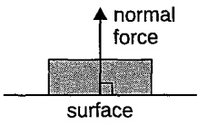</td><td>A book resting on a table</td></tr><tr><td>Friction (or frictional force)</td><td>The force resisting the motion• of two surfaces sliding past each other 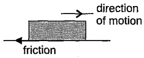</td><td>A car slowing down due to road friction</td></tr><tr><td rowspan="3"></td><td>Tension</td><td>The pulling force transmitted along a rope, string, or cable</td><td>A hanging light fixture held by a wire</td></tr><tr><td>Air resistance (or Drag)</td><td>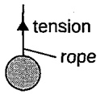 The force exerted by air against the direction of an object&#x27;s motion air</td><td>A parachute slowing down a skydiver</td></tr><tr><td></td><td>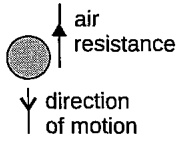 Applied force• A force applied to an object by• a person or another object</td><td>Pushing a shopping car</td></tr><tr><td></td><td></td><td>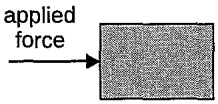 Buoyant force• The upward force exerted by a fluid on a submerged object 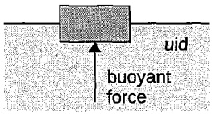</td><td>A boat floating on water</td></tr><tr><td>Thrust</td><td></td><td>The force propelling an object• forward, usually in fluids. direction of motion thrust</td><td>A jet engine pushing an airplane forward</td></tr></table>

Is there only one force acting on an object at all times?

Give some examples of different forces acting on an object in opposite directions at the same time.

No. There can be more than one force acting on an object in different directions at the same time.

Situation

An object resting on a table

A person in a lift

Types of forces acting on the object

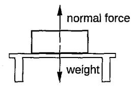

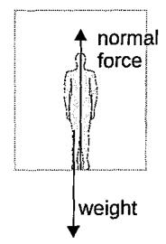

An object moving across a rough floor

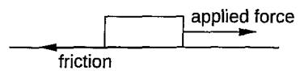

An object falling in the air

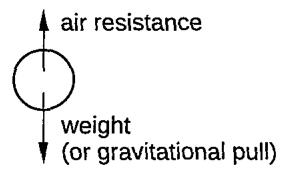

An object flying in the air

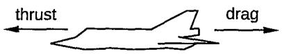

What is a balanced force?

Balanced forces occur when two or more forces acting on an object are equal in magnitude but opposite in direction, resulting in a net (or resultant) force of zero.

— The object will have zero acceleration and will either

» remain at rest, or

» continue moving at a constant velocity

Eg.

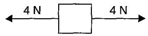

Take the direction to the right as positive.

Net force acting on the object $: = 4 N + ( - 4 N ) = 4 N - 4 N = 0$

Hence, balanced forces are said to be acting on the object.

Remark:

Forces are a vector quantity. Hence, positive and negative signs are used to denote the opposite directions of the forces.

What is an unbalanced force?

Unbalanced forces occur when two or more forces acting on an object do not cancel each other out, resulting in a net (or resultant) force that is not zero.

This net force causes the object to accelerate in the direction of the force.

» A net force is a single force that has the same effect as all the forces combined.

Eg.

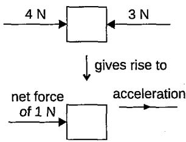

Take the direction to the right as positive.

Net force acting on the object = 4 N + (-3 N) =4N-3N = 1N to the right

Hence, unbalanced forces are said to be acting on the object. There will be a net force of 1 N acting on the object towards the right, causing the object to accelerate in the direction of the net force.

## Remark:

The net force and the acceleration are always in the same direction.

<table><tr><td>Aspect</td><td>Balanced forces</td><td>Unbalanced forces</td></tr><tr><td>Definition</td><td>Forces that cancel out each other, resulting in zero net force.</td><td>Forces that do not cancel out each other, resulting in a non-zero net force.</td></tr><tr><td>Effect on object</td><td>The object remains at rest or continues to move at a constant velocity (no acceleration).</td><td>The object accelerates in the direction of the net force.</td></tr><tr><td>Motion</td><td>No change in motion; the object remains in equilibrium.</td><td>Change in motion; the object experiences acceleration.</td></tr><tr><td>Example</td><td>A book resting on a table with gravity pulling it down and the table pushing it up with equal force.</td><td>A car accelerating when the engine force exceeds frictional forces.</td></tr></table>

Question The diagram shows the forces acting on different objects. For each object, state the net force acting on it.

(a)

$$
3 N \boxed { 8 N }
$$

(b)

$$
\frac { 1 2 N } { 1 0 N } =
$$

(c)

$$
\frac { 5 N } { 2 } = 1 \frac { 7 N } { 2 }
$$

(d)

$$
\frac { 6 N } { 1 0 } = 1 0 N
$$

Answer Take the direction to the right as positive.

(a) Net force = −3 N + 8 N = 5N (to the right)

(b) Net force = -12N + 12N = 0N

(c) Net force = 5 N + 7 N = 12 N (to the right)

(d) Net force = 6 N + (−10 N) = −4 N (to the left)

## Remark:

In this Worked example:

• Objects in (a), (c) and (d) will move with an acceleration

•The object in (b) will move at a constant speed or remain at rest.

## Question 3

The diagrams show forces acting on different objects. Find the net force acting on each object.

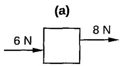

(b)  
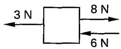

(c)

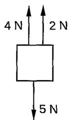

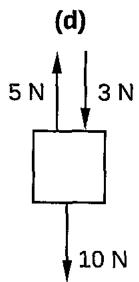

## Newton's first law of motion

What is Newton's First Law of Motion?

It states that every object will continue in its state of rest or uniform motion in a straight line unless a net (or resultant) force acts on it.

This implies that if the forces acting on an object are balanced (i.e., equal in magnitude and opposite in direction), they cancel each other out, resulting in no net force.

Consequently, the object will either remain at rest or continue to move at a constant velocity in a straight line.

Remark:

This law describes how objects behave when no unbalanced forces are acting on them.

<table><tr><td rowspan="3">Give some examples of Newton&#x27;s First Law of Motion in our daily lives.</td><td>Examples</td><td>Description</td></tr><tr><td>A ball rolling on the• ground</td><td>A ball will continue rolling at a constant speed until friction or another force causes it to stop.</td></tr><tr><td>A book on a shelf</td><td>A book remains at rest on a shelf until an external force, like a hand pushing it, moves it.</td></tr><tr><td></td><td>A spacecraft in space</td><td>A spacecraft will continue travelling in a straight line at a constant speed in the vacuum of space, as there is no external force acting on it.</td></tr></table>

Newton's First Law of Motion describes the behaviour of an object that it will stay at rest or move at a constant velocity unless acted upon by an external force.

This behaviour is due to inertia, which is the property of an object to resist changes in its state of motion.

Remark:

In other words, an object's inertia explains why it continues to stay at rest or move at a constant velocity if no external force is acting on it.

Inertia is the property of an object that resists changes in its state of motion.

## Remark:

This means that an object with inertia will remain at rest if it is not moving, or it will continue to move at a constant velocity if it is already in motion, unless a force acts upon it.

• Inertia depends on the mass of the object.

– The greater the mass, the greater the inertia.

Eg.

Heavier objects have more inertia, making them harder to accelerate or decelerate.

<table><tr><td>Give some examples of the concept of inertia in our daily lives.</td><td>Examples</td><td>Description</td></tr><tr><td></td><td>Passengers in a moving car</td><td>When a car stops suddenly, passengers tend to lunge forward due to their inertia.</td></tr><tr><td></td><td></td><td>This is because their bodies resist the sudden deceleration of the</td></tr><tr><td></td><td></td><td>car and want to continue moving forward.</td></tr></table>

<table><tr><td>Give some examples of the concept of inertia in our daily lives.</td><td>A book on a table</td><td></td><td>A book lying on a table will remain stationary unless we apply a force to move it.</td></tr><tr><td></td><td></td><td></td><td>The book&#x27;s inertia keeps it at rest, resisting any change in its state of motion.</td></tr><tr><td></td><td>Spilling coffee while braking</td><td></td><td>When you suddenly brake while holding a cup of coffee, the coffee may spill forward.</td></tr><tr><td></td><td></td><td></td><td>The coffee&#x27;s inertia causes it to continue moving in the same direction as before the braking, even as the cup and car slow</td></tr><tr><td></td><td>Starting a heavy object</td><td></td><td>down. Pushing a heavy piece of furniture requires</td></tr><tr><td></td><td></td><td></td><td>significant effort because of its large mass. The furniture&#x27;s inertia resists the force applied, making it harder to start moving.</td></tr><tr><td></td><td></td><td></td><td>Once in motion, it also resists stopping for the same reason.</td></tr><tr><td></td><td>Buses and standing passengers</td><td>balance.</td><td>When a bus suddenly accelerates or decelerates, standing passengers may lose</td></tr><tr><td></td><td></td><td></td><td>The passengers&#x27; bodies have inertia that resists changes in motion, causing them to lurch forward or backward as the bus</td></tr><tr><td>Worked example 1</td><td></td><td></td><td>changes speed.</td></tr><tr><td></td><td>mass.</td><td></td><td>Question Define inertia and explain how it is related to an object&#x27;s</td></tr><tr><td></td><td>Answer</td><td></td><td>Inertia is the property of an object that resists changes in its state of motion. An object&#x27;s inertia increases with its mass. Heavier objects have more inertia and are harder to</td></tr><tr><td>Worked example 2</td><td></td><td>accelerate or decelerate.</td><td></td></tr><tr><td></td><td></td><td></td><td>Question An empty car and a fully loaded car are both traveling at the same speed. Which car has more inertia, and why?</td></tr><tr><td></td><td>Answer</td><td></td><td>The fully loaded car has more inertia because it has greater</td></tr><tr><td></td><td></td><td></td><td></td></tr><tr><td></td><td></td><td></td><td></td></tr><tr><td></td><td></td><td></td><td></td></tr><tr><td></td><td></td><td></td><td></td></tr><tr><td></td><td></td><td></td><td></td></tr><tr><td></td><td></td><td></td><td></td></tr><tr><td></td><td></td><td></td><td>mass. Greater mass means more resistance to changes in</td></tr><tr><td></td><td></td><td>motion.</td><td></td></tr><tr><td></td><td></td><td></td><td></td></tr><tr><td></td><td></td><td></td><td></td></tr><tr><td></td><td></td><td></td><td></td></tr><tr><td></td><td></td><td></td><td></td></tr><tr><td></td><td></td><td></td><td></td></tr><tr><td>Worked example 3</td><td></td><td></td><td></td></tr><tr><td></td><td></td><td></td><td></td></tr><tr><td></td><td>Question</td><td></td><td></td></tr><tr><td></td><td></td><td></td><td></td></tr><tr><td></td><td></td><td></td><td>Describe what happens to a cup of coffee when you</td></tr><tr><td></td><td></td><td></td><td></td></tr><tr><td></td><td></td><td></td><td></td></tr><tr><td></td><td></td><td></td><td></td></tr><tr><td></td><td></td><td></td><td></td></tr><tr><td></td><td></td><td></td><td></td></tr><tr><td></td><td></td><td></td><td></td></tr><tr><td></td><td></td><td></td><td></td></tr><tr><td></td><td></td><td></td><td></td></tr><tr><td></td><td></td><td></td><td></td></tr><tr><td></td><td></td><td></td><td></td></tr><tr><td></td><td></td><td></td><td></td></tr><tr><td></td><td></td><td></td><td>suddenly brake a car, and explain this in terms of inertia.</td></tr><tr><td></td><td></td><td></td><td></td></tr><tr><td></td><td></td><td></td><td></td></tr><tr><td></td><td></td><td></td><td></td></tr><tr><td></td><td></td><td></td><td></td></tr><tr><td></td><td></td><td></td><td></td></tr><tr><td></td><td></td><td></td><td></td></tr><tr><td></td><td></td><td></td><td></td></tr><tr><td></td><td></td><td></td><td></td></tr><tr><td></td><td></td><td></td><td></td></tr><tr><td></td><td></td><td></td><td></td></tr><tr><td></td><td></td><td></td><td></td></tr><tr><td></td><td></td><td></td><td></td></tr><tr><td></td><td></td><td></td><td></td></tr><tr><td></td><td></td><td></td><td></td></tr><tr><td></td><td></td><td></td><td></td></tr><tr><td></td><td></td><td></td><td></td></tr><tr><td></td><td></td><td></td><td></td></tr><tr><td></td><td></td><td></td><td></td></tr><tr><td></td><td></td><td></td><td></td></tr><tr><td></td><td></td><td></td><td></td></tr><tr><td></td><td></td><td></td><td></td></tr><tr><td></td><td></td><td></td><td></td></tr><tr><td></td><td></td><td></td><td></td></tr><tr><td></td><td></td><td></td><td></td></tr><tr><td></td><td></td><td></td><td></td></tr><tr><td></td><td></td><td></td><td></td></tr><tr><td></td><td></td><td></td><td></td></tr><tr><td></td><td></td><td></td><td></td></tr><tr><td></td><td></td><td></td><td></td></tr><tr><td></td><td></td><td></td><td></td></tr><tr><td></td><td></td><td></td><td></td></tr><tr><td></td><td></td><td></td><td></td></tr><tr><td></td><td></td><td></td><td></td></tr><tr><td></td><td></td><td></td><td></td></tr><tr><td></td><td></td><td></td><td></td></tr><tr><td></td><td></td><td></td><td></td></tr><tr><td></td><td></td><td></td><td></td></tr><tr><td></td><td></td><td>The coffee may spill forward when braking suddenly. The</td><td></td></tr><tr><td></td></table>

Define Newton's Second Law of Motion.

What does the formula of Newton's Second Law of Motion tell us?

It states that when a net force acts on an object of a constant mass, the object will accelerate in the direction of the net force.

F = ma

where F = net force (N), m = mass (kg), a = acceleration $( m / s ^ { 2 } )$

It tells us that the acceleration of an object is directly proportional to the net force acting on it and is inversely proportional to its mass.

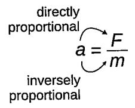

This means that:

If the mass remains unchanged, acceleration increases when the net force acting on it increases.

If the net force remains unchanged, acceleration decreases when the mass of the object increases.

Scenario

Graph

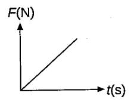

## What it means

• If mass remains the same:

As the net force F increases at a constant rate, a also increases at a constant rate.

Net force increases at a constant rate.

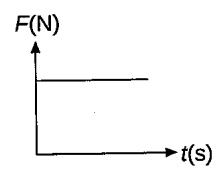

• If mass remains the same:

If the net force F is constant, a is constant.

Net force remains constant with time.

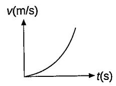

Velocity increases at an increasing rate (slopes of graph get steeper).

This indicates that acceleration is increasing.

• If mass remains the same:

The increasing acceleration suggests that the net force is increasing uniformly over time.

If a is increasing uniformly, this means that the net force F is also increasing uniformly.

The object always accelerates in the same direction as the net force.

<table><tr><td rowspan="2">net force</td><td colspan="2">acceleration</td></tr><tr><td>才</td><td></td></tr><tr><td></td><td>object</td><td></td></tr></table>

Question A 3 kg object moves with an acceleration of $2 \mathsf { m } / \mathsf { s } ^ { 2 }$ on the floor. Calculate the applied force if the object moves

(a) on a smooth surface,

(b) on a surface with a friction of 2 N acting on the object.

## Answer

(a) $F = m a = 3 \mathrm { ~ k g } \times 2 \mathrm { ~ m } / s ^ { 2 } = 6 \mathrm { ~ N ~ }$

(b) [From (a), the net force to accelerate the object at 2 $m / s ^ { 2 }$ is 6 N.] Net force = Applied force – Friction 6 N = Applied force – 2 N Applied force = 6N + 2N = 8N

Question When a force of 20 N is applied to a 2 kg object, the object moves at a constant speed of $2 m / s .$ Calculate

(a) the friction acting on the object,

(b) the acceleration of the object.

## Answer

(a) Net force = Force applied – Friction 0 = 20 N – Friction Friction = 20 N

(b) a= 0 Remark: 'A constant speed' means 'zero net force' or 'zero acceleration'.

Question A block of mass 5 kg is pulled across a rough surface by a 45 N force, against a friction F.

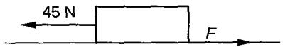

The acceleration of the block is $4 \ m / s ^ { 2 } .$ Calculate the friction $F _ { \bullet }$

## Answer

$$
\begin{array} { c c } { F _ { \mathsf { n e t } } = m a } & { { \mathsf { N e t } } { \mathsf { f o r c e } } = \mathsf { F o r c e } a { \mathsf { p p l i e d - F r i c t i o n } } } \\ { = 5 \mathsf { k g } \times 4 \mathsf { m / s ^ { 2 } } } & { 2 0 \mathsf { N } = 4 5 \mathsf { N } - F } \\ & { = 2 0 \mathsf { N } } & { F = 4 5 \mathsf { N } - 2 0 \mathsf { N } = 2 5 \mathsf { N } } \end{array}
$$

Worked example 5

Question

Answer

Remark:

Deceleration already implies a reduction in speed, so it is often treated as having a negative acceleration.

Therefore, when stating the magnitude of deceleration in an answer, you can omit the negative sign

An aircraft moves along a runway. The resultant force on the aircraft is zero.

(a) (i) What is meant by a resultant force?

(ii) Describe the movement of the aircraft when the resultant force is zero.

(b) The aircraft has a take-off mass of 320 000 kg. Each of the 4 engines can produce a maximum force of 240 kN. Calculate the maximum acceleration of the aircraft.

(a)(i) It is the single force that has the same effect as all the forces combined.

(ii) It moves at a constant speed.

(b) $a = { \frac { \left( 2 4 0 0 0 0 \times 4 \right) \ N } { 3 2 0 0 0 0 \ k g } } = 3 \ { \mathrm { m } } / { \mathrm { s } } ^ { 2 }$

A car of mass 900 kg is first accelerated to $2 5 m / s$ on a road. After travelling at this speed for a while, the driver applies the brake until the car comes to a stop. The graph shows the motion of the car.

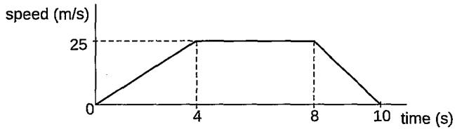

(a) What is the resultant force acting on the car at time

(i) $t = 0 \mathrm { ~ t o ~ } t = 4 s$

(ii) $t = 4 s \ t _ { 0 } t = 8 s$

(b) What is the braking force experienced by the car at time $t = 8 \ s \ t \circ t = 1 0 \ s ?$

(a) (i)

$$
a = \frac { 2 5 \ m / s - 0 } { 4 s } = 6 . 2 5 \ m / s ^ { 2 }
$$

$$
F = m a = 9 0 0 \ { \ k g } \times 6 . 2 5 \ { \mathsf { m } } / { \mathsf { s } } ^ { 2 } = 5 6 2 5 \ { \mathsf { N } }
$$

(ii) O N

(b) Deceleration of the car:

$$
a = { \frac { 0 - 2 5 \ \mathsf { m / s } } { 2 \mathsf { s } } } = - 1 2 . 5 \ \mathsf { m / s ^ { 2 } } = 1 2 . 5 \ \mathsf { m / s ^ { 2 } }
$$

$$
F = m a = 9 0 0 ~ { \ k g } \times 1 2 . 5 ~ { \mathsf { m } } / { \mathsf { s } } ^ { 2 } = 1 1 ~ 2 5 0 ~ { \mathsf { N } }
$$

## Question

The total resistive forces that act backwards on a moving object are friction and force F as shown in the diagram below.

The graph shows the total resistive force that acts on the object plotted against time t.

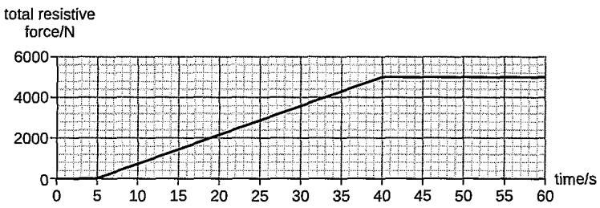

The car is at rest at t = 0. The forward force acting on the car is zero until t =5 s. From t = 60 s, the forward force has a constant value of 5000 N.

(a) Identify force F.

(b) (i) During which two time intervals are the forces on the object balanced?

(ii) Describe the motion of the car during these two intervals.

(c) The object has a mass of 600 kg. Calculate

(i) the acceleration of the car at t = 3 s,

(ii) the time, t, when the acceleration of the object is 5.0 m/s².

## Answer

(a) Fis air resistance/drag.

(b) (i) 0 to 5 s and 40 s to 60 s Remark: Newton's First Law of Motion

(ii) The object remains at rest from 0 to 5 s. It moves at a constant speed (or with zero acceleration) from 40 s to 60 s.

## (c) (i) 0 m/s²

(ii) $F = m a = 6 0 0 ~ { \ k g } \times 5 . 0 ~ { \ m / s ^ { 2 } } = 3 0 0 0 ~ { \ r N }$ 3000 N = 5000 N – Total resistive force Total resistive force = 5000 N – 3000 N = 2000 N From the graph, the total resistive force is 2000 N at t = 19 s. At this time, the object experiences an acceleration of $5 . 0 \mathsf { m } / s ^ { 2 } .$

## Remark:

When 2 or more objects are in contact with one another, they will form a system, meaning that they will move with the same acceleration when a force is applied to one of the objects.

## Remark:

Using the acceleration, we can use the free-body diagram to determine the 'individual net force' acting on each mass to cause it to move at this acceleration. (We will learn about the freebody diagram later.)

Understand the formula $F = m \times ( \nu – u / t )$

## Remark:

This formula can only be used when acceleration is constant, $a = ( \nu - u ) / t .$

Worked example 8

## Question

Three blocks of mass, m, 2m and 3m, are placed adjacent to each other on a frictionless, horizontal surface as shown. A constant force of magnitude F is applied to the right.

<table><tr><td colspan="2"></td><td colspan="2"></td><td rowspan="2"></td></tr><tr><td>F 1</td><td>m</td><td>2m</td><td>3m</td></tr></table>

Show that the net force acting on block 3m is three times greater than the net force acting on m.

Total mass of object $; = m + 2 m + 3 m = 6 m$

acceleration of the system: $a = \frac { F } { 6 m } m / s ^ { 2 }$

$$
\lim \limits _ { 0  \infty } \frac { \overrightarrow { A } } { 3 m }  \overrightarrow { B } \overrightarrow { B } \overrightarrow { C } _ { n }
$$

net force on 3m $: F _ { 3 m } = 3 m \vert \frac { F } { 6 m } \vert = \frac { F } { 2 } ~ \mathsf { N }$

$$
\underbrace { \mathsf { n e t f o r c e } } _ { \mathsf { o n m } } \underbrace { \longrightarrow } _ { \mathsf { m } } \boldsymbol { a } = \frac { \boldsymbol { F } } { 6 m }
$$

net force on m $: F _ { \mathfrak { m } } = m \left( { \frac { F } { 6 m } } \right) = { \frac { F } { 6 } } ~ { \mathsf { N } }$

Hence, the net force acting on block 3m is three times greater than the net force acting on m.

The formula to calculate the net force required to bring an object to rest or change its velocity over a period of time:

$$
\begin{array} { r l r l } { F = m a = m \displaystyle \left( \frac { v - u } { t } \right) } & { } & & { \mathsf { W } h e r e } \\ & { } & & { F = \mathsf { n e t ~ f o r c e ~ ( N ) } } \\ & { } & & { m = \mathsf { m a s s } \left( \mathrm { k g } \right) } \\ & { } & & { u = \mathsf { i n i t i a l ~ v e l o c i t y ~ ( m / s ) } } \\ & { } & & { v = \mathsf { f i n a l ~ v e l o c i t y ~ ( m / s ) } } \\ & { } & & { t = \mathsf { t i m e ~ o v e r ~ w h i c h ~ t h e ~ f o r c e ~ a c t s ~ ( s ) } } \end{array}
$$

Question A 60 kg football player running at $1 0 \mathsf { m } / s$ is brought to a stop by a tackle in 1.5 seconds. Calculate the force exerted by the tackle on the player.

Answer

$$
F = m { \left( \frac { v - u } { t } \right) } = 6 0 ~ { \mathrm { k g } } \times { \left( \frac { 0 - 1 0 ~ { \mathrm { m / s } } } { 1 . 5 ~ { \mathrm { s } } } \right) } = - 4 0 0 ~ { \mathsf { N } }
$$

(The negative sign shows the force is opposite to the direction of motion.)

## Question 4

When a 4 kg load is pushed along the horizontal flat surface of a bench, it moves at a constant speed when the friction acting on it is 8 N. When the load is pushed along the same bench with a force of 12 N, it will move with a constant   
A speed of 1 m/s. C speed of 2 m/s.   
C acceleration of 1 m/s². D acceleration of 2 m/s².

## Question 5

A block of mass 4 kg is pulled across a rough surface by a 24 N force, against a friction force F.

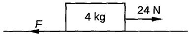

The acceleration of the block is 4 m/s². What is the value of F? A 4N 8N C 16 N D 24 N

## Question 6

The diagram shows a trolley with a mass of 4 kg moving on a level surface.

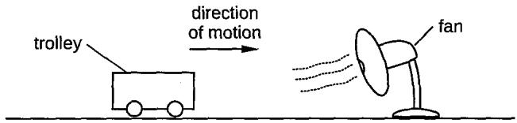

A fan is turned on after 4 seconds. The trolley stops after moving for another 6 seconds. The graph shows the motion of the trolley.

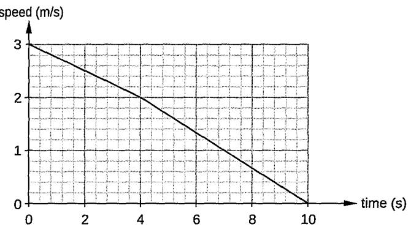

(a) In the first 4 seconds, (i) calculate the acceleration of the trolley, (ii) find the frictional force acting on the trolley.

(b) In the last 6 seconds, (i) find the acceleration of the trolley, (ii) find the drag due to air blowing from the fan.

(c) Find the stopping distance of the trolley.

## Question 7

A cyclist is pedalling in a straight line at a constant speed. Ignore air resistance.

(a) Name the two horizontal forces acting on the cyclist.

## (b)What does Newton's first law of motion state about these forces?

(c) The cyclist is moving at a constant speed when he comes to a downward hill. He stops pedalling but begins to accelerate at 0.2 m/s². Calculate the size of the force causing this acceleration. The mass of the cyclist and bicycle is 90 kg.

## Question 8

(a)A 20 kg box is sliding across a floor at 5 m/s and comes to rest in 2 seconds due to friction. What is the frictional force acting on the box?

(b) A 1000 kg car decelerates from 20 m/s to a compiete stop in 4 seconds after the brakes are applied. If the braking force acting on the car is 5000 N, find the mass of the car.

## Newton's Third Law of Motion

Define Newton's Third Law of Motion.

It states that if body A exerts a force $F _ { A B }$ on body B, then body B will exert an equal and opposite force $F _ { _ { \mathsf { B A } } }$ on body A.

## Remark:

These two forces (action and reaction) act on different bodies. This means that if one object exerts a force on a second object, the second object exerts an equal and opposite force on the first object.

一 In other words, for every action, there is an equal and opposite reaction.

State the important concepts related to Newton's Third Law of Motion.

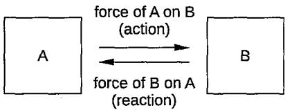

Eg.

When you push a box, you exert a force on the box (action). At the same time, the box exerts an equal and opposite force on you (reaction).

Action and reaction forces are equal in magnitude and opposite in direction.

• They must act on different objects.

Remark:

Hence, they do not cancel out each other because they are not acting on the same object.

<table><tr><td rowspan="5">Give some examples of Newton&#x27;s Third Law of Motion in our daily lives. By using a ball falling in the</td><td>Examples Walking</td><td>Action force</td><td>Reaction force</td><td>Effect We move</td></tr><tr><td></td><td>Foot pushes backward against the ground.</td><td>Ground pushes forward on the foot with equal force.</td><td>forward as a result of the ground&#x27;s reaction force.</td></tr><tr><td>Aeroplane flight</td><td>Engines push air backward.</td><td>Air pushes the aeroplane forward with equal force.</td><td>The aeroplane moves forward through the air.</td></tr><tr><td>Propellers of a boat</td><td>Propellers push water backward.</td><td>Water pushes the propellers forward with equal force.</td><td>The boat moves forward in water.</td></tr><tr><td>Bouncing a • ball</td><td>Ball exerts a downward force on the ground.</td><td>Ground exerts an upward force on the ball with equal force.</td><td>The ball bounces back up after hitting the ground.</td></tr><tr><td>air (moving towards Earth) as an example, draw the action-reaction forces. State how these action-</td><td>When a ball falls through the air, there are two main pairs of action- reaction forces involved: Action force</td><td>Reaction force</td><td></td><td>Effect on the ball</td></tr><tr><td>reaction forces produce a balanced or unbalanced force acting on the ball.</td><td>The Earth exerts a gravitational force (weight)</td><td>The ball exerts an equal and opposite gravitational force</td><td>upward on the</td><td>(1a) and (2b) are the two forces acting on the ball that causes it to experience balanced</td></tr><tr><td>Remarks: 1(a) and (2b) act on the ball in the opposite directions. As a result, they produce either</td><td>downward on the ball. (1a) The ball pushes against the air as it</td><td>Earth. (1b) The air exerts an equal and opposite force upward (air</td><td></td><td>or unbalanced force. If (1a) =(2b): No net force on the ball → zero acceleration.</td></tr><tr><td>a balanced or unbalanced force on the ball. (1a) is the weight</td><td>falls. (2a)</td><td>resistance) on the ball. (2b)</td><td></td><td>If (1a) &gt; (2b): Net downward force on the ball speeds up).</td></tr><tr><td>(gravitational force) acting on the ball that pulls the ball downward. (2b) is the air resistance acting on the ball that opposes the downward motion of the ball.</td><td></td><td>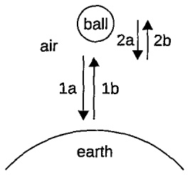</td><td>slows down).</td><td>→ accelerates (or If (1a) &lt; (2b): Net upward force on the ball → decelerates (or</td></tr></table>

<table><tr><td>State some common mistakes related to Newton&#x27;s Third Law of Motion.</td><td>Mistakes Forces cancel</td><td>What is it?</td><td>Correct understanding</td></tr><tr><td>Remark: The forces acting on an object of our interest, whether balanced or unbalanced, originate from any action or reaction forces that are applied to that</td><td>each other out</td><td>Believing that action and reaction forces cancel each other because they are equal and opposite.</td><td>Action and reaction forces act on different objects. They do not cancel each other out because they do not act on the same object.</td></tr><tr><td>object. Eg. 1a and 1b are a pair of action-reaction forces. 2a and 2b are another pair of action-reaction forces. 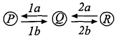 If Q is our object of interest: Only (1b) and (2a) can produce a balanced or unbalanced force on Q because they act on Q. (1a can cause a balanced or</td><td>Forces act on the same object Larger objects</td><td>Thinking that action and reaction forces act on the same object. Assuming that</td><td>Action and reaction forces act on different objects. Eg. A book exerts a force on the table, and the table exerts an equal and opposite force on the book.</td></tr><tr><td>unbalanced force on P as it acts on P.) 2b can cause a balanced or unbalanced force on R as it acts on R.)</td><td>experience larger reaction forces</td><td>larger objects experience a larger reaction force when interacting with smaller</td><td>The reaction force is equal in magnitude to the action force, regardless of the sizes of the objects.</td></tr><tr><td colspan="2">Worked example 1</td><td colspan="2">objects. Question Trolley P and trolley Q are joined by a stretched spring. The masses of trolleys P and Q are 3m and m respectively.</td></tr></table>

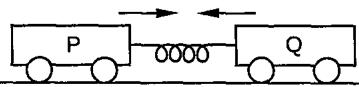

When the trolleys are released, the acceleration of P is 4 m/s² to the right. Calculate the acceleration of trolley Q to the left.

Answer (Calculate the force of action from P on Q.)

$$
F = m a = ( 3 m ) ( 4 ) = 1 2 m \ N
$$

(The force of reaction from Q on P is 12m N also.)

$$
F = m a
$$

$$
1 2 m = ( m ) a
$$

$$
a = 1 2 ~ \mathsf { m } / \mathsf { s } ^ { 2 }
$$

Remark:

Newton's Third Law explains that action and reaction forces are equal and opposite, and Newton's Second Law of Motion relates force to acceleration, showing that the smaller mass results in a larger acceleration for the same force.

## Question

Three blocks A, B and C of masses 4 kg, 2 kg and 1 kg respectively, are in contact on a frictionless surface, as shown. A force of 14 N is applied on the 4 kg block.

<table><tr><td></td><td>A</td><td>B</td></tr><tr><td>14N</td><td>4 kg</td><td>C 2 kg |1 kg|</td></tr></table>

(a) Calculate the acceleration of block B and hence the resultant force acting on it.

(b) Calculate the force exerted on block A by block B.

(c) State all the pairs of action-reaction forces involved block C.

## Answer

(a) Total mass of the system (the applied force of 14 N causes three blocks moving at the same acceleration because they are in contact with one another. Hence, the three blocks are considered a system.)

= 4 kg + 2 kg + 1 kg = 7 kg

$$
\scriptstyle { a = { \frac { 1 4 \ N } { 7 \ k g } } = 2 \ m / s ^ { 2 } }
$$

Resultant force on block B:

$$
F = m a = 2 \mathrm { ~ k g } \times 2 \mathrm { ~ m } / \mathsf { s } ^ { 2 } = 4 \mathrm { ~ N ~ }
$$

Remark:

In physics, a 'system' refers to a single object or a group of objects that are being studied and analysed as a single entity.

(b) $F _ { _ { \mathsf { B A } } }$ be the force exerted on block A by block B.

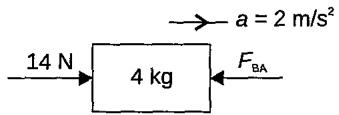

14 $\mathsf { N } - F _ { \mathsf { B A } } = 4 \ \mathsf { k g } \times 2 \ \mathsf { m } / \mathsf { s } ^ { 2 }$

14 $N - F _ { \mathrm { B A } } = 8 ~ \mathsf { N }$

$$
F _ { \mathsf { B A } } = 6 ~ \mathsf { N }
$$

Hence, force exerted on block A by block B is 6 N.

(c) Force on B by C and force on C by B. (contact force pair)

Force on the surface by C and force on C by the surface. (normal force pair)

Force on Earth by C and force on C by Earth. (gravitational force pair)

## Question9

Two small identical solid spheres, A and B, are suspended by light inextensible threads from a frame. Sphere A is pulled to one side, as shown in Diagram 1, and released. Sphere A collides with sphere B, as shown in Diagram 2, and stops and sphere B swings upwards, as shown in Diagram 3.

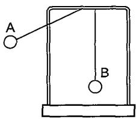  
Diagram 1

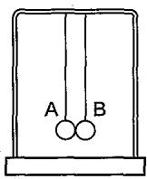  
Diagram 2

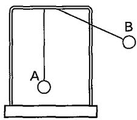  
Diagram 3

Using Newton's Second and Third Laws of Motion, explain the motion of the spheres during collision in terms of the force acting on them.

## Question 10

The diagram shows the forces acting on a rocket at take-off. The force arrows are not drawn to scale.   
Take g as 10 N/kg.

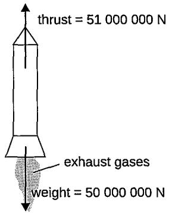

(a) Explain, in terms of Newton's Third Law, why the rocket moves.

(b) Calculate the resultant force on the rocket.

(c) Calculate the acceleration of the rocket.

(d)As the rocket uses fuel, its mass and weight become smaller. A student suggests this will not affect the acceleration because the thrust remains constant. Explain whether or not you agree with this suggestion.

## Free-body diagram

What is a free-body diagram?• A free-body diagram is a simplified drawing of an object isolated from its surroundings.

一 It shows all the forces acting on the object, represented by arrows.

– Each arrow indicates the direction and magnitude of a force.

Remark:

In other words, a free-body diagram helps us identify all the possible forces acting on a single object.

Draw a free-body diagram when a car accelerates. Show all the forces acting on it.

<table><tr><td colspan="2">Step 1</td><td>What to do?</td><td colspan="2">Example</td></tr><tr><td colspan="2"></td><td colspan="2">Represent the object with a simple shape Eg.</td></tr><tr><td colspan="2">2 Identify all forces acting on the object, except when specific instructions state</td><td colspan="2">A square, a rectangle or</td></tr><tr><td colspan="2"></td><td>Weight/Gravitational force Pulls the car</td></tr><tr><td colspan="2">otherwise. Eg. Draw a free-body</td><td>downward towards the ground Normal force</td></tr><tr><td colspan="2">diagram of a box moving across the floor (omit the vertical</td></tr><tr><td colspan="2">forces). Thrust In this case, we do Forward force not need to include generated by the the vertical forces. car's engine</td></tr><tr><td colspan="2">Friction/Air resistance Opposes the car's</td></tr><tr><td colspan="2">forward motion. 3</td></tr><tr><td colspan="2">Use arrows to represent the forces. 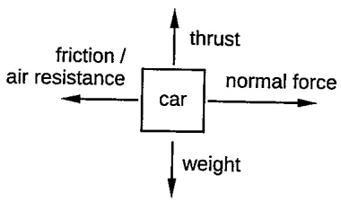</td></tr><tr><td rowspan="3">Describe some common mistakes when drawing free- body diagrams.</td><td>Mistake</td><td></td><td>What is it?</td><td>Correct understanding</td></tr><tr><td>1</td><td>objects</td><td>Including multiple</td><td>Should represent a single object, isolating it from other objects.</td></tr><tr><td>2</td><td></td><td>Forgetting to include all forces</td><td>Ensure all forces acting on the object are considered, including subtle ones like friction or air resistance.</td></tr><tr><td rowspan="2"></td><td>3</td><td>directions</td><td>Incorrect force</td><td>Arrows should accurately represent the direction of the forces. Eg.</td></tr><tr><td>4</td><td></td><td>Confusing action- reaction pairs</td><td>Gravity always points downward. Action-reaction pairs act on different objects. Only</td></tr></table>

Draw a free-body diagram of an aircraft flying through the air. Show four different forces acting on it.

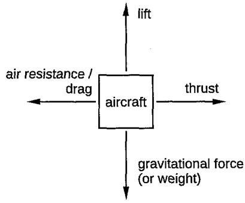

<table><tr><td rowspan="2">Answer</td><td>Force</td><td>What is it?</td></tr><tr><td>Weight</td><td>Pulls the aircraft downward.</td></tr><tr><td>Lift</td><td></td><td>Pushes the aircraft upward, generated by the wings.</td></tr><tr><td>Thrust</td><td></td><td>Pushes the aircraft forward, generated by the engines.</td></tr><tr><td>Drag</td><td></td><td>Air resistance /• Opposes the aircraft&#x27;s motion, acting backward.</td></tr></table>

## Question

Two blocks of mass, 1 kg and 3 kg, are tied together on a smooth horizontal table with a string. The system is pulled by a horizontal force P of 16N as shown.

<table><tr><td rowspan="2">16N</td><td rowspan="2">P</td><td rowspan="2">1 kg</td><td rowspan="2">3 kg</td></tr><tr><td></td></tr></table>

(a) Draw a free-body diagram of blocks 1 kg and 3 kg (omit the vertical forces).

(b) Find the acceleration of the system.

(c) Find the tension in the string connecting the blocks.

## Answer

(a) Let T be the tension in the string.

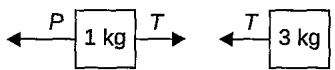

Remark:

•'smooth' implies 'frictionless'.

When a force is applied to a system of masses connected by a string, it creates tension T in the string.

The direction of the tension force between two masses is always such that it pulls the masses towards each other, ensuring they move together as a single entity.

Eg.

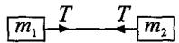

》 For $m _ { r }$ tension pulls it towards $m _ { z ^ { * } }$ Hence, $m _ { I }$ feels the tension pulling it to the right.

» For $m _ { z }$ tension pulls it towards $m _ { I ^ { \ast } }$ Hence, $m _ { 2 }$ feels the tension pulling it to the left.

» In this way, the tension is able to pull m, and m2 towards each other, allowing them to move as a single entity.

(b) Total mass of system = 1 kg + 3 kg = 4 kg

$$
\pmb { \imath } = \frac { 1 6 } { 4 \ k g } = 4 \ m / s ^ { 2 }
$$

## (c) For 3 kg mass:

Tension T acts as the net force that pulls 3 kg (the only horizontal force acting on it) to move at 4 $m / s ^ { 2 }$ (refer to the free-body diagram of 3 kg mass in (a))

$$
T = 3 \mathrm { ~ k g } \times 4 \mathrm { ~ m } / s ^ { 2 } = 1 2 \mathrm { ~ N ~ }
$$

Question

Answer

A block of mass 5 kg resting on a horizontal surface is connected by a cord, passing over a light frictionless pulley to a hanging block of mass 4 kg. The frictional force acting on the 5 kg mass is 25 N. $( g = \bar { 1 } 0 \mathsf { N } / \mathsf { k g } )$

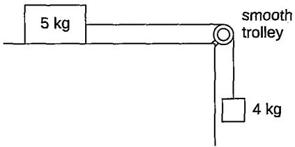

(a) Find the acceleration of the system when 4 kg mass is released.

(b) Find the tension in the string when 4 kg mass is released.

(a) (Draw the free-body diagrams for both objects to visualise all forces acting on each of them.)

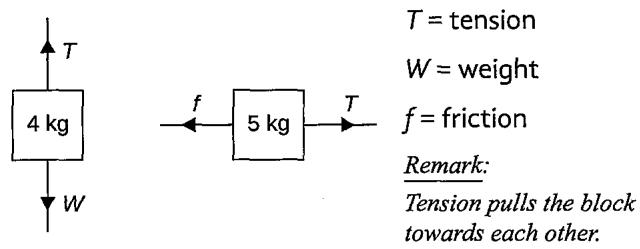

Take the forward motion as positive. (For 4 kg mass, its forward motion is downwards. For 5 kg mass, its forward motion is to the right.)

Both 5 kg mass and 4 kg mass move at the same acceleration.

For 4 kg mass:

For 5 kg mass:

$$
W { = } m g = 4 \times 1 0 { = } 4 0 N
$$

$$
T - f = m a
$$

$$
W - T = m a
$$

$$
\tau - 2 5 \mathsf { N } = 5 a
$$

40 N-T=4a

$$
T = 5 a + 2 5 \ N \ ( 2 )
$$

$$
{ \cal T } = 4 0 ~ { \sf N } - 4 a { \mathrm { \Omega } } \left( 1 \right)
$$

Substitute (1) into (2):

$$
4 0 ~ \mathsf { N } - 4 a = 5 a + 2 5 ~ \mathsf { N }
$$

$$
9 a = 1 5 N
$$

$$
a = 1 . 6 7 ~ \mathsf { m } / s ^ { 2 }\tag{b}
$$

$$
\begin{array} { c } { { T = 4 0 - 4 { \left( 1 . 6 7 \right) } } } \\ { { { } } } \\ { { = 4 0 - 6 . 6 8 } } \\ { { { } } } \\ { { = 3 3 . 3 \mathsf { N } } } \end{array}
$$

<table><tr><td rowspan="7">What is a vector diagram?</td><td>Aspect</td><td></td><td>What is it?</td></tr><tr><td>Definition</td><td></td><td>It is a graphical representation that shows the magnitude and direction of vectors, which are quantities with both size and direction.</td></tr><tr><td>Purpose</td><td></td><td>Helps visualise the effects of multiple forces acting on an object and can be used to determine</td></tr><tr><td>Component • Vectors</td><td></td><td>the resultant force or analyse equilibrium</td></tr><tr><td></td><td></td><td>Arrows that represent vectors.</td></tr><tr><td></td><td>»</td><td>Length → Magnitude of the force</td></tr><tr><td></td><td>》</td><td>Direction → Direction of the force</td></tr><tr><td></td><td>• Tail and head of arrows</td><td></td></tr><tr><td>How do we construct a vector diagram that involves three vectors?</td><td></td><td>» Tail → Point where the force is applied » Head → Direction and magnitude</td></tr><tr><td></td><td>Step</td><td>What to do?</td></tr><tr><td></td><td>1 · Identify Forces</td><td></td></tr><tr><td></td><td></td><td>Determine the forces acting on the object.</td></tr><tr><td></td><td></td><td>Three forces, A, B and C, acting on the object</td></tr><tr><td>2</td><td>Set up appropriate scale to represent each vector</td><td></td></tr><tr><td></td><td>Eg.</td><td>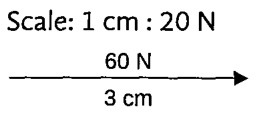</td></tr><tr><td>3</td><td>1 cm :20 N</td><td>3 cm : 60 N</td></tr><tr><td></td><td>Combined forces</td><td>Connect the vectors tip-to- 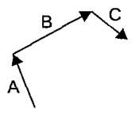</td></tr><tr><td>4</td><td>tail in order</td><td></td></tr><tr><td></td><td>Draw resultant force</td><td></td></tr><tr><td></td><td>1</td><td>If the resultant force is zero (equilibrium)</td></tr><tr><td></td><td></td><td>The vector diagram</td></tr><tr><td></td><td>»</td><td>should form a closed loop (meaning the sum</td></tr><tr><td></td><td></td><td>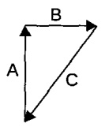 of all forces acting on the object equals zero). (a closed loop)</td></tr></table>

Worked example 1

Remark:

For similar types of Question (b) that ask for the effect of tension due to a change in angle:

## Question

Simply sketch a new vector diagram with a new arbitrary angle and measure the lengths that represent the tension.

If the lengths increase → magnitude increases due to a change in angle

If the lengths decrease →   
magnitude increases due to a   
change in angle   
$E g .$

Answer

In $\langle b \rangle .$ , sketch a new vector diagram with any angle of $T _ { 2 }$ that is less than $3 2 ^ { \circ }$ to the vertical.

As the length representing the weight remains the same, both the lengths of $T _ { \iota }$ and $T _ { z }$ will become shorter as the angle decreases, indicating a decrease in magnitude.

Conversely, if the angle is greater than 32°, both the lengths of $\mathbf { \dot { T } } _ { l }$ and $T _ { 2 }$ will become longer as the angle increases, indicating an increase in magnitude.

If the resultant force is not zero

» Draw the resultant vector from the start to the end point

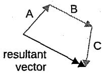

(resultant vector from start to end point)

Measure the length of the required vector.

Use the scale to convert it to its actual magnitude.

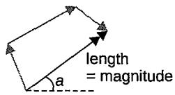

State the direction in which the required vector acts.

The magnitude of the resultant vector is $\mathsf { N } ,$ and acts at an angle of a to the horizontal.

Eg. acts at an angle of \_\_ to/ from the horizontal/vertical.

A 12 kg mass is suspended from a beam by a wire at an angle of $3 2 ^ { \circ }$ away from the vertical as shown. The tension in this wire is $\tau _ { \mathfrak { r } }$ The mass is pulled to one side by a horizontal string with a tension $\tau _ { { \scriptscriptstyle 2 } } .$ $( g = 1 0 \mathsf { N } / \mathsf { k g } )$

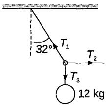

(a) Using a vector diagram and a suitable scale, calculate the tension in, given that the resultant force is zero,

(i) the wire $\tau _ { \mathfrak { r } }$

(ii) in the string $\tau _ { { \mathfrak { r } } }$

(b) State what would happen to the magnitudes of $\tau _ { \mathfrak { r } }$ and $T _ { \scriptscriptstyle 2 }$ when the angle of $3 2 ^ { \circ }$ is decreased.

(a) Weight of mass = 12kg × 10 N/kg = 120 N

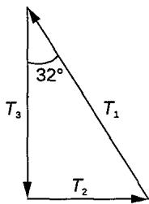

Scale: 1 cm: 40 N

For $\tau _ { _ { 3 } } ,$ 3 cm : 120 N

Remark:

(i) length of $T _ { \mathrm { _ 1 } } = 3 . 5 c m$ Hence, 3.5 cm : 140 N Tension $\tau _ { \scriptscriptstyle 1 } = 1 4 0 \ N$

Since the vector diagram forms a closed loop, draw $T _ { 3 \cdot }$ first and then extend $\mathcal { T } _ { I }$ and $T _ { 2 }$ until they intersect.

(ii) length of $\tau _ { _ 2 } = 1 . 9 \mathsf { c m }$ Hence, 1.9 cm : 76 N Tension $T _ { _ { 2 } } = 7 6 N$

(b) The magnitudes of both $\boldsymbol { \tau } _ { \scriptscriptstyle 1 }$ and $\boldsymbol { \mathsf { T } } _ { 2 }$ decrease. (since the weight acting downward remains constant)

Question

There are three forces, 150 N, 200 N and 250 N, acting on an object O. Find the resultant force acting on object O.

Answer Scale: 1 cm : 50 N  
  
To draw the vector diagram as accurate as possible:

Use a consistent scale for all vectors

Keep angles of given vectors accurately

• Label vectors

Length of resultant force = 4.0 cm

The magnitude of the resultant force

= 4.0 cm 50 N = 200 N (± 5 N)

The resultant force acting on an object O has a magnitude of 200 N, and acts at an angle of $4 2 . 3 ^ { \circ }$ to the vertical.

## Question 11

A load of mass 750 g is suspended by a wire at 25º to the vertical and pulled to the right by a horizontal cord as shown in the diagram. The resultant force is zero. Take g as 10 N/kg.

Using a vector diagram,

(a) find tension $\tau _ { \mathfrak { z } }$ in the wire holding up the load.

(b) find tension $\boldsymbol { T } _ { 2 }$ that must be applied to the horizontal cord to maintain the load in a stable position.

## Question 12

There are two vertical forces and one horizontal force acting on object M, as shown. Use a vector diagram and a suitable scale to determine the resultant force acting on object M.

## Friction and its effects

Define friction.

It is the contact force that opposes or tends to oppose motion between surfaces in contact.

What is the cause of friction?

• Surfaces have irregularities.

When two surfaces come into contact, their irregularities can interlock or catch on each other, creating resistance to motion.

Hence, when the applied force is removed, friction will cause a moving object to slow down and come to a stop eventually.

The rougher the surface, the more significant the interlocking and friction.

## Remark:

These tiny, uneven features, such as small bumps, grooves, and other imperfections, on the surface of materials that are not visible to the naked eye are also called microscopic irregularities.

Give some examples of positive effects and negative effects of friction.

Positive effects of friction

• Enables Walking and running

Enable a moving object to slow down

• Holds objects in place

## Negative effects of friction

Causes wear and tear on surface, leading to damage

Moving parts in engines and machines become less efficient due to the energy lost as heat from friction

• Produce unwanted noise

<table><tr><td rowspan="4">Describe some methods to enhance the positive effects of friction.</td><td>Methods Using</td><td>How?</td><td>Examples Car and bike</td></tr><tr><td>treads</td><td>Treads are patterns or grooves on surfaces that increase friction by providing better grip and reducing slipping</td><td>tires have tread patterns to improve traction on different road surfaces.</td></tr><tr><td>Using parachute</td><td>A parachute increases air resistance and friction by creating a large surface area that slows descent through the air</td><td>Parachutes slow the fall of skydivers and provide a controlled landing</td></tr><tr><td>Using chalk</td><td>Chalk creates a dry, rough layer on surfaces (such as hands or sports equipment) to increase friction and reduce slipping</td><td>Climbers use chalk to improve grip on climbing holds and ropes</td></tr><tr><td rowspan="6">Describe some methods to reduce the negative effects of friction. surfaces</td><td>Methods</td><td>How?</td><td>Examples</td><td>Ball bearings in</td></tr><tr><td>Use of ball bearings</td><td>Reduce friction by allowing surfaces to roll over each other instead of sliding, minimising</td><td></td><td>skateboard wheels; Moving parts of machines.</td></tr><tr><td>Using wheels</td><td>resistance Reduce friction by converting sliding motion into rolling</td><td></td><td>Trolleys Car tyres</td></tr><tr><td></td><td>motion, which requires less force and creates less resistance</td><td></td><td></td></tr><tr><td rowspan="2">Using lubricants and polished</td><td>Lubricants reduce friction by creating a</td><td></td><td>Motor oil in car engines</td></tr><tr><td>slippery layer between surfaces Polished surfaces reduce</td><td>chains</td><td>Grease in bicycle Polished bearings</td></tr><tr><td rowspan="2"></td><td>Using air</td><td>surface roughness and interlocking Reduces friction by</td><td></td><td>in high-speed machinery</td></tr><tr><td>cushion</td><td>creating a layer of air between surfaces, minimising contact and resistance</td><td></td><td>Maglev trains Hovercrafts</td></tr></table>

Objects falling without air resistance (free-falling) and falling with air resistance
<table><tr><td>Concept</td><td>Without air resistance</td><td>With air resistance</td></tr><tr><td>Definition</td><td>An object falling under the influence of gravity only</td><td>An object falling under the influence of gravity and air resistance</td></tr><tr><td>Force acting</td><td>Only gravitational force (weight)</td><td>Gravitational force (weight) and air resistance (drag)</td></tr><tr><td>Acceleration</td><td>Constant acceleration due to gravity  $( 1 0 m / s ^ { 2 }$  on Earth)</td><td>Acceleration decreases as speed increases due to increasing air</td></tr><tr><td>Velocity</td><td>Continuously increases</td><td>resistance Initially increases, then reaches termina velocity where it remains constant</td></tr><tr><td>Terminal Velocity</td><td>Not applicable (no air resistance to balance gravity)</td><td>Terminal velocity is reached when gravitational force equals air resistance</td></tr><tr><td>Motion</td><td>Uniform acceleration</td><td>Accelerates initially, then moves at constant speed (terminal velocity)</td></tr></table>

v-t graph

  
$a = 1 0 \mathrm { m } / \mathsf { s } ^ { 2 } ,$ meaning speed increases by $1 0 \mathrm { m } / s$ every second

Falling at constant acceleration initially until $t _ { \tt _ { 1 } }$

From $t _ { \tt _ { 1 } }$ to $t _ { 2 } ,$ speed increases at a decreasing rate

At $t _ { 2 } ,$ falling at a constant speed called the terminal velocity

Describe the motion of a skydiver before and after opening the parachute when he jumps off a plane and falls towards the ground.

velocity (m/s)

<table><tr><td>Phase</td><td>Description</td><td>Forces involved</td><td>Key points</td></tr><tr><td>Initial jump (1)</td><td>Skydiver starts to fall freely under gravity.</td><td>Gravity only.</td><td>Begins free fall.</td></tr><tr><td>Acceleration phase (1 &amp; 2)</td><td>Skydiver accelerates downwards, speed increases.</td><td>Gravity is larger than air resistance.</td><td>Increasing speed. The net force is downward.</td></tr><tr><td>Increasing air resistance (2)</td><td>Air resistance increases as speed increases, reducing net downward force.</td><td>Both forces act; gravity is greater than air resistance.</td><td>Decreasing acceleration. The net force remains downward.</td></tr><tr><td>Terminal velocity (3)</td><td>Air resistance equals gravity, constant speed achieved.</td><td>Gravity equals air resistance.</td><td>Constant speed. Net force is zero.</td></tr><tr><td>Parachute deployment (4)</td><td>Parachute opens, increasing air resistance dramatically.</td><td>Air resistance is larger than gravity.</td><td>Rapid deceleration. The net force becomes upward.</td></tr><tr><td>Deceleration phase (5)</td><td>Skydiver slows down quickly due to increased air resistance.</td><td>Air resistance remains larger than gravity.</td><td>The net force is upward, causing rapid deceleration.</td></tr><tr><td>New terminal velocity (6)</td><td>Air resistance decreases as speed decreases until it equals gravity again.</td><td>Gravity equals new, lower air resistance.</td><td>A new, much lower terminal velocity and descends steadily</td></tr><tr><td>Land on ground (7)</td><td>Skydiver lands on the ground.</td><td>Gravity only.</td><td>Final stop of descent.</td></tr></table>

<table><tr><td rowspan="3">State the characteristics of air resistance that acts on moving objects. Remark:</td><td>Characteristics</td><td></td><td>What it means</td></tr><tr><td>Always acts in the direction opposite to motion</td><td></td><td>Air resistance opposes the movement of objects through air.</td></tr><tr><td>Increases with the speed of the moving object</td><td></td><td>Faster-moving objects experience greater air resistance.</td></tr><tr><td rowspan="3">&#x27;More speed, more size, more air = more resistance.&#x27;</td><td>Increases with the surface area (or size) of the object</td><td></td><td>Larger surface area means more air particles push against the object.</td></tr><tr><td>Increases with the density of air</td><td></td><td>In denser air (e.g., at low altitudes or humid conditions), resistance is</td></tr><tr><td></td><td></td><td>stronger.</td></tr></table>

## Question 13

The diagram shows a parachutist falling through the air, together with the forces acting. The parachutist weighs 500 N.

(a) Complete the sentences by choosing a phrase from the boxes below. Each phrase may be used once, more than once or not at all.

less than 500 N equal to 500 N more than 500 N

(i) When the parachutist is speeding up, the air resistance is

(ii)When the parachutist is speeding up, the weight is

(iii) When the parachutist reaches terminal speed, the air resistance is

(b) At some point the parachutist opens the parachute.

(i) State what effect this has, if any, on the two forces acting on the parachutist.

(ii) State what effect this has on the motion of the parachutist.

## Section A: Multiple-choice Questions

1 Which of the following properties will not be changed when a force is applied to it? A mass B velocity C size D acceleration

2 A spacecraft completes the last stage of its journey back to Earth by parachute, falling with constant speed into the sea. The spacecraft falls with constant speed because

A the gravitational field strength of theEarth is constant near the Earth's surface.

B the air resistance is greater than the weight of the spacecraft.

C the weight of the spacecraft is greater than the air resistance.

D the air resistance is equal to the weight of the spacecraft.

3 A bird, flying at a constant height, is gaining speed. The four forces acting are lift L, air resistance R, thrust T and weight W as shown in the diagram.

What is correct?

<table><tr><td rowspan=1 colspan=1></td><td rowspan=1 colspan=1>vertical forces</td><td rowspan=1 colspan=1>horizontal forces</td></tr><tr><td rowspan=1 colspan=1>A</td><td rowspan=1 colspan=1> $L = W$ </td><td rowspan=1 colspan=1>T&gt; R</td></tr><tr><td rowspan=1 colspan=1>B</td><td rowspan=1 colspan=1> $L > W$ </td><td rowspan=1 colspan=1> $T > R$ </td></tr><tr><td rowspan=1 colspan=1>C</td><td rowspan=1 colspan=1> $L = W$ </td><td rowspan=1 colspan=1> $T = R$ </td></tr><tr><td rowspan=1 colspan=1>D</td><td rowspan=1 colspan=1> $L = W$ </td><td rowspan=1 colspan=1> $\tau < R$ </td></tr></table>

4 The diagram shows a load being dragged on the horizontal floor by an applied force of 20 N.

The loadaccelerates at $2 \mathsf { m } / \mathsf { s } ^ { 2 } .$ What is the magnitude of friction acting on the object? A 2N B 4N C 8N D 20N

A car of mass 1200 kg is accelerating at 2.5m/s². If the friction force on the car is 450N, what is the force exerted by the car engine to move forward? A 2550 N B 3000 N C 3450 N D 4000 N

The diagram shows an object being pulled by two forces, $\boldsymbol { { \ F } } _ { 1 }$ and $F _ { z } .$

Which diagram correctly shows the addition of forces, $F _ { _ 1 }$ and $F _ { _ 2 }$ to obtain the net force F?

A

B

C

D

The diagram shows an object of mass 4 kg being pushed across the horizontal surface by the applied force, F.

The object moves at a constant speed of 2 m/s. What is the value of F? A 4N B 10 N C 12 N D 16 N

8The diagram shows four forces acting on a block.

What is the net force acting on the block?

A zero B 2 N to the right C 3 N to the left D 5N to the right

The diagram shows an object being pulled by a force of 80 N. The mass of the object is 12 kg.

If the friction acting on the object is 32 N, what is the acceleration of the object? A $\boldsymbol { \perp } \mathsf { m } / \mathsf { s } ^ { 2 }$ B $_ { 2 \mathsf { m } / \mathsf { S } ^ { 2 } }$ C $\mathfrak { 3 } \mathfrak { m } / \mathfrak { s } ^ { 2 }$ D 4 $m / s ^ { 2 }$

10 The diagram shows two forces acting on an object of mass 8 kg to make it move on a smooth surface.

Which of the following statements is not correct?

A The speed of the object is increasing.

BThe object accelerates at 1 $m / s ^ { 2 }$ in the direction of the force 10 N.

C The mass of the object remains unchanged.

D The object will move at a constant speed if a force of 16 N acts from the opposite directions of the forces 10 N and 6 N.

## Section B: Structured Questions

(a) A force was applied on a load of 500 g. The load moves with an acceleration of $0 . 8 ~ \mathsf { m } / \mathsf { s } ^ { 2 }$ across the horizontal floor. If the friction force acting on the load is 3 N, calculate the force applied on the load.

(b) An object is accelerating at $4 m / s ^ { 2 } .$ If the forward force applied on the object is 600 N and the friction acting on the object is 450 N, calculate the mass of the object

(c) The diagram shows a block of 200 g resting on the smooth floor. A force of 1.2 N is applied to the block as shown.

<table><tr><td>1.2 N</td><td>200 g</td><td></td></tr></table>

Calculate the acceleration of the block.

2 The graph shows the motion of a car from $t = 0$ to $t = 1 5 0$ S.

(a) Describe the motion of the car from $\mathfrak { t } = 0$ to $\mathfrak { t } = 1 5 0 \ \mathfrak { s } .$

(b) Calculate the acceleration of the car in the first 50 s.

(c) Determine the net force acting on the car from $t = 5 0 \ s \ t 0 \ t = 1 0 0 \ s$ . Explain your answer.

(d) The net force acting on the car from t = 100 s to t = 150 s is 180 N. Calculate the mass of the car.

(e) A hotel is situated 1200 m ahead of the starting point of the car. Explain whether the car wil pass the hotel during its motion as shown in the graph.

3The diagram shows the horizontal forces acting on a truck.

The driving force is 1000 N between 0 and 20 s. The mass of the truck is 2400 kg. Between 0 and 20 s, the truck moves at a constant speed of 20 m/s

(a) Between 0 and 20 s, the drag force on the truck is also 1000N. Explain clearly why this must be the case.

(b) At 20 s the driving force is increased and the van accelerates for 20 s to reach a new constant speed of 30 m/s. Calculate the average resultant force on the van between 20 s and 40 s.

(c) The van continues at this new constant speed for a further 20 s. On the grid below, sketch a graph to show how the resultant force on the van changes between 0 and 60 s.

## Section C: Free-response Questions

1 The overall stopping distance for a car is given by the equation below:

Overall stopping distance = Thinking distance + Braking distance

The graph below is the speed-time graph for a car initially travelling at a constant speed.   
The time starts from the moment the driver sees an obstacle on the road.

(a) What is the reaction (thinking) time of the driver of this car?

(b) Calculate the distance travelled by the car during the driver's thinking time.

(c) Calculate the total stopping distance for the car.

(d) How long does it take for the car to come to a stop after the brakes have been applied?

(e) Calculate the deceleration of the car during the time when the brakes are applied.

(f) The mass of the car is 1200 kg. Calculate the size of the resultant force that causes the car to decelerate.