## Unit 5: Turning effects of forces

## Section A: Multiple-choice Questions

1 A hole is drilled in a square wooden block. The diagram shows the wooden block hanging freely on a nail. Where is the centre of gravity of the wooden block?

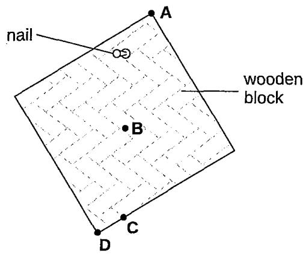

A wooden bar is pivoted at its centre so that it can rotate freely. Two equal forces F are applied to the bar. In which diagram is the turning effect greatest?

A

B

C

D

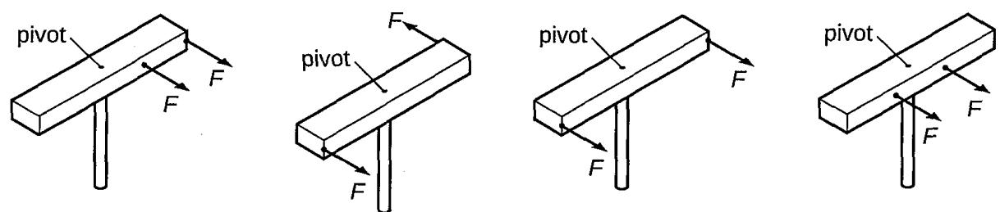

The diagram shows an object of weight W and an object of weight Z balanced on a uniform metre rule.

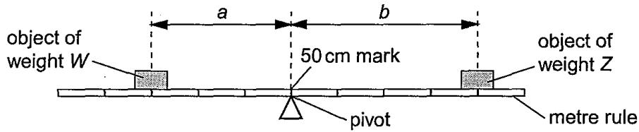

Which equation relating to W, Z, a and b is correct?

A

$$
{ \frac { W } { a } } = { \frac { Z } { b } }
$$

B

$$
W \times Z = a \times b
$$

C

$$
W \times a = Z \times b
$$

D

$$
W \times ( a \times b ) = Z
$$

The diagrams show four objects A, B, C and D. The centre of gravity G of each object is marked on the diagrams. Which object is not in equilibrium?

A

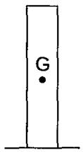

B

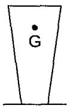

C

D

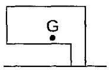

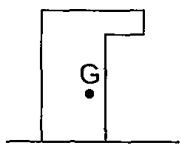

The diagrams show three uniform beams P, Q and R, each pivoted at its centre. The two forces acting on each beam are also shown.

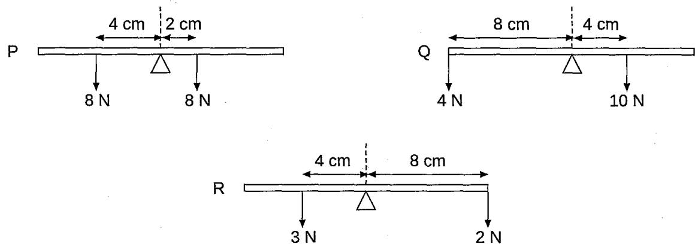

Which beams rotate clockwise?

A P and Q only B P and R only C Q and R only P, Q and R

6 The díagram shows an L-shaped piece of card suspended freely from a pin at B. When the card is pushed, it swings and then comes to a stop in the position shown. At which labelled point is the centre of gravity of the card?

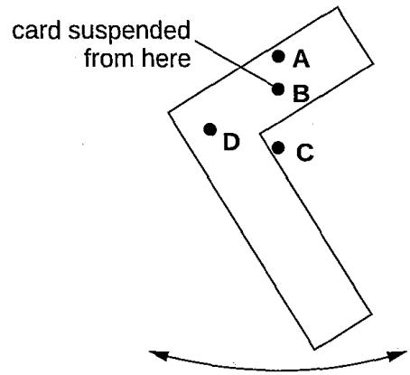

7 The diagrams show all the forces acting on a uniform beam of length 3x. Which force system causes only rotational motion of the beam without any linear movement?

A  
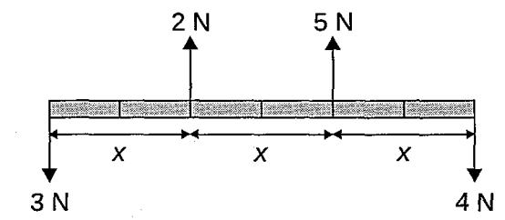

B  
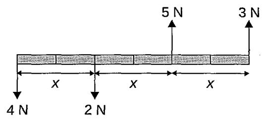

C  
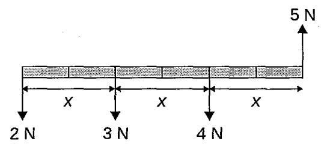

D  
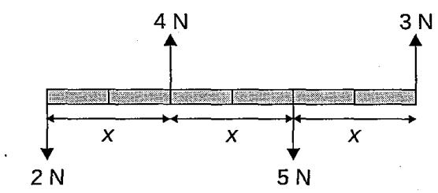

A rod of length 1 metre has non-uniform composition so that the centre of gravity is not at its geometrical centre. The rod is laid on supports across two top-pan balances as shown in the diagram.

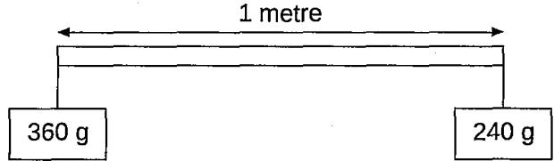

The balances (previously set at zero) give readings of 360 g and 240 g. Where is the centre of gravity of the rod relative to its geometrical shape? A $\frac { 1 } { 1 0 }$ metre to the left B $\frac { 1 } { 1 0 }$ metre to the right C $\frac { 1 } { 5 }$ metre to the left D $\frac { 1 } { 5 }$ metre to the right

A heavy uniform beam of length L is supported by two vertical cords as shown.

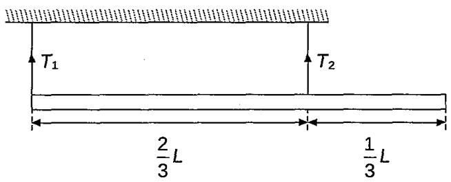

The beam is in equilibrium. What is the ratio $\frac { T _ { _ 1 } } { T _ { _ 2 } }$ of the tensions in these cords? A $\frac 1 3$ B $\frac 1 2$ C $\frac { 2 } { 1 }$ D $\frac { 3 } { 1 }$

Five identical loads are balanced on a uniform beam by an object of mass 10 kg. They are placed at an equal distance from the pivot.

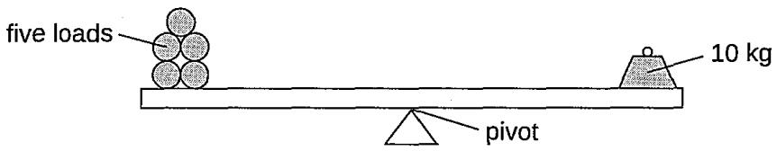

Two more identical loads are added to the other five. The average position of the loads on the beam does not change. What mass now balances the loads? A 3.5 kg B 7.0 kg C 12 kg D 14 kg

11 The diagram shows an unbalanced rod. Two loads X and Y can be moved along the rod.

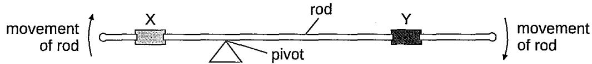

The rod turns in a clockwise direction as shown. Which action could make the rod balance? A moving X to the left B moving X to the right C moving Y to the right D moving the pivot to the left

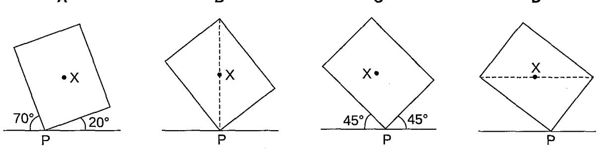

A heavy beam rests on two supports. The diagram shows the only three forces $F _ { \scriptscriptstyle 1 } , F _ { \scriptscriptstyle 2 }$ and $F _ { 3 }$ acting on the beam.

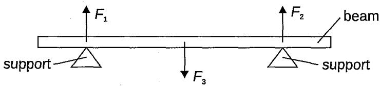

The beam ís in equilibrium. Which statement is correct?

A All the forces are equal in size.

B The resultant force on the beam is in the opposite direction to the resultant turning effect.

C The resultant force on the beam is zero and the resultant turning effect on the beam is zero.

D The total upward force is twice the total downward force.

The diagrams show four solid cones. The centre of gravity of each cone is marked by a point labelled G. Which cone is the most stable?

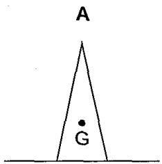

B

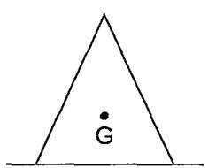

C

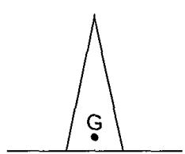

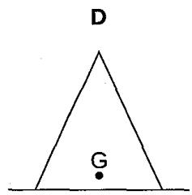

The weight of an object is found using the balance shown in the diagram. The object is put in the lefthand pan and various weights are put in the right-hand pan.

object

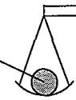

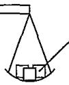

weights

These are the results.

<table><tr><td rowspan=1 colspan=1>weights in the right-hand pan</td><td rowspan=1 colspan=1>effect</td></tr><tr><td rowspan=1 colspan=1>0.1 N, 0.1 N, 0.05 N, 0.02 N</td><td rowspan=1 colspan=1>balance tips down slightly on the left-hand side</td></tr><tr><td rowspan=1 colspan=1>0.2 N, 0.1 N, 0.01 N</td><td rowspan=1 colspan=1>balance tips down slightly on the right-hand side</td></tr></table>

What is the best estimate of the weight of the object?

A

0.27 N

B

0.29 N

C

0.31 N

D

0.58 N

A plane lamina with centre of gravity X touches the ground at point P. Which diagram shows the lamina in equilibrium?

A

B

C

D

A heavy uniform plank of length L is supported by two forces, $F _ { \mathrm { _ { 1 } } }$ and $F _ { 2 } ,$ at points distant $\frac { L } { 8 }$ and $\frac { L } { 4 }$ from its ends as shown.

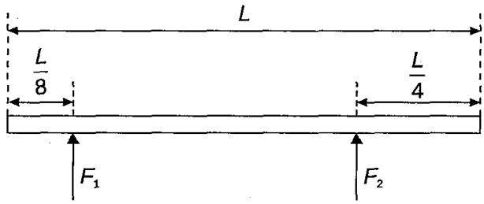

What is the value of $\frac { F _ { 1 } } { F _ { 2 } } :$

A $\frac { 2 } { 5 }$ B $\frac { 3 } { 5 }$ C $\frac { 2 } { 3 }$ D $\frac { 3 } { 2 }$

A heavy truck on wheels has a platform attached to it. A boy stands on the platform. The truck does not fall over. Which position A, B, C or D could be the centre of gravity of the whole system (truck, platform and boy)?

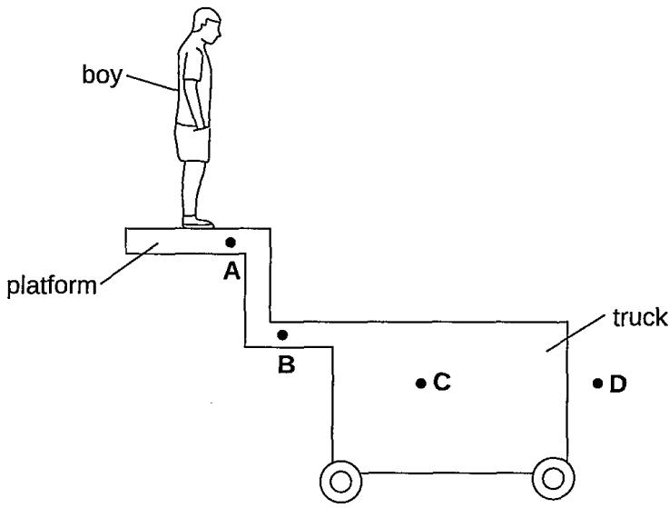

The diagram shows a non-uniform beam of weight 120 N, pivoted at one end. The beam is kept in equilibrium by force F.

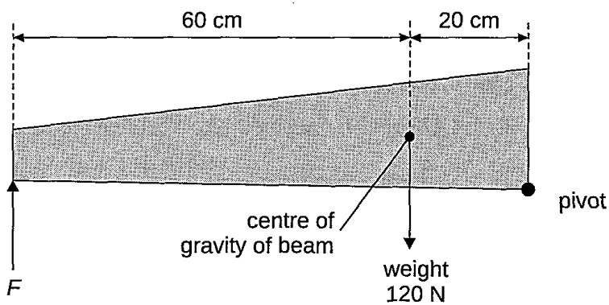

What is the value of force $F ?$ A 30 N B 40 N C 360 N D 480 N

A long plank XY lies on the ground. A load of 120 N is placed on it, at a distance of 0.50 m from end X, as shown. End Y is lifted off the ground. The upward force needed to do this is 65 N.

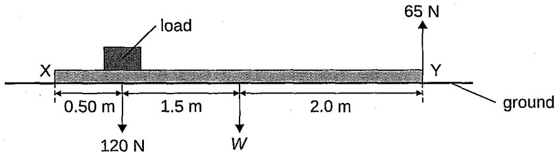

In the diagram, W is the weight of the plank, acting at its mid-point. What is the value of W? A 35 N B 47 N C 100 N D 133 N

The diagram shows a uniform, flat metal sheet hanging freely from a nail at point A. A weight also hangs freely on a string tied to A. One of the labelled points is at the centre of gravity of the metal sheet. Which point is at the centre of gravity?

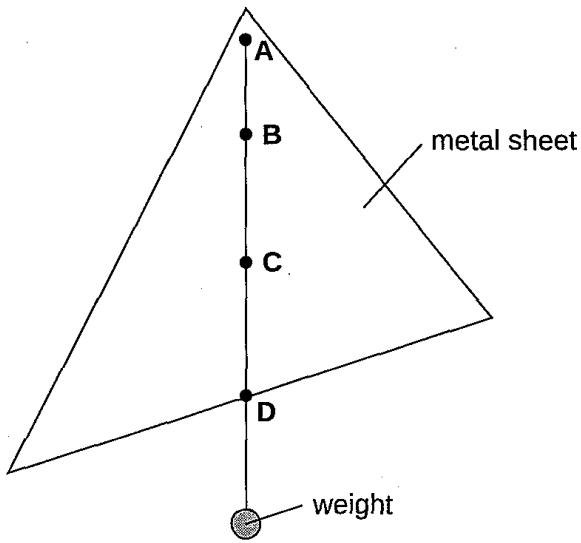

## Section B: Structured Questions

1 (a) A uniform plank is placed on a pivot at its centre of gravity. Two 4.0 N weights are hung from the plank as shown. The plank is balanced.

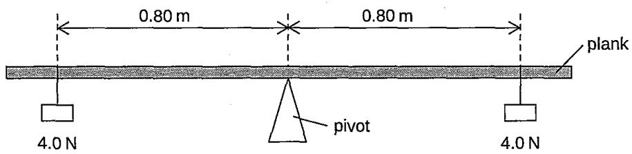

Calculate the clockwise moment acting about the pivot.

(b)The pivot and both the weights are moved 0.20 m to the left to new positions as shown below.

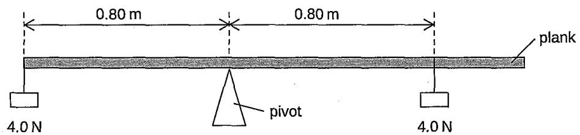

The plank is no longer balanced. Explain why it tilts in a clockwise direction.

(c)The plank has a weight of 2.0 N. Where would a 1.0 N weight be placed to restore balance?[3]

A manufacturer produces a type of cup intended for use by very young children. Diagrams 1, 2 and 3 show a cup that always returns to an upright position when tipped on its side.

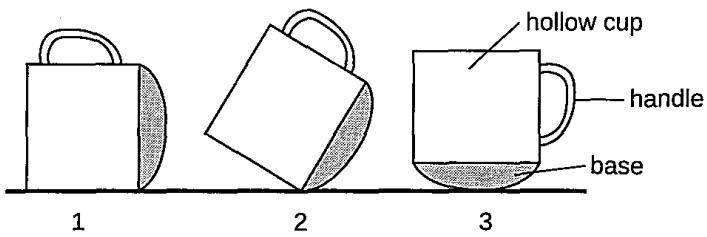

(a) What is meant by the centre of gravity of the cup? [1]

(b) On diagram 1, mark with a letter X the likely position of the centre of gravity of the cup. [1]

(c) Explain how the manufacturer of the cup ensures that the centre of gravity of the cup is at X. [2]

(d) Suggest the disadvantage of this cup when it is used by very young children. [1]

Susan investigates the principle of moments by setting up the apparatus as shown. She adjusts the position of the 2 N weight until the ruler balances. The mass of the ruler is negligible.

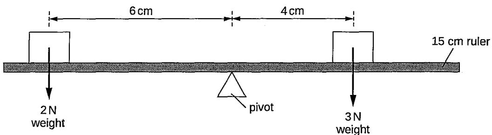

(a) Susan concludes that the ruler balances because the clockwise moment equals the anticlockwise moment.

(i) State what is meant by the clockwise moment. [1]

(ii) Show whether Susan's conclusion is correct. [1]

(b) The 2 N weight is left in the same position. The 3 N weight is replaced with a 5 N weight. Determine what distance the 5 N weight must now be placed from the pivot for the ruler to still balance. [2]

(a) State what is meant by the centre of gravity of an object. [1]

(b) A baby is being pushed in a stroller as shown below. The baby and stroller have a combined weight of 150 N.

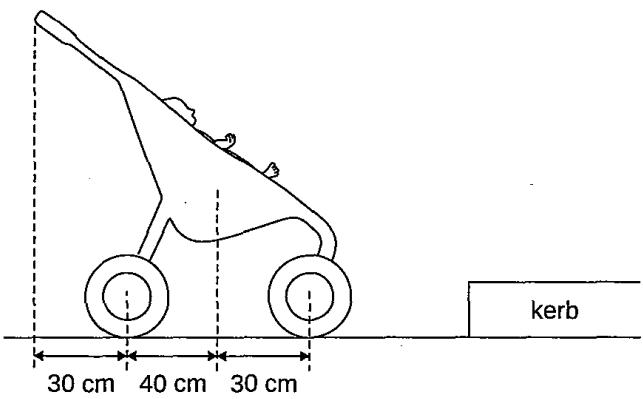

(i) The mother moves the stroller from the road over the kerb. By taking moments about the rear wheel of the stroller, calculate the vertical downward force on the handle that would be needed to just lift the front wheel. [2]

(ii) The mother finds it a lot easier to turn the stroller around and, using the handle, lift the back wheel onto the kerb while keeping the front wheel on the ground. Explain why the mother finds this new approach easier and justify your answer with a calculation. [3] (iii) Describe two ways in which you could alter the design of the stroller in order to make it more stable. [2]

Diagram 1 shows a forklift truck of weight $2 . 0 \times 1 0 ^ { 4 }$ N carrying a uniform block of concrete of side 0-80 m. The front wheel of the forklift truck acts as the pivot, represented by the letter P.

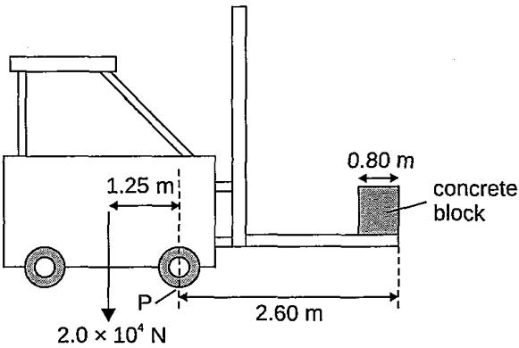  
Diagram 1

(a) Label clearly, using the letter C, the centre of gravity of the concrete block. [1]

(b) With the concrete block positioned as shown, the forklift truck is on the point of toppling. Calculate the mass of the block. Take g as 10 N/kg. [3]

(c) Explain, in terms of moments, whether or not it would be possible for the forklift truck to support this concrete block in the raised vertical position shown in Diagram 2. [2]

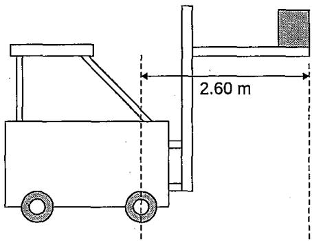  
Diagram 2

State one change that can be made to the forklift truck that would allow it to carry greater masses. [1]

The diagram shows two vertical walls supporting a uniform horizontal platform in equilibrium.

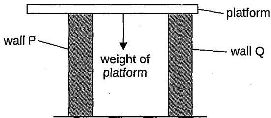

(a) The net force acting on the platform is zero. State another condition that applies to this platform.

(b) The walls exert upward forces on the platform. A student suggests that wall P should be moved a little further away from the centre of gravity of the platform and wall Q. State and explain the effect this change would have on the force exerted by wall P on the platform. [2]

A passenger at an airport pulls a travel case as shown in Diagram 1. When the passenger is stationary, a free body diagram for the travel case is shown in Diagram 2. It is held at rest by the passenger's hand at H and its centre of gravity is at G. The mass of the case is 8.5 kg.

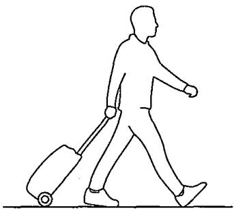  
Diagram 1

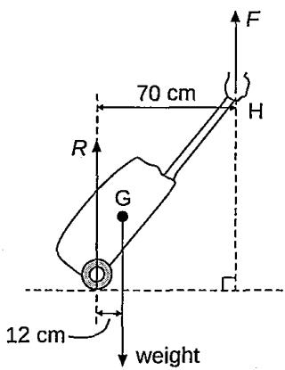  
Diagram 2

(a) Define the moment of a force. [1]

(b) Calculate the size of the upward pull, F, of the hand on the case. [3]

(c) Calculate the value of R, the force of the ground on the case. [1]

(d) Explain how repacking the case so as to move the centre of gravity further away from the wheel would affect the size of force F. [2]

(a) (i) Define the moment exerted by a force F about a point P. [1]

(ii) State the unit of moment. [1]

The long arm of the car-park barrier shown in the diagram is a tube of mass 12.0 kg which is free to rotate about a fixed pivot P near one end. A counterweight is attached firmly to one end of the tube so that the barrier is in equilibrium with its long arm horizontal. Points C and T on the diagram show the locations of the centre of gravity of the counterweight and tube, respectively. Take g as 10 N/kg.

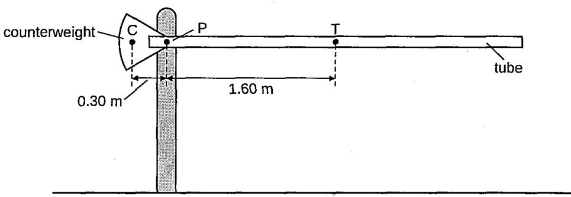

(i) Draw on the diagram the lines of action and directions of all the forces acting on the tube and counterweight. [1]

(ii) Calculate the weight of the tube. [2]

(iii)Calculate the mass of the counterweight. [2]

A non-uniform plank of wood XY is 2.50 m long and weighs 950 N. Force-meters (spring balances) A and B are attached to the plank at a distance of 0.40 m from each end, as shown in the diagram.

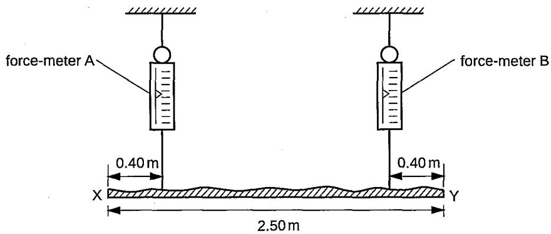

When the plank is horizontal, force-meter A records 570 N.

(a) Calculate the reading on force-meter B. [2]

(b) On the diagram, mark a likely position for the centre of gravity of the plank. [1]

(c) Determine the distance of the centre of gravity from the end X of the plank. [2]

Heavy duty coil springs are used in vehicle suspension. The diagram shows a truck of weight of 14 000 N and length of 4.5 m. When carrying no load, the centre of gravity is 2.0 m from the rear end. The part of the vehicle shown shaded in grey is supported by four identical springs, one near each wheel.

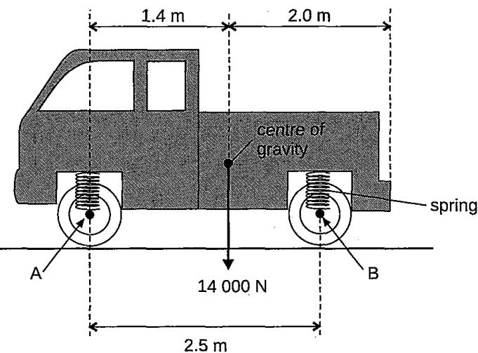

(a)State and explain which pair of springs, front or rear, will be compressed the most. [2]

(b) By taking moments about axle A, calculate the force exerted on the truck by each rear spring. [3]

A school technician installs a projector of weight 20 N and uniform support beam of weight 10 N in a classroom as shown.

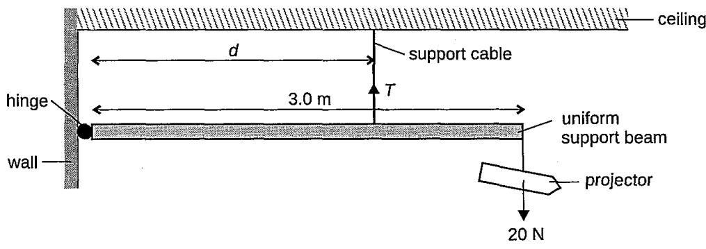

(a)Label with an arrow on the diagram, the weight of the beam.

(b) The manufacturer states that, for safety purposes, the tension, T, in the support cable must not exceed 40 N. Calculate the minimum distance, d, that the technician can place the cable so that the tension in it does not exceed the safe limit. [3]

(c)Determine the size and direction of the force that the hinge exerts on the beam when the tension in the support cable is at its maximum safe limit [2]

The diagram shows how a mechanic applies a force on a spanner to try to undo a bolt.

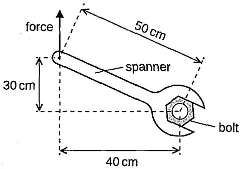

(a) Calculate the force required to produce a moment of 4.8 N m.

(b) The mechanic is not able to undo the bolt because a moment of 9.6 N m is needed. Explain how the mechanic could produce a moment of 9.6 N m. [2]

The diagram shows a car which can climb extremely steep roads at a constant speed.

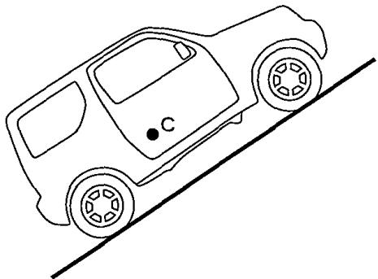

(a) Calculate the weight of such a car of mass 2500 kg. Take g as 10 N/kg.

(b) The centre of gravity of the car is marked with a dot C. Add an arrow to the diagram to show the direction and line of action of the weight of this car. Label this arrow W. [1]

(c) The ground exerts a frictional force on each wheel of the car. Add an arrow to the diagram to show the direction and line of action of the frictional force acting on the front wheel of the car. Label this arrow F. [1]

(d) The ground exerts a normal reaction force on each wheel of the car. Add an arrow to the diagram to show the direction and line of action of the reaction force acting on the front wheel of the car. Label this arrow R. [1]

(e) Give a reason why it would be unsafe for the centre of gravity to be located nearer the back of such a car on this steep road. [1]

State the conditions necessary for a body to remain in equilibrium.

(i) Two boys support a uniform plank of wood of length 8.0 m and of mass 30 kg. One boy is 0.5 m from end P of the plank and the other 2.0 m from end Q. Show on the diagram below all the forces acting on the plank. Take g as 10 N/kg. [2]

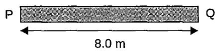

(ii) Starting, by taking moments about a suitable point, determine the force each boy exerts on the plank. [4]

(ii) If the boy near end P moves a small distance towards end Q, what will happen to the size of the force exerted by each boy? [1]

(iv) Where would the boy near end P have to support the plank to exert the same force as the boy near end Q? [1]

(a) Explain, with the aid of a diagram, what is meant by the moment of a force about a point.  [2]

(b) A uniform metre ruler is pivoted at the 10 cm mark and the other end is supported by a newtonmeter attached to the 95 cm mark as shown in the diagram. The ruler balances horizontally when the newtonmeter reads 0.8 N. Take g as 10 N/kg.

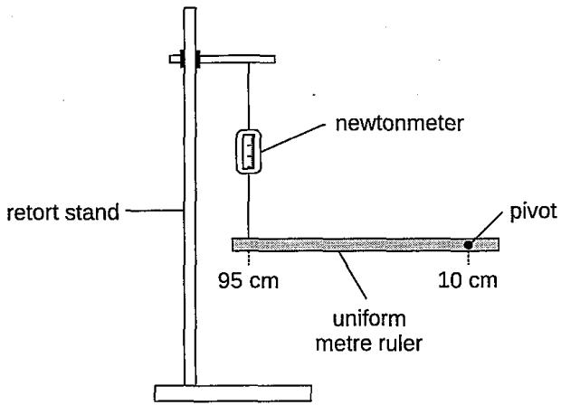

(i) Determine the mass of the ruler.

A mass of 0.5 kg is now added at the 70 cm mark on the ruler and the ruler is adjusted to be horizontal once more.

(ii) How could you check the ruler is horizontal? [1]

(iii) What is the new reading on the newtonmeter when the ruler is horizontal? [2]

If a uniform metre ruler of greater mass than the one in part (b) were used, describe how you could alter the apparatus so the ruler is horizontal once more. Explain your reasoning. [2]

(a) The triangular prism shown in Diagram 1 has its centre of gravity at the point labelled X.

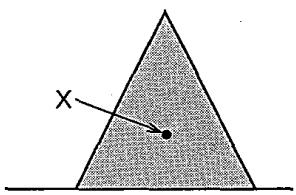  
Diagram 1

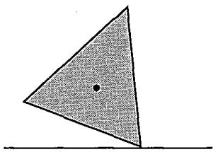  
Diagram 2

(i)What is meant by the centre of gravity?

(ii) The triangular prism is tilted as shown in Diagram 2. Explain why it returns to its original position when it is released. [1]

Diagrams 3 and 4 show the positions of two other triangular prisms.

  
Diagram 3

  
Diagram 4

Explain why, compared to the prism in Diagram 1,

(i) the prism in Diagram 3 is less stable, [1]

(ii) the prism in Diagram 4 is more stable. [1]

(c)Write down the equation for the moment of a force and explain its effect. [2]

(d) Diagram 5 shows a person balanced on a tightrope. Diagram 6 represents the person when she is not balanced. The weight of the person is 600 N and the position X of her centre of gravity is shown.

(i) Calculate the anticlockwise moment about the tightrope in Diagram 6. [2]

(ii) State the value of the clockwise moment required to restore balance in Diagram 6. [1]

(iii) Suggest a way in which balance could be restored. [1]

A student carried out an experiment to investigate the principle of moments. The equipment was set up as shown, with the uniform metre ruler suspended at the 0.10 m mark, by a thread at one end, and by a newtonmeter on the 0.90 m mark at the other end. A 250 g mass was then added to the ruler on the 0.70 m mark.

(a) When the mass was added, the height of the newtonmeter was readjusted until the ruler was horizontal. Explain how this was done. [1] (b) Draw an arrow, labelled W, on the diagram to represent the weight of the ruler acting through the centre of gravity. [1]

(c) State the principle of moments.

[2]

(i) The reading on the newtonmeter was found to be 2.8 N. Determine a value for the weight of the ruler. [4]

(ii) Calculate the tension in the thread supporting the ruler at the 0.10 m point. [2]

A student gives the following incorrect definition for the moment of a force.

'moment of force = mass × distance from pivot'

Give two reasons why this definition is incorrect.

A cyclist exerts a constant downward force of 90 N on one pedal as shown in Diagram 1. When the pedal is in the horizontal position, a moment of 27 Nm is produced about the pivot O.

  
Diagram 1

(i) Calculate d.

(ii) Hence calculate the moment about O when the pedal is in the following position. [3]

  
Diagram 2

(iii) Draw two positions of the pedal that would give zero moment about O. [2]

(iv)Explain why the force has zero moment in these positions drawn in (b)(iii).

One condition for a body to remain in equilibrium is that there should be no net moment acting on it about any point. State the other condition necessary for a body to remain in equilibrium.[1]

Diagram 1 shows a uniform plank of weight w pivoted so that it remains in equilibrium when forces $F _ { \mathrm { 1 } }$ and $F _ { _ 2 }$ are applied to it at distances $x _ { \mathfrak { z } }$ and $x _ { 2 }$ as shown. R represents the contact force at the pivot.

Applying the principle of moments about the pivot, complete the equation:

$$
\boldsymbol { F } _ { \mathrm { 1 } } \boldsymbol { x } _ { \mathrm { 1 } } =
$$

An experiment is carried out to find the weight of a student. A uniform plank of wood PQ, 4.0 m long and weighing 90 N, is pivoted about a point 0.8 m from P. A 100 N weight is placed 0.4 m from Q in order to balance the plank horizontally, as shown in Diagram 2.

## Diagram 2

(i) Use the information given to find the relevant distances a and b. [1]

(ii) Hence calculate the weight of the student. [2]

(iii) Determine the value of the force exerted by the pivot on the plank. [1]

(iv) By taking moments about Q, and using your answers to (c)(ii) and (c)(iii), confirm that the plank is in equilibrium. [2]

(v) The student now steps off the plank and is replaced by another, heavier student who stands at point P. Which way must the pivot be moved in order to balance the plank horizontally? Explain your answer. [2]

(a)State the principle of moments.

(b)The diagram shows a child's mobile in equilibrium.

A piece of cotton thread is attached to the rod supporting objects A and B and another piece of cotton thread supports the rod holding objects C and D. The tension in the cotton threads is T and all the rods are horizontal.

(i)Complete the following table assuming the weights of the rods are negligible.

<table><tr><td rowspan=1 colspan=1>Object</td><td rowspan=1 colspan=1>A</td><td rowspan=1 colspan=1>B</td><td rowspan=1 colspan=1>C</td><td rowspan=1 colspan=1>D</td></tr><tr><td rowspan=1 colspan=1>Weight (N)</td><td rowspan=1 colspan=1>0.40</td><td rowspan=1 colspan=1></td><td rowspan=1 colspan=1></td><td rowspan=1 colspan=1>0.10</td></tr></table>

(ii) Calculate the distance, d.

(iii) What is the magnitude of T?

(c)Object A becomes detached and falls to the ground. State and explain the initial effect on

(i) the rod holding objects A and B, [1]

(ii) the rod holding objects C and D, [1]

(iii) the rod closest to the top of the mobile. [1]

A student investigates the principle of moments. He connects a ruler to a stand with a pivot and hangs a 2 N weight from the 60 cm mark on the ruler. He then uses a forcemeter to hold the ruler horizontal, as shown in Diagram 1. The scale on the forcemeter reads from 0 N to 10 N.

  
Diagram 1

(a) How could the student check that the ruler is horizontal? [2]

(b) Calculate the moment of the 2 N weight [2]

(c) The student holds the ruler horizontal with the forcemeter at the 10 cm mark. He expects the reading on the forcemeter to be 12 N. The actual reading is 10 N.

(i) Explain why the correct reading should be larger than 12 N. [2]

(ii) Give one possible reason why the actual reading is only 10 N. [1]

(d) The student's textbook shows two workers using a pole to carry some load, as shown in Diagram 2.

  
Diagram 2

Worker P and worker Q feel different forces on their shoulders. Use ideas about moments to explain why worker P feels the larger force. [3]

A uniform plank of wood of mass 32 kg and length 4.0 m is used by a boy to help him cross a ditch. In the ditch is a rock, which is used to support the plank horizontally 0.80 m from one end, as shown in Diagram 1. The other end of the plank is supported by the bank. Take g as 10 N/kg.

  
Diagram 1

(i) Calculate the vertical supporting force from the rock when the plank is placed in position as shown in the diagram. [2]

(ii) The boy has a mass of 46 kg. Determine whether the boy can walk to the far end of the plank without it tipping. [3]

Diagram 2 shows a back view of a tablet on a tablet holder.

In normal use, the tablet is stable.

(i) Explain the meaning, in the above sentence, of the word stable.

(ii) State the relationship between the total clockwise moment and the total anticlockwise moment about any axis of the monitor when it is stable. [1]

The instruction booklet explains that the holder can be tilted. It also includes a warning, as shown in Diagram 3.

  
Diagram 3

(iii) Explain why the tablet will tip over if the holder is tilted too far back. Include the words centre of gravity, weight and moment in your explanation. [3]

The diagram shows a motorcycle and rider balanced stationary on a level surface. The motorcycle is in contact with the road at A and B.

The motorcycle has a weight of 1200 N and the rider's weight is 825 N.

(a)State the principle of moments. [2]

(b)Calculate the moment of the rider's weight about A. [2]

(c) Calculate the vertical force that the road exerts on the front tyre at B by taking the moments about A. [4]

(d) Calculate the vertical force that the road exerts on the rear tyre at A. [2]

(a) One condition for a body to remain in equilibrium is that there should be no net moment acting on it. State the other condition necessary for a body to remain in equilibrium. [1]

(b) The diagram shows a uniform plank of weight w pivoted so that it remains in equilibrium when weights $w _ { \mathfrak { x } }$ and $w _ { \mathfrak { z } }$ are placed on it at distances $x _ { \scriptscriptstyle 1 }$ and $x _ { 2 }$ from the pivot as shown. R represents the normal reaction at the pivot.

(i) Write an expression that shows the principle of moments about the pivot based on the diagram above. [1]

(ii) Using your answer to part (a), write down an expression for R. [1]

An experiment is carried out to find the weight of a student. A uniform plank of wood PQ, 3.0 m long, weighing 80 N is pivoted about a point 0.5 m from P. The student stands 0.3 m from P. A 20 N weight is placed 0.5 m from $\mathsf Q$ in order to balance the plank horizontally.

(i) Draw a diagram of the plank representing each force on it by an arrow. Indicate distances in your diagram. [3]

(ii) Calculate the weight of the student. [3]

(iii) Determine the value of the force exerted by the pivot on the plank. [1]