# Unit 4 Turning effects of forces

## Moment

In dynamics, what is meant by a moment (or a torque)?

Name fixed point around which an object turns when a force is applied.

It is the turning effect of a force.

Remark:

Define the moment of a force about a pivot.

Recall that it is one of the effects of forces.

Pivot (or fulcrum)

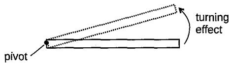

It is the product of the force F and the perpendicular distance d from the pivot to the line of action of the force.

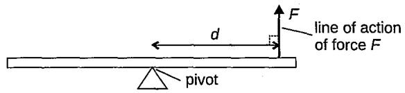

Eg.

A force F is exerted on the rod as shown. a, b and c represent various distances.

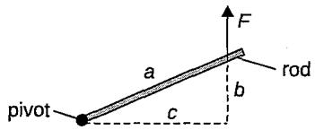

The moment of force F about the pivot $= F \times c$ (not $F \times a$ or $F \times b )$

Remark:

In this example, the line of action of force F is a vertical line. When extends downward, it will meet the perpendicular distance from the pivot to this line, c.

Give the formula for the moment of a force.

$$
M = F d
$$

where

M = moment (Nm)

F = force applied (N)

d = perpendicular distance from the pivot to the line of action of the force (m)

State the SI unit for moment of forces.

Newton metre (Nm)

What is the relationship between the moment (M), force (F) and perpendicular distance (d) from the pivot?

The moment (M) is directly proportional to both the force (F) and the perpendicular distance (d).

• If d remains unchanged, M increases as Fincreases.

• If F remains unchanged, M increases as d increases.

State the two types of moment.

## Clockwise moment

## What is it?

Moment causing rotation in the direction of the hands of a clock about the pivot

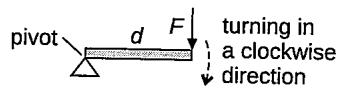

## Anticlockwise moment

Moment causing rotation opposite to the direction of the hands of a clock about the pivot

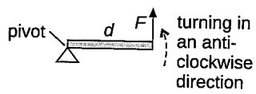

## Applications

## How?

Opening a• Applying force on the door handle creates a door moment (or turning effect) about the hinges, causing the door to rotate open.

Opening a jar

Applying force on the lid creates a moment around the jar, making it easier to twist open.

Using a seesaw

Children sitting at different distances from the pivot create moments that balance or tip the seesaw.

Using a screwdriver

Question Calculate the moment of forces in the following diagrams.

(a)  
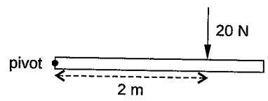

(b)  
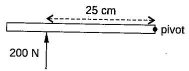

## Answer

(a) $M = 2 0 ~ \mathsf { N } \times 2 ~ \mathsf { m } = 4 0 ~ \mathsf { N m }$

(b) $M = 2 0 0 \mathsf { N } \times 2 5 \mathsf { c m } = 5 0 0 0 \mathsf { N c m }$ Or

$$
M = 2 0 0 ~ { \mathsf { N } } \times 0 . 2 5 ~ { \mathsf { m } } = 5 0 ~ { \mathsf { N } } { \mathsf { m } }
$$

Question

(a) If the moment of forces on the beam is 150 Nm. Find the force applied, F.

(b) If the moment of forces on the beam is 600 Nm. Find the distance, d.

Answer

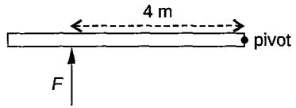

(a)

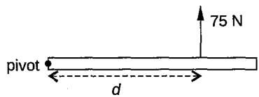

$$
F = \frac { 1 5 0 \ N m } { 4 \ m } = 3 7 . 5 N
$$

(b) $d = \frac { 6 0 0 \mathsf { N } m } { 7 5 \mathsf { N } } = 8$ m

Worked example 3

Question

(a)

Calculate the moment of forces in the following diagrams.

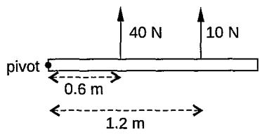

(b)  
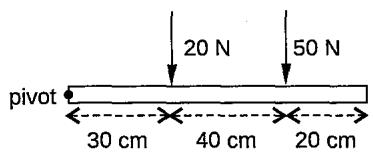

Answer

(a) $\begin{array} { c } { M = ( 4 0 \ \mathsf { N } \times 0 . 6 \ \mathsf { m } ) + ( 1 0 \ \mathsf { N } \times 1 . 2 \ \mathsf { m } ) } \\ { = 2 4 \ \mathsf { N } \mathsf { m } + 1 2 \ \mathsf { N } \mathsf { m } = 3 6 \ \mathsf { N } \mathsf { m } } \end{array}$

$$
{ \begin{array} { r l } { ( { \mathsf { b } } ) } & { M = ( 2 0 { \mathsf { N } } \times 0 . 3 { \mathsf { m } } ) + ( 5 0 { \mathsf { N } } \times 0 . 7 { \mathsf { m } } ) } \\ & { \quad = 6 { \mathsf { N } } { \mathsf { m } } + 3 5 { \mathsf { N } } { \mathsf { m } } = 4 1 { \mathsf { N } } { \mathsf { m } } } \end{array} }
$$

## Question 1

The diagram shows a force applied on a beam which is pivoted at one side in Experiment 1.

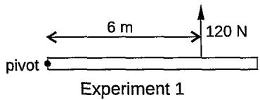

(a) Calculate the moment of forces.

The experiment is repeated with the following modifications as shown in Experiments 2 and 3 below.

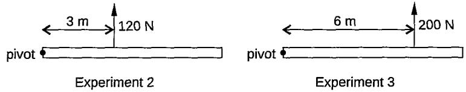  
(b) State the effect on the ease of turning the beam in Experiments 2 and 3 compared to Experiment 1. Show your answer clearly.

## Principle of moments

What does it mean when an object is said to be in equilibrium?

State two conditions that must be met for any object to be in equilibrium.

## Remark:

If there is a net force acting on an object, the object will accelerate in the direction of the net force, according to Newton's Second Law of Motion.

» We learnt how to determine the net force acting on an object in the previous unit.

If there is a net moment acting on an object, the object will turn or rotate about a pivot point.

Hence, when there is a net force and a net moment acting on an object, the object will not be in equilibrium.

It means that the object will neither rotate (no rotational motion) nor move along a path (meaning no linear motion or translational motion).

## Conditions

## No net force

## What is it?

The sum of all forces acting on the object must be zero.

This ensures that the object will not have any translational motion.

Remark:

Translational motion refers to movement where all parts of an object move in the same direction and at the same speed, resulting in a change in position along a path.

## No net moment

The sum of all clockwise moments about any pivot must equal the sum of all anticlockwise moments (which is known as the principle of moments).

This ensures that the object will not have any rotational motion.

Example

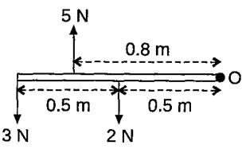

Sum of upward force = 5 N

Sum of downward force   
=3N + 2 N   
=5 N

Net force = 5 N − 5 N = 0 N (no translational motion)

Sum of clockwise moment   
= 5 N× 0.8 m   
= 4 Nm

Sum of anticlockwise moments

The object is in equilibrium.

It states that for an object to be in equilibrium, the sum of the clockwise moments about a pivot must equal the sum of the anticlockwise moments.

## Remark:

This is one of the two conditions that an object must satisfy to be in equilibrium.

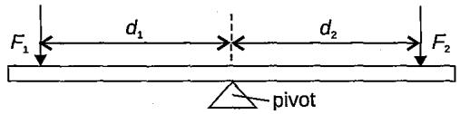

Sum of anticlockwise moments = Sum of clockwise moments

$$
\bar { F } _ { 1 } d _ { 1 } = \bar { F } _ { 2 } d _ { 2 }
$$

The objects will be in equilibrium. This means that they will not turn in either ways.

## Remark:

## Remark:

Explain why the balance of an object is not affected by its weight.

The principle of moments helps determine when an object is in equilibrium, meaning it will not rotate or tip over. This is crucial in designing stable structures like bridges, buildings, and furniture.

Worked example 1

The balance of an object depends on the moments acting on it, not the weight alone.

Balance depends on moments (force × perpendicular distance), not just the amount of force (weight).

An object is balanced when the sum of clockwise moments equals the sum of anticlockwise moments about a pivot.

This means there is no resultant moment, and the object stays in equilibrium.

anticlockwise M clockwise M
<table><tr><td rowspan="2"></td><td colspan="2"></td><td rowspan="2">object</td></tr><tr><td></td><td></td></tr><tr><td></td><td></td><td></td><td></td></tr><tr><td>force applied</td><td>pivot</td><td>weight of object</td><td></td></tr></table>

If the positions of the weights and distances from the pivot stay the same, increasing or decreasing the total weight proportionally will still keep the moments balanced.

Question In the following experimental setup, the uniform plank stays in equilibrium. R is the force exerted by the pivot on the plank. By ignoring the weight of the plank, calculate the magnitude of forces F and R.

(a)  
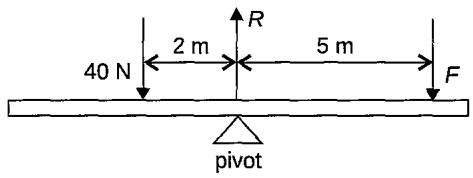

(b)  
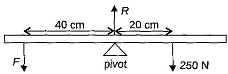

(c)

Answer

Remark:

Remember the two conditions for any object to be in equilibrium:

• No net force

• No net moment

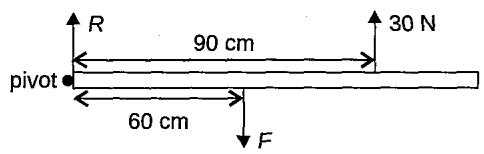

(a) clockwise M = anticlockwise M Since net force = 0:

$$
F \times 5 ~ { \mathsf { m } } = 4 0 ~ { \mathsf { N } } \times 2 ~ { \mathsf { m } }
$$

$$
R - \left( 4 0 + 1 6 \right) \ N = 0
$$

$$
F = 1 6 ~ \mathsf { N }
$$

$$
R = 5 6 ~ \mathsf { N }
$$

(b) clockwise M = anticlockwise M Since net force = 0:

$$
2 5 0 \mathsf { N } { \times } 2 0 \mathsf { c m } = \mathsf { \boldsymbol { F } } { \times } 4 0 \mathsf { c m }
$$

$$
R - \left( 2 5 0 + 1 2 5 \right) \Nu = 0
$$

$$
F = 1 2 5 \mathsf { N }
$$

$$
R = 3 7 5 \ N
$$

(c) clockwise M = anticlockwise M Since net force = 0:

$$
F \times 6 0 ~ \mathsf { c m } = 3 0 \mathsf { N } \times 9 0 ~ \mathsf { c m }
$$

$$
\left( R + 3 0 \right) \mathsf { N } - 4 5 \mathsf { N } = 0
$$

$$
F = 4 5 \ N
$$

Worked example 2

$$
R = 1 5 \mathsf { N }
$$

Question

(a)

In the diagrams, calculate the sum of clockwise and anticlockwise moments on the beam and state the direction in which the beam will turn.

(b)  
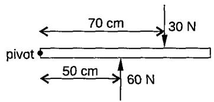

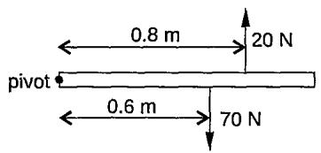

Answer

(a) Sum of clockwise $M = 3 0 ~ { \mathsf { N } } \times 7 0 ~ { \mathsf { c m } } = 2 1 0 0 ~ { \mathsf { N } } { \mathsf { c m } }$

Sum of anticlockwise $M = 6 0 ~ { \mathsf { N } } \times 5 0 ~ { \mathsf { c m } } = 3 0 0 0$ Ncm

The beam will turn in the anticlockwise direction. (The sum of anticlockwise moments is greater than that of clockwise moments.)

(b) Sum of clockwise $M = 7 0 N \times 0 . 6 m = 4 2 N m$

Sum of anticlockwise $M = 2 0 \ \mathsf { N } \times 0 . 8 \ \mathsf { m } = 1 6 \ \mathsf { N m }$

The beam will turn in the clockwise direction. (The sum of anticlockwise moments is less than that of clockwise moments.)

The diagram shows the axle P fixed into the wheel Q so that they rotate together. They are mounted in bearings, which are not shown.

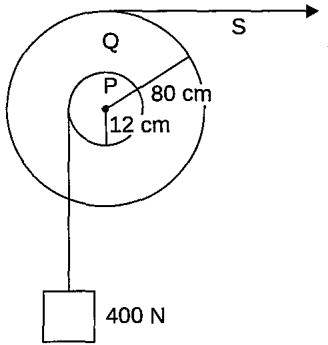

A load of 400 N hangs on a rope wound around the axle, which has a radius of 12 cm. String S is wound around a wheel of radius 80 cm. Calculate the force in string S that produces equal and opposite moments.

Let F be the force in string S.

clockwise M = anticlockwise M

F×80 cm = 400 N×12 cm

$$
F = 6 0 ~ \mathsf { N }
$$

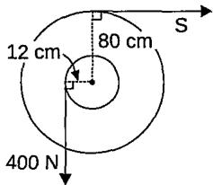

Remark:

The distance must be perpendicular to the line of action of the force.

Worked example 4

The diagram shows a box of mass 50 kg placed at a distance, $x ,$ from the pivot P.

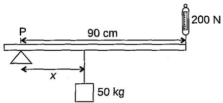

When the plank is balanced, the reading of the spring balance is 200 N. By ignoring the weight of the plank and taking the gravitational field strength as 10 N/kg, calculate the value of x.

Weight of the box $: = m g = 5 0 ~ k g \times 1 0 ~ \mathsf { N } / \mathsf { k g } = 5 0 0 ~ \mathsf { N }$

clockwise M = anticlockwise M

500 N×x = 200 N× 90 cm

$$
x = 3 6 c m
$$

Worked example 5

Remark:

Whenever there are two possible pivot points, we can choose one as the pivot to calculate the force acting at the other pivot point.

Question

Answer

## Question 2

The diagram shows a load being moved using a wheelbarrow.

The total mass of the load and wheelbarrow is 50 kg. By taking the gravitational field strength as 10 N/kg, calculate force F needed just to lift the loaded wheelbarrow.

A uniform plank of length 4.0 m and weight 200 N is suspended by two strings. $\tau _ { \mathfrak { r } }$ and $\tau _ { _ 2 }$ are the tensions in the strings. A load of weight 40 N is placed at 0.5 m from one end of the plank as shown. The plank is balanced horizontally.

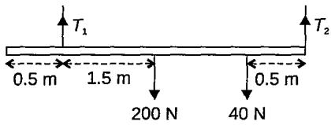

(a) By taking moments about a suitable point, calculate $T _ { \scriptscriptstyle { 1 } \cdot }$

(b) Hence or otherwise, calculate the tension $\boldsymbol { \tau } _ { { \scriptscriptstyle 2 } } .$

(c) How could you check the ruler is horizontal?

(a) To calculate $\tau _ { \mathbf { { r } } }$ we take moments about $T _ { \scriptscriptstyle 2 }$ (meaning taking $\boldsymbol { T } _ { 2 }$ as the pivot)

clockwise M = anticlockwise M

$$
\begin{array} { c } { { T _ { 1 } \times 3 . 5 ~ \mathsf { m } = \left( 2 0 0 \mathsf { N } \times 2 . 0 ~ \mathsf { m } \right) + \left( 4 0 \mathsf { N } \times 0 . 5 ~ \mathsf { m } \right) } } \\ { { T _ { 1 } = 1 2 0 ~ \mathsf { N } } } \end{array}
$$

(b) Since the plank is balanced, the net force is also zero. Upward forces —Downward forces = Net force

$$
\begin{array} { c } { { 1 2 0 ~ \mathsf { N } + T _ { \mathrm { { 2 } } } - \left( 2 0 0 ~ \mathsf { N } + 4 0 ~ \mathsf { N } \right) = 0 ~ } } \\ { { T _ { \mathrm { { 2 } } } = 1 2 0 ~ \mathsf { N } ~ } } \end{array}
$$

or

Take moments about $\tau _ { \mathrm { r } }$

clockwise M = anticlockwise M

$$
\begin{array} { c } { { \left( 2 0 0 \mathsf { N } \times 1 . 5 ~ { \mathsf { m } } \right) + \left( 4 0 \mathsf { N } \times 3 . 0 ~ { \mathsf { m } } \right) = { T } _ { 2 } \times 3 . 5 ~ { \mathsf { m } } } } \\ { { { T } _ { 2 } = 1 2 0 ~ \mathsf { N } } } \end{array}
$$

(c) Measure the vertical distance from the surface to both ends of the plank. If both ends are at the same height, the plank is horizontal.

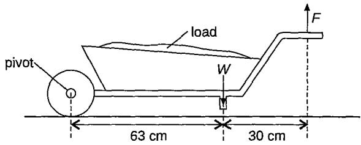

## Question 3

The diagram shows the essential parts of a hand winch.

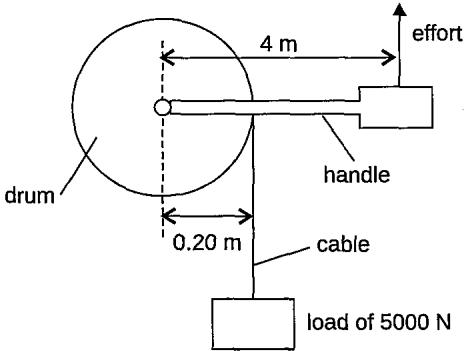

The winch is used to move a load of 5o00 N over a horizontal distance towards the drum through a cable.   
Calculate the minimum amount of effort required to turn the drum.

## Question4

The diagram shows a uniform metre rule AB suspended from two ropes X and Y.

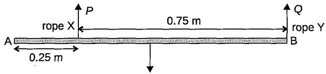  
10.5 N

The weight W of the metre rule is 10.5 N and it acts in the middle part of the plank. The force in rope X is P. The force in rope Y is Q. The metre rule is in equilíbrium.

(a) State, in terms of P, the moment of force P about B.

(b) Calculate

(i) the moment of W about B,

(ii) the force P,

(iii) the force Q.

## Centre of gravity

Define the centre of gravity of It is an imaginary point where the entire weight of the object appears an object. to act.

Explain why an object will balance at the centre of gravity.

An object will balance at its centre of gravity because, at this point, the line of action of the object's weight passes through the pivot.

As a result, the weight does not create any moment (or torque) around the pivot since there is no perpendicular distance from the pivot to the line of action of the weight.

This means there is no net moment acting on the object, allowing it to remain in equilibrium and balanced.

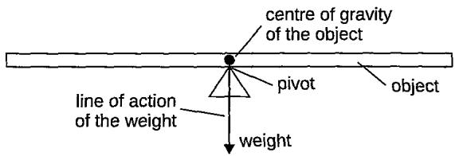

Where is the location of the centre of gravity (CG) in regular-shaped and uniform density and irregular-shaped objects?

Types of object

Regularshaped and uniform density

How to find its CG?

'• The CG is at the geometric centre.

Examples

Remark:

For some regular-shaped objects with uniform density, the centre of gravity is not located on the actual objects, eg, a cylinder with a hollow centre.

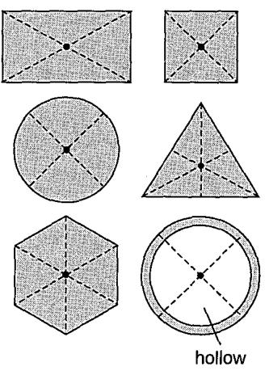

'•' = centre of gravity

Irregularshaped

The CG can be found by plumb line method.

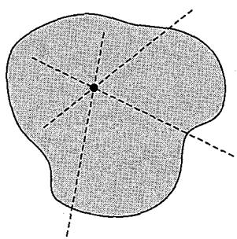

'•' = centre of gravity

Describe how the centre of gravity for an irregularshaped lamina can be determined using the plumb line method.

## Step

## Procedure

Make three holes near the edge of an irregular-shaped lamina.

Hang the lamina freely about one of its holes on a pin clamped firmly on a retort stand.

A plumb line attached to a bob is then suspended from the same pin. After it rests, mark the position and trace the vertical line from the hole.

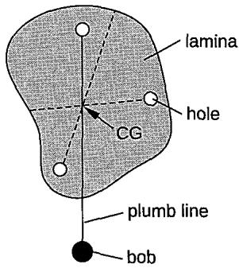

4 Repeat the experiment for the rest of the two holes.

Remarks:

Lamina means a thin plate.

5 The point of intersection of the three lines is the centre of gravity (CG) of the irregularly shaped lamina.

The lamina can be balanced at the point of intersection.

The object will come to rest with its centre of gravity aligned on a vertical line directly below the pivot.

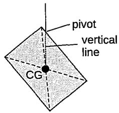

Worked example

## Question

A uniform metre rule of mass 0.5 kg rests on supports P and Q as shown below. Take g as 10 N/kg.

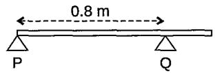

What force is exerted by support Q on the beam?

## Remark:

Look out for the keywords 'uniform' and 'metre rule'.

## Answer

Uniform → the centre of gravity is at midpoint.

Metre rule → the total length is 1 m.

Weight W of beam = 0.5 kg × 10 N/kg = 5 N

Let F be the force exerted by support Q on the beam.

Take the moments about P:

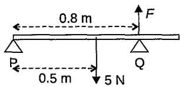

clockwise M = anticlockwise M

5 N×0.5 m=F×0.8 m

F=3.125 N

## Question5

Two loads are placed on a uniform bar. The uniform bar has a length of 1.0 m and weighs 5 N.

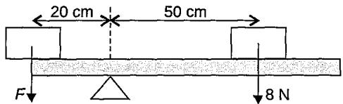

(a) Calculate the force F needed in order to balance the bar.

(b) Hence, find the force exerted by the pivot on the bar.

## Question6

The diagram shows apparatus for investigating moments of forces.

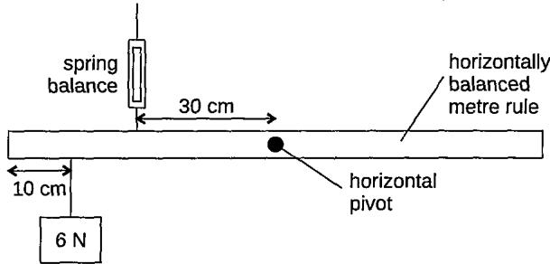

The uniform metre rule shown in the diagram is in equilibrium. The horizontal pivot is at the centre of the metre rule.

(a)Write down two conditions for the metre rule to be in equilibrium.

(b) Show that the value of the reading on the spring balance is 8 N.

(c) The weight of the uniform metre rule is 1.5 N. Calculate the force exerted by the horizontal pivot on the metre rule. State the direction of this force.

(d) How could you check the ruler is horizontal?

## Stability

It is the ability of objects to remain in their original position.

<table><tr><td rowspan="2">Describe how the line of action of the centre of gravity affects the stability of an object.</td><td colspan="2">Stability</td><td colspan="2">How?</td></tr><tr><td>Stable</td><td>position after being displaced.</td><td>When the line of action of the centre of gravity stays within the base area of support of an object when tilted, the object can return to its original</td><td>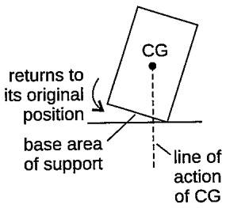</td></tr><tr><td colspan="2">Unstable State two factors affecting the</td><td colspan="2">• . When the line of action of the centre of gravity falls outside the base area of support of an object when tilted, the object will topple to a new position and does not return to its original position.</td></tr><tr><td rowspan="6">stability of an object.</td><td>Factors Position of the</td><td>How it affects and why Lower CG increases</td><td>Example</td></tr><tr><td>centre of gravity</td><td>stability. This is because the line of action of the centre of gravity is</td><td>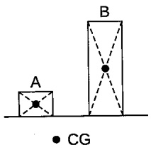</td></tr><tr><td></td><td>less likely to fall outside of the base when tilted to a certain angle.</td><td>A is more stable than because it has a lower centre of gravity.</td></tr><tr><td>Base area of support of the object</td><td>Wider base of support increases stability. This is because the line of action</td><td>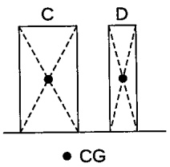</td></tr><tr><td></td><td>of the centre of gravity is more likely to stay within the base when the object is tilted at a certain angle.</td><td>C is more stable than because it has a wide base area of support.</td></tr></table>

Using a suitable diagram, explain, in terms of moments of force, why the line of action of the centre of gravity affects the stability of an object.

Remark:

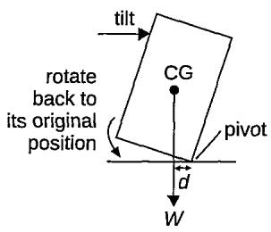  
Restoring moment is the moment that returns the object to equilibrium when tilted, acting opposite to the tilting direction.

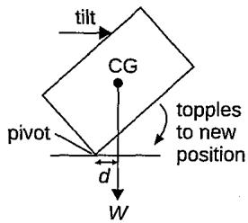

When the object is tilted but the line of action of the centre of gravity stays within its base, the anticlockwise moment (restoring moment) acts to bring the object back to its original position.

This occurs because the restoring moment generated by the weight is greater than the tilting moment, causing the object to return to the same side of the base area.

When the object is tilted until the line of action of the centre of gravity falls outside its base, the sum of the clockwise moments created by the tilt and the weight causes the object to topple over to the other side of the base area of support.

d = the perpendicular distance from the pivot to the line of action of the weight.

Remark:

Depending on how the diagram is presented, recognise the correct direction of moments of force that allow the object to return to its original position or topple over.

## Question 7

Díagram 1 shows an object of mass 4 kg being balanced by a horizontal force, F. G is the centre of gravity of the object

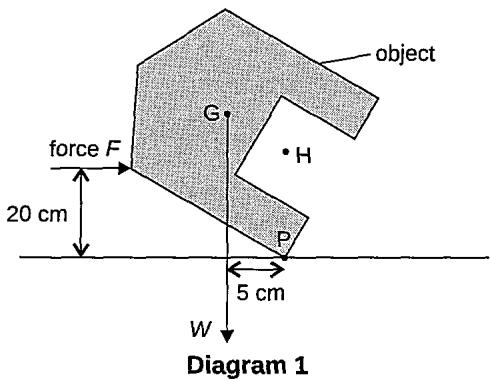

Take the gravitational field strength as 10 N/kg.

(a) Find the weight of the object.

(b) On the same diagram, draw an arrow to show the vertical force that acts upwards on the object.

(c) State the principle of moments for the object to remain in equilibrium.

(d) Calculate

(i) the moment of the weight about point P,

(ii) the value of the force, F.

(e) The object is placed in the upright position, as shown in Diagram 2.

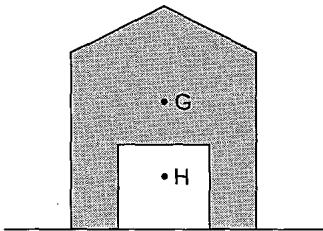  
Diagram 2

Explain why the object will be more stable with the centre of gravity at H than at G.

## Question 8

The stability of a car is tested, as shown in the diagram.

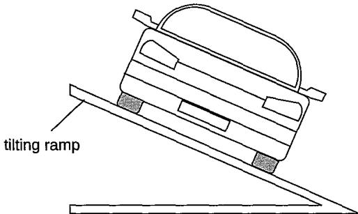

The ramp is tilted as much as possible without the car toppling over. The ramp is then fixed and the car remains at rest in the position shown.

(a) On the same diagram, draw arrows to represent the forces acting on the car. Label your arrows with the names of the forces.

(b) Explain why the car topples over if the ramp is tilted to a certain angle.

(c) State how the position of the centre of gravity affects the stability of the car.

## Section A: Multiple-choice Questions

1The diagram shows a load used to balance the toy.

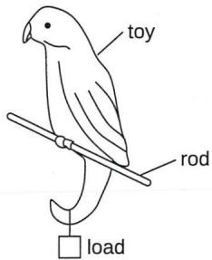

What is the effect of the load?

A To raise the centre of gravity above the rod

B To raise the centre of gravity to the rod

C To lower the centre of gravity below the rod

D To increase the weight by not affecting its centre of gravity

2 The diagram shows a truck going down a rough slope. What is the safest position for its centre of gravity?

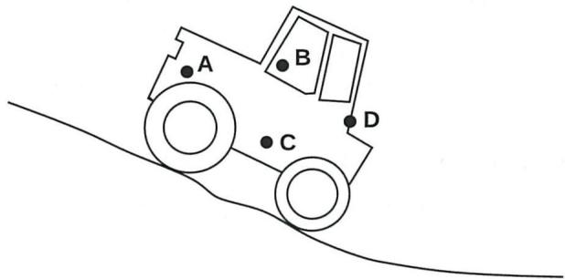

A plane lamina is freely suspended from point X. The weight of the lamina is 5.0 N and the centre of gravity is at Z.

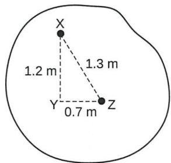

The lamina is displaced into the position shown. What is the moment that will cause the lamina to swing?

A 3.5 Nm clockwise B 6 Nm anticlockwise

C 6 Nm clockwise D 6.5 Nm anticlockwise

4 Why is it better to use a long spanner rather than a short one to loosen a nut on a bolt?

A Less force needs to be exerted by the user.

B Reduce the effect of friction.

C Less turning is required on the spanner.

D Less work is done by the user.

5 A student balances a non-uniform object on a pivot by attaching a weight at one end, as shown. Where is the centre of gravity?

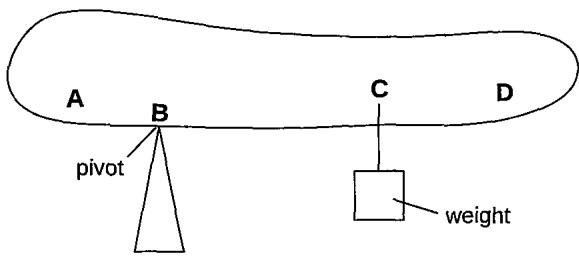

The diagram shows a wheelbarrow and its load, which have a total weight of W. This is supported by a vertical force of 400 N at the ends of the handles

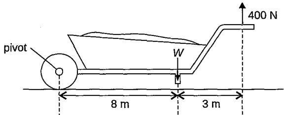

What is the total weight of the load and the wheelbarrow?

A 400 N B 550 N C 700 N D 850 N

7 A uniform metre rule, which weighs 2.0 N, is pivoted horizontally at the 40 cm mark. A 4.0 N weight is hung from the 20 cm mark.

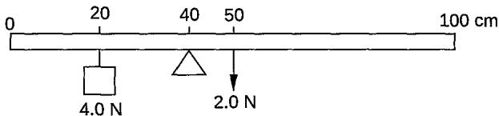

What is the resultant moment about the pivot?

<table><tr><td rowspan=1 colspan=1></td><td rowspan=1 colspan=1>magnitude</td><td rowspan=1 colspan=1>direction</td></tr><tr><td rowspan=1 colspan=1>A</td><td rowspan=1 colspan=1>ON</td><td rowspan=1 colspan=1>no turning</td></tr><tr><td rowspan=1 colspan=1>B</td><td rowspan=1 colspan=1>0.6 Nm</td><td rowspan=1 colspan=1>clockwise</td></tr><tr><td rowspan=1 colspan=1>C</td><td rowspan=1 colspan=1>0.6 Nm</td><td rowspan=1 colspan=1>anticlockwise</td></tr><tr><td rowspan=1 colspan=1>D</td><td rowspan=1 colspan=1>1.0 Nm</td><td rowspan=1 colspan=1>anticlockwise</td></tr></table>

The diagram shows a plank hinged at X and supported by a vertical rope at Y, 2 m from X. A load weighing 500 N is placed at the end of Z of the plank, which is 8 m from the hinge.

By neglecting the weight of the plank, what is the tension T in the rope? A 500 N B 1000 N C 1500 N D 2000 N

A uniform bar of length 1.0 m is supported 20 cm from one end. In order to balance the bar, a weight of 6 N is attached to one end, as shown.

What is the weight of the bar? A 2N B 4N C 6N D 8N

10Two loads are placed on a uniform metre rule and weight 4 N as shown.

The metre rule is balanced by these two loads. What is the value of force F? A 0.5 N B1N C 2N D 3N

## Section B: Structured Questions

1 The diagram shows a ladder AB. End A of the ladder rests against a vertical wall. End B rests on rough ground.

The diagram shows two of the forces acting on the ladder. The only force on the ladder at A is F, which acts at a right angle to the wall. The weight of the ladder is 240 N acting at the centre of gravity of the ladder.

(a) Calculate the moment of the weight of the ladder about point B.

(b) Write an expression, in terms of F, for the moment of F about point B.

(c) Use your answers from (a) and (b) to calculate F.

(d) Explain why there must be an upwards force acting on the ladder at B.

(a) Diagram 1 shows the same vertical force of 400 N exerted by a man on the hand pedal of a wheel in three different positions, X, Y and Z. P is the pivot of the pedal.

  
Z  
Diagram 1

State the position, X, Y or Z, in which the force exerts the largest moment about the pivot. Give a reason for your answer.

(b) The diagram shows a uniform metre rule in equilibrium supported by a force 0.8 N.

By taking the gravitational field strength as 10 N/kg, caiculate the mass of the metre rule.

3 A uniform plank XY of length 6.0 m and weight 400 N is suspended by a vertical rope at each end. A load of weight 250 N is placed at 1.5 m from position X. The plank is in equilibrium.

Calculate the tension in the rope supporting the plank

(a) at position X,

(b) at position Y.

## Section C: Free-response Questions

1(a) State the two conditions necessary for a system of forces acting on a body to be in equilibrium.

(b) Diagram 1 shows a loaded wheelbarrow held in equilibrium by a gardener. The wheel of the wheelbarrow is in contact with the ground at point C.

There are three vertical forces acting on the wheelbarrow. P is the upward force applied by the gardener. Q is the upward force of the ground on the wheel at point C. W is the weight of the wheelbarrow and its contents.

Explain why the force P is less than the force W

(i) by considering the forces P, Q and W,

(ii) by considering the moments of the forces P and W about point C.

(c) Diagram 2 shows a kitchen cupboard resting on a support and attached to a wall by a screw.

The weight of the cupboard and its contents is 75 N. G is the position of the centre of gravity of the cupboard. The clockwise and anticlockwise moments about point P are equal. Calculate force F exerted by the screw.